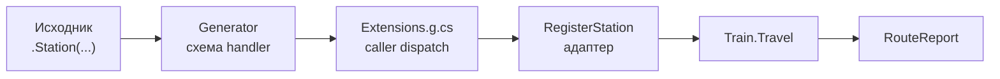
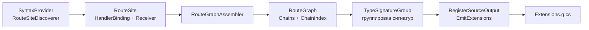
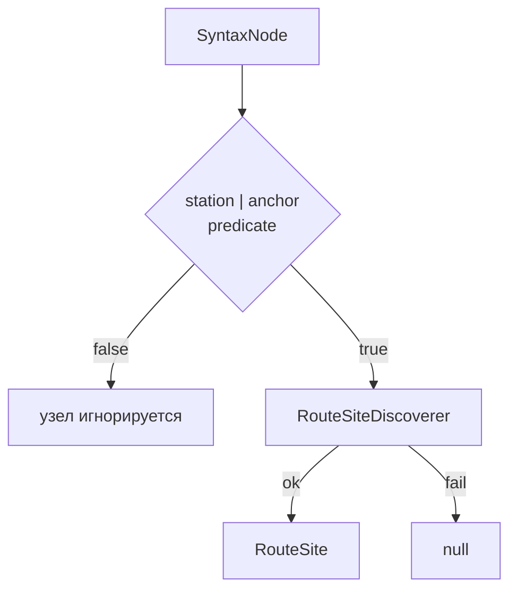
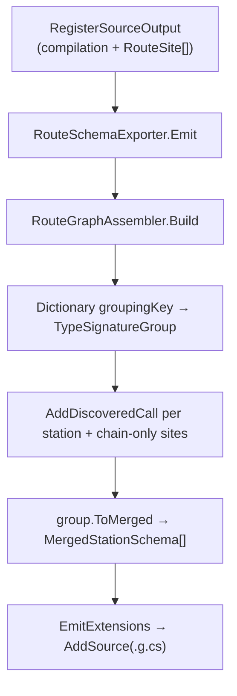
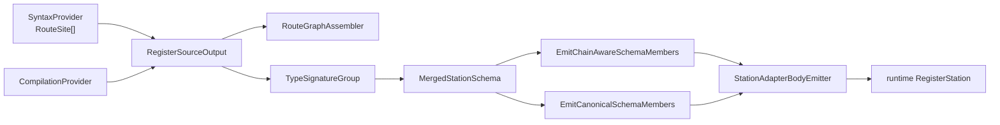
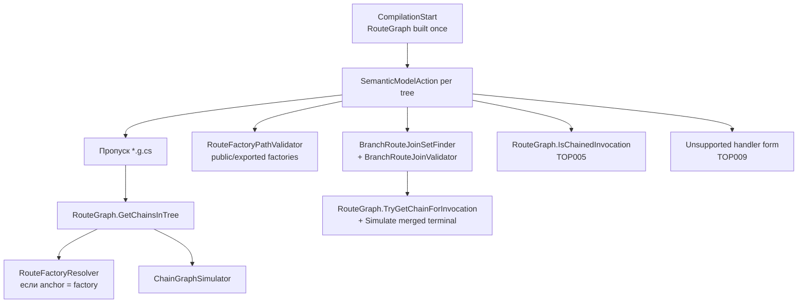
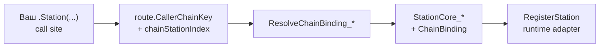
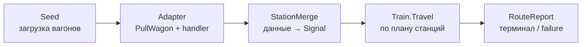

# Архитектура TrainOP: как устроены генератор, caller dispatch и runtime

Документ для разработчика, который знает C#, но только поверхностно — source generators, Roslyn analyzers и caller dispatch. Здесь полный путь от `.Station(...)` в исходнике до `RouteReport` в runtime.

Связанные документы: [getting-started](getting-started.md), [core-api](core-api.md), [cross-assembly-routes](cross-assembly-routes.md).

---

## Главная идея в одном абзаце

Вы пишете fluent-маршрут из лямбд. **Генератор** читает имена параметров как ключи вагонов, выводит форму возврата и эмитит типизированные расширения. **Анализатор** симулирует поток вагонов по цепочке и репортит TOP* до runtime. **Caller dispatch** различает call site'ы с одной CLR-сигнатурой через `CallerChainKey` + порядковый индекс станции. **Runtime** тянет поезд по списку адаптеров и мержит возвраты в `CargoManifest`.



---

## 1. Метафора и публичные типы

Railway Oriented Programming: станции — шаги пайплайна, зелёный сигнал — продолжить, красный — стоп (опционально через `ServiceStation`). Данные живут в мутабельном манифесте вагонов.

| Термин | Тип | Роль |
|--------|-----|------|
| Манифест | `CargoManifest` | словарь `string → object` между станциями |
| Маршрут | `TrainRoute` | builder: `.Station` / `.ServiceStation` |
| Поезд | `Train` | исполнитель `Travel` / `TravelAsync` |
| Сигнал | `GreenSignal` / `RedSignal` | продолжение или остановка |
| DSL | `RailwaySignals.*` | что возвращает data-handler |
| Отчёт | `RouteReport` | визиты, failure, `Get<T>(wagon)` |

### Минимальный маршрут

```csharp
var route = new TrainRoute()
    .Station("Seed", () => new { paymentId = "pay-1", amount = 100m })
    .Station("Discount", (string paymentId, decimal amount) =>
        new { paymentId, amount = amount * 0.9m })
    .Station("Validate", (string paymentId, decimal amount) =>
        amount > 0
            ? RailwaySignals.Green(new { paymentId, amount })
            : RailwaySignals.Red("INVALID_TOTAL", "amount must be positive"));

var report = route.DispatchTrain().Travel();
var paymentId = report.Get<string>("paymentId");
var amount = report.Get<decimal>("amount");
```

- Имена параметров handler'а = ключи вагонов.
- Первая станция без параметров — seed: загружает стартовый груз.
- `Travel()` всегда стартует с **пустого** манифеста; входные данные задаются только seed-станцией (или замыканием внешних переменных в seed).

---

## 2. Compile-time: что делает генератор

`TrainRouteStationGenerator` — `IIncrementalGenerator` в проекте `src/TrainOP.Generators`. Он не «магически» меняет ваши лямбды: он находит вызовы `.Station(...)`, строит схему handler'а и эмитит C#-файлы в compilation.

### Пайплайн



| Шаг | Комponent | Что делает |
|-----|-----------|------------|
| 1 | `RouteSiteDiscoverer` + `HandlerSchemaResolver` | SyntaxProvider transform: predicate → semantic parse → `RouteSite` (Station / ServiceStation / Anchor) |
| 2 | `TryResolveHandler` | Лямбда, anonymous method, method group / local function из **текущей** compilation (иначе `null`; TOP009 — в analyzer) |
| 3 | `HandlerInputSchemaBuilder` | Wagon inputs vs framework: `CargoManifest`, `RedSignal`, `SignalIssue`, `CancellationToken`, `ref` |
| 4 | `HandlerReturnInference` | Anonymous/record, value tuple, `GreenPayload`, `RedFailure`, `GreenPass`, `Task<T>`, void |
| 5 | `RouteGraphAssembler` + `RouteGraph` | Сборка fluent-графа, `CallerChainKey`, `stationIndex`, `ChainSiteBinding` |
| 6 | `TypeSignatureGroup` / `MergedStationSchema` | Группировка по сигнатуре делегата |
| 7 | Emit | `TrainRouteStation.Extensions.g.cs` (canonical или chain-aware адаптеры) |
| 8 | `RouteSchemaExporter` | Schema attributes для public factory (cross-assembly) |

Параллельно `ChainValidationAnalyzer` использует тот же `RouteSiteDiscoverer` + `RouteGraphAssembler` на уровне compilation и симулирует граф вагонов по цепочке (TOP001–TOP013).

### RegisterSourceOutput: инкрементальный пайплайн

Точка входа генератора — callback, переданный в `RegisterSourceOutput` внутри `TrainRouteStationGenerator.Initialize`. Он выполняется Roslyn **каждый раз**, когда меняется compilation или набор обнаруженных вызовов `.Station` / `.ServiceStation`. Именно здесь собираются группы handler'ов и эмитится `TrainRouteStation.Extensions.g.cs`.

#### Что подаётся на вход

Генератор регистрирует **три инкрементальных источника**, склеенных через `Combine`:

```csharp
var stationSites = context.SyntaxProvider.CreateSyntaxProvider(
    RouteSiteDiscoverer.IsCandidateStationSite,
    RouteSiteDiscoverer.TryDiscoverStation);

var anchorSites = context.SyntaxProvider.CreateSyntaxProvider(
    RouteSiteDiscoverer.IsCandidateAnchorSite,
    RouteSiteDiscoverer.TryDiscoverAnchor);

var allSites = stationSites.Collect()
    .Combine(anchorSites.Collect())
    .Select(RouteSiteDiscoverer.MergeSites);

var combined = context.CompilationProvider.Combine(allSites);

context.RegisterSourceOutput(combined, (productionContext, source) => { ... });
```

| Компонент | Тип | Роль |
|-----------|-----|------|
| `CompilationProvider` | `Compilation` | Текущая compilation |
| `SyntaxProvider` (station + anchor) + `Collect()` | `ImmutableArray<RouteSite>` | Все call site'ы и anchor-кандидаты |
| `RouteGraphAssembler.Build` | `RouteGraph` | Цепочки, `ChainIndex`, chained-set |
| `source.Left` | `Compilation` | Compilation для assembly |
| `source.Right` | `ImmutableArray<RouteSite>` | Объединённые discovery-узлы |

SyntaxProvider работает в **две фазы**: дешёвый syntactic predicate отсеивает почти всё, semantic transform (`TryDiscoverStation` / `TryDiscoverAnchor`) вызывается только для узлов, прошедших фильтр.

#### RouteSiteDiscoverer: transform SyntaxProvider

`RouteSiteDiscoverer.TryDiscoverStation` — единая точка semantic resolve handler'а (через `HandlerSchemaResolver`). На выходе — `RouteSite` с `HandlerBinding`, `Receiver`, `StationName` или `null`.

##### Место в пайплайне



##### Что RouteSiteDiscoverer **не** делает

| Не входит в transform | Где это происходит |
|-----------------------|-------------------|
| TOP009 (unsupported handler) | `ChainValidationAnalyzer` → `TryGetUnsupportedStationHandler` |
| TOP005 (orphan station) | `ChainValidationAnalyzer` → `RouteGraph.IsChainedInvocation` |
| TOP001–TOP003 (wagon flow) | `ChainValidationAnalyzer` → `ChainGraphSimulator` |
| TOP007 (conflicting wagon names) | `RegisterSourceOutput` → `TypeSignatureGroup.ToMerged` |
| Chain id / station index | `RouteGraphAssembler` в callback (из собранных `RouteSite`, без полного rescan) |

Handler schema строится **один раз** в discovery; `ChainDetector.TryAdvanceChain` использует pre-built binding из `RouteSite` при forward walk.

##### TryGetDataRouteHandlerInvocation — семантическая цепочка

Обе `TryGetData*Invocation` делегируют в общий `TryGetDataRouteHandlerInvocation`. Шаги (любой `false` → `GetRouteHandlerCall` вернёт `null`):

| # | Проверка | Зачем |
|---|----------|-------|
| 1 | `MatchesRouteHandlerShape` | Повторная проверка формы (защита при прямом вызове вне predicate) |
| 2 | `IsTrainRouteReceiver(memberAccess.Expression, receiverType, semanticModel)` | Receiver — или `TrainRoute`, или выражение, **рекурсивно** сводимое к TrainRoute (`new TrainRoute()`, fluent `.Station(...)`, `?:`, `??`, switch expression) |
| 3 | `IsBuiltinTrainRouteHandler` | Вызов **встроенного** `TrainRoute.Station` / `ServiceStation` (не generated extension) — пропуск |
| 4 | `TryResolveHandler(arg[1], semanticModel, out resolved)` | Handler — лямбда, anonymous method или однозначный method group / local function **с исходником в текущей compilation** |
| 5 | `IsLikelyBuiltinServiceStationHandler` (только ServiceStation) | Отсечь legacy handler `(RedSignal red) => …` без data-oriented вагонов |
| 6 | `HandlerInputSchemaBuilder.TryBuild(resolved, …)` | Построить полную схему: wagon inputs, framework-параметры, return shape |
| 7 | Извлечь `stationName` | Literal `"Name"` → `Token.ValueText`; иначе fallback `Arguments[0].ToString().Trim('"')` |

`handlerLocation` для diagnostics и группировки берётся из **handler-выражения** (`resolved.Location`), не из всего invocation.

##### TryResolveHandler — разбор второго аргумента

Второй аргумент `.Station("Name", **handler**)` проходит `UnwrapHandlerExpression` (снимает скобки и cast), затем:

| Форма handler'а | `HandlerKind` | Как получается `IMethodSymbol` |
|-----------------|---------------|--------------------------------|
| `(…) => …` / `x => …` | `Lambda` | `semanticModel.GetSymbolInfo(lambda)` |
| `delegate(…) { … }` | `AnonymousMethod` | `GetSymbolInfo(anonymousMethod)` |
| `LocalHandler` / `this.Handler` | `MethodGroup` | `GetSymbolInfo` + `GetMemberGroup`; должна быть **ровно одна** подходящая overload |
| `Func<…>` variable | — | **не поддерживается** → `null` |

Для method group / local function дополнительно:

- `IsInspectableInCompilation` — хотя бы один `DeclaringSyntaxReference` лежит в syntax tree **этой** compilation (методы только из referenced DLL без исходников → `null`).
- Тело метода (`Body` / `ExpressionBody`) подтягивается для `HandlerReturnInference` (анализ return expressions, tuple literals).

`ResolvedHandler` несёт: `Kind`, `IMethodSymbol`, тело, `Location`, исходный `ExpressionSyntax`.

##### HandlerInputSchemaBuilder.TryBuild — что попадает в binding

Из `IMethodSymbol.Parameters` строится `StationHandlerBinding`:

**Входы (`HandlerInputParameters`):**

- каждый параметр классифицируется: **Wagon** (имя → ключ вагона), `CargoManifest`, `RedSignal`, `SignalIssue`, `CancellationToken`;
- `ref`/`out` wagon → `WagonBinding.IsByRef`;
- optional nullable value types → `IsOptional`;
- порядок слотов сохраняется в `HandlerCallSlot[]` для codegen invoke.

**Выход (`HandlerOutputParameters` / `ReturnShape`):**

- `HandlerReturnInference` по типу return и телу handler'а: void, anonymous/record, value tuple, `Task<T>`, `RailwaySignals.Green/Red/Pass`, `CargoManifest`, unknown;
- для tuple/record — member names (или `ItemN` → позже TOP006 в analyzer).

Если схема невалидна — `TryDiscoverStation` → `null`.

##### Результат: RouteSite

`RouteSite` объединяет anchor и station call site: `HandlerBinding`, `Receiver`, `StationName`, `IdentityLocation`, а для anchor — `AnchorKind`, `FactoryMethod`, `InitialWagons`.

#### Общая схема callback'а



#### Шаг 1. RouteSchemaExporter (отдельный выход)

Без изменений: public factory schema для cross-assembly.

#### Шаг 2. RouteGraphAssembler — сборка графа из RouteSite

`RouteGraphAssembler.Build(sites, compilation)`:

1. Собирает station sites в `stationByKey` и якоря из discovery (`RouteSiteKind.Anchor`).
2. Forward ordering через `ChainDetector.TryAdvanceChain` от каждого якоря с pre-built binding из `RouteSite`.
3. Строит `RouteGraph`: `Chains`, `ChainIndex` (`locationKey → ChainSiteBinding[]`), chained-set.

Semantic resolve handler'а выполняется **один раз** в discovery; повторного `DetectChains` scan по syntax tree нет.

#### Шаг 3. AddDiscoveredCall — дедупликация и группировка

Один проход по `graph.StationSites` + дополнение из `graph.ChainIndex` для call site'ов, попавших в цепочку без pre-resolved handler в discovery.

Lookup chain binding: `ChainStationCallIndex.TryResolveAll(graph.ChainIndex, ...)`.

#### Шаг 4. Analyzer — тот же граф

`ChainValidationAnalyzer` в `RegisterCompilationStartAction` вызывает `RouteSiteDiscoverer.CollectAll` + `RouteGraphAssembler.Build` один раз на compilation. Per-tree semantic action использует `graph.GetChainsInTree(tree)` и `graph.IsChainedInvocation`.

Если после обработки `groups.Count == 0` — callback завершается **без** `AddSource`.

#### Шаг 5. TypeSignatureGroup → MergedStationSchema

```csharp
var mergedSchemas = groups.Values
    .Select(group => group.ToMerged(productionContext))
    .OrderBy(x => x.DelegateTypeId)
    .ToImmutableArray();
```

`ToMerged` для каждой группы:

1. Создаёт `MergedStationSchema(canonicalBinding, delegateTypeId)`.
2. Объединяет return shapes → `ReturnMembers` для compile-time merge.
3. Решает, нужен ли **chain dispatch** (`RequiresChainDispatch`):
   - есть chain bindings **и**
   - в группе **больше одного набора имён вагонов** при одной type-сигнатуре.
4. Если chain dispatch → `merged.SetChainBindings(_chainBindings)` + `ReportNonChainConflicts` (TOP007 для orphan call site'ов вне цепочки с конфликтующими именами).
5. Если не chain dispatch → `ReportCanonicalConflicts` (TOP007, когда два non-chain call site с одной сигнатурой, но разными именами параметров).

`UsesChainDispatch` на `MergedStationSchema` дополнительно требует `!IsServiceStation` — service station не участвует в caller dispatch таблицах.

#### Шаг 6. EmitExtensions — эмиссия одного .g.cs

`EmitExtensions(productionContext, mergedSchemas)`:

1. `BuildMetadataConsolidation` — для **non-chain** групп с одинаковым `delegateTypeId + wagon names` объединяет return metadata, чтобы `ReturnMembers_*` static field эмитился один раз.
2. Пишет заголовок `TrainRouteStationExtensions` в `StringBuilder`.
3. Для каждого `MergedStationSchema` (dedupe по `emissionKey`) вызывает `EmitSchemaMembers`:

| `merged.UsesChainDispatch` | Что эмитится |
|----------------------------|--------------|
| `true` | **Chain-aware:** `ChainStationBinding_*` struct, static `ChainBinding_*` constants, `ResolveChainBinding_*(chainKey, index)` switch, публичный `.Station` → `StationCore_*(route, handler, route.CallerChainKey, route.NextChainRegistrationOrdinal())`, internal overload с resolved binding |
| `false` | **Canonical:** static `WagonNames_*`, optional `RefFlags_*` / `ReturnMembers_*`, один публичный `.Station` с compile-time именами + `route.NextChainRegistrationOrdinal()` (чтобы не сбить индекс, если дальше по маршруту будут chain-dispatch станции) |

4. Тело регистрации в обоих случаях генерирует `StationAdapterBodyEmitter.EmitRegistration` → `route.RegisterStation(..., manifest => { PullWagon; invoke handler; StationMerge })`.
5. `context.AddSource("TrainRouteStation.Extensions.g.cs", SourceText.From(...))` — единственный основной output генератора станций.

#### Chain-aware vs canonical: что видит runtime

**Canonical** (один набор имён вагонов на всю группу):

```csharp
// Упрощённо
public static TrainRoute Station(this TrainRoute route, string stationName, TrainStationHandler_Abc handler)
{
    route.NextChainRegistrationOrdinal(); // сдвиг счётчика для смешанных маршрутов
    return route.RegisterStation(stationName, manifest => { /* Pull по WagonNames_Abc */ });
}
```

**Chain-aware** (несколько цепочек с `(string, decimal)` но разными именами):

```csharp
public static TrainRoute Station(this TrainRoute route, string stationName, TrainStationHandler_Abc handler)
{
    return StationCore_Abc(route, stationName, handler, route.CallerChainKey, route.NextChainRegistrationOrdinal());
}

private static ChainStationBinding_Abc ResolveChainBinding_Abc(string chainKey, int chainStationIndex)
{
    switch (chainKey) {
        case "Routes/Payment.cs:12:PaymentRoute":
            switch (chainStationIndex) { case 1: return ChainBinding_Abc_..._1; }
            break;
        // ...
    }
    return DefaultChainBinding_Abc;
}
```

При `RegisterStation` binding уже содержит `inputNames`, `returnMembers`, `refFlags` для **конкретной** станции **конкретной** цепочки — runtime reflection не нужен.

#### Инкрементальность и побочные эффекты

| Действие | Где | Когда |
|----------|-----|-------|
| `context.AddSource(...)` | `EmitExtensions`, `RouteSchemaExporter` | Новый/обновлённый generated file |
| `context.ReportDiagnostic(TOP007)` | `TypeSignatureGroup.ToMerged` | Конфликт имён вагонов без chain dispatch |
| Полный rebuild route graph | `RouteGraphAssembler.Build` | На **каждый** вызов callback (из collected `RouteSite[]`) |

SyntaxProvider даёт инкрементальность на уровне **transform отдельных узлов**; `RouteGraphAssembler` пересчитывается в callback целиком из актуального массива sites.

#### Связь с остальными компонентами



Analyzer (`ChainValidationAnalyzer`) использует те же `RouteSiteDiscoverer`, `RouteGraphAssembler`, `ChainDetector` (walk-primitives), `StationSyntaxHelper`.

### Что эмитится

- **`TrainRouteStation.Extensions.g.cs`** — типизированные `Station` / `ServiceStation`, `StationCore_*`, таблицы `ChainBinding_*` / `ResolveChainBinding_*` (caller dispatch).
- **`RouteSchemas.g.cs`** — schema attributes для public route factory (cross-assembly).

### Допустимые формы handler'а

- лямбда: `(string paymentId, decimal amount) => …`
- anonymous method: `delegate(string paymentId, decimal amount) { … }`
- method group / local function, объявленные в этом проекте

Не поддерживаются: переменные/`Func<>` без dataflow, неоднозначные перегрузки, методы только из referenced DLL без исходников — analyzer сообщает **TOP009**.

### Валидные формы сборки цепочки

```csharp
// 1) Прямая fluent-цепочка
var route = new TrainRoute()
    .Station("Seed", () => new { id = 1 })
    .Station("Next", (int id) => new { id = id + 1 });

// 2) Локальная после new TrainRoute()
var route = new TrainRoute();
route = route
    .Station("Seed", () => new { id = 1 })
    .Station("Next", (int id) => new { id = id + 1 });

// 3) Private/internal factory extension
var route = CreateSeed()
    .Station("Next", (int id) => new { id = id + 1 });

// 4) Public factory из referenced assembly (exported schema)
var route = PaymentModule.Build()
    .Station("Finalize", (string paymentId, decimal amount) =>
        new { paymentId, status = "done" });
```

Параметр / поле / свойство / делегат как receiver (`baseRoute.Station(...)`) пока **не** поддерживаются (**TOP005**).

---

## 3. Работа анализатора

Генератор **эмитит** код. Анализатор **не эмитит** ничего: он только ходит по синтаксису/семантике и репортит диагностики в IDE / `dotnet build`. Оба живут в пакете `TrainOP.Generators`, но это разные механизмы Roslyn.

Точка входа: `ChainValidationAnalyzer` (`[DiagnosticAnalyzer(LanguageNames.CSharp)]`).



### Что делает за один проход syntax tree

| Этап | Компонент | Результат |
|------|-----------|-----------|
| Найти цепочки | `RouteGraph` | `RouteChain` (anchor + станции по порядку) |
| Factory как anchor | `RouteFactoryResolver` | Подтянуть upstream schema / TOP011 |
| Симуляция вагонов | `ChainGraphSimulator` | TOP001, TOP002, TOP003, TOP004, TOP006, TOP010 |
| Public factory paths | `RouteFactoryPathAnalyzer` + `RouteFactoryPathValidator` | TOP012 / TOP013 |
| Ветвление | `BranchRouteJoinSetFinder` + `BranchRouteJoinValidator` | TOP008; при успешном merge — симуляция хвоста |
| Orphans | `RouteGraph.IsChainedInvocation` | TOP005 на `.Station` вне цепочки |
| Форма handler'а | `StationSyntaxHelper.TryGetUnsupportedStationHandler` | TOP009 |

Сгенерированный код (`.g.cs`) анализатор **не** анализирует (`ConfigureGeneratedCodeAnalysis(None)` + явный skip по пути).

### Симуляция манифеста (`ChainGraphSimulator`)

Это сердце вагонных проверок. Анализатор **не** вызывает runtime: он station-by-station обновляет модель:

- **Live** — какие вагоны сейчас «есть» и какого типа, где произведены;
- **Removed** — какие были сняты partial-return'ом;
- **HasUnknownReturn** — возврат не разобран статически → дальше осторожнее (в т.ч. factory/join).

На каждой станции:

1. Проверяет, что все required wagon inputs есть в Live (иначе **TOP001**).
2. Сверяет типы Live vs параметр (**TOP002**).
3. Если вагон был Removed, а снова нужен — **TOP003**.
4. Учитывает return: добавляет/обновляет вагоны, снимает omitted regular inputs (как в runtime merge).
5. `return CargoManifest` → **TOP004** (warning).
6. Tuple без имён → **TOP006**.
7. `GreenSignal`/`RedSignal` вместо DSL → **TOP010**.

После симуляции известен **terminal** набор вагонов — его же используют factory schema export и join веток.

### Ветки и join (TOP008)

Когда маршрут развилками сходится обратно в `.Station(...)`:

1. `BranchRouteJoinSetFinder` находит набор веток + downstream-станцию.
2. `BranchRouteJoinValidator` проверяет: все ветки resolvable, нет unknown terminal, нет конфликтов типов одного имени между ветками.
3. Если ok — строится **merged** terminal; хвост симулируется уже от него.
4. Если нет — **TOP008**; на fork-downstream **TOP005** подавляется (join-ошибка важнее orphan).

### Factory return paths (TOP012 / TOP013)

Для exported public factory (`returns TrainRoute`):

1. `RouteFactoryPathAnalyzer` собирает все `return` / expression-body пути.
2. Каждый путь симулируется как цепочка.
3. `RouteFactoryPathValidator` требует согласованный terminal между путями:
   - разные terminal sets → **TOP012**;
   - unknown terminal на пути → **TOP013**.

Именно это позволяет consumer-сборке валидно продолжать `.Station(...)` после `PaymentModule.Build()`.

### Generator vs Analyzer: кто репортит что

Не все TOP* идут из analyzer. Часть возникает при **emit** генератора.

| Код | Кто репортит | Где логика |
|-----|--------------|------------|
| TOP001–TOP006, TOP008–TOP013 | **Analyzer** | `ChainValidationAnalyzer` + simulator / join / factory |
| TOP007 | **Generator** | `TypeSignatureGroup`: два call site с одной type-сигнатурой, но разными именами вагонов (конфликт канона группы) |
| TOP005 / TOP009 | Analyzer | orphans / unsupported form |
| TOP010 | Analyzer (и учитывается при schema) | runtime Signal return |

`WagonParameterAnalyzer` — не DiagnosticAnalyzer, а хелпер: `ref`, nullable value-type, effective type для совместимости вагонов (им пользуются и generator, и симуляция).

### Чем analyzer отличается от generator на практике

| | Generator | Analyzer |
|--|-----------|----------|
| Цель | эмитить `.g.cs` | красные/жёлтые волны в IDE |
| Нужен для сборки data-oriented API | да (без него нет `.Station` overload) | нет (сборка может пройти, если код уже «счастливый») |
| Видит цепочку | да (`ChainStationCallIndex`) | да (`ChainDetector`) |
| Симулирует вагоны | косвенно (для chain bindings / schema) | да, полный walk + TOP* |
| Caller dispatch | эмитит `ResolveChainBinding_*` | не участвует (только валидация цепочек) |

Без анализатора библиотека «едет», но ошибки вагонов вылезут в runtime (`KeyNotFoundException` / cast) или вообще как неверный merge. Analyzer переносит эти проверки на compile-time.

---

## 4. Зачем caller dispatch (и почему без него ломается)

### Проблема CLR-сигнатур

Два handler'а `(string, decimal)` — один и тот же тип делегата. Но вагоны могут называться `paymentId`/`amount` в одной цепочке и `orderId`/`total` в другой. Одна overload-расширение не знает, какие имена взять на конкретном call site.



| Ситуация | Поведение |
|----------|-----------|
| Без caller dispatch | Одна overload на `(string, decimal)`. Имена вагонов канонические для группы — два call site с разными именами параметров смешиваются. |
| С caller dispatch | На `new TrainRoute()` штампуется `CallerChainKey`. Каждая `.Station` передаёт key + ordinal в `ResolveChainBinding_*` и получает compile-time `inputNames` / `returnMembers` для своей цепочки. |

### Упрощённый вид сгенерированного chain-dispatch

```csharp
// Публичный extension (упрощённо)
public static TrainRoute Station(this TrainRoute route, string stationName, TrainStationHandler_Abc handler)
{
    return StationCore_Abc(route, stationName, handler, route.CallerChainKey, route.NextChainRegistrationOrdinal());
}

// Resolve по ключу цепочки и индексу станции
internal static TrainRoute StationCore_Abc(..., string chainKey, int chainStationIndex)
{
    return StationCore_Abc(..., ResolveChainBinding_Abc(chainKey, chainStationIndex));
}

// Регистрация с уже известным binding
internal static TrainRoute StationCore_Abc(..., ChainStationBinding_Abc binding)
{
    var inputNames = binding.InputNames;   // ["paymentId", "amount"] или ["orderId", "total"]
    var returnMembers = binding.ReturnMembers;
    return route.RegisterStation(stationName, manifest => { /* pull + handler + merge */ });
}
```

### Caller dispatch (единственный режим)

Генератор всегда эмитит **ctor+ordinal dispatch**: идентичность цепочки штампуется на `new TrainRoute()`, resolve идёт по `CallerChainKey` + `chainStationIndex` через compile-time lookup tables.

Бенчмарки: [`benchmarks/README.md`](../benchmarks/README.md).

---

## 5. Runtime: как едет поезд



| Шаг | Что происходит |
|-----|----------------|
| `RegisterStation` | Сгенерированный адаптер кладётся в список `StationPlan` на `TrainRoute` |
| `DispatchTrain` | Снимок планов → `Train` (+ optional `ServiceStationPlan`) |
| `Travel` | Пустой `CargoManifest`; по очереди вызов каждого адаптера |
| Adapter | `PullWagon` по именам → handler → `StationMerge` / `ToSignal` → Green\|Red |
| Green | Манифест из сигнала идёт на следующую станцию; визит пишется в отчёт |
| Red | Опционально `ServiceStation`; green → продолжить, иначе стоп + `FailureCode` / `FailureMessage` |
| Exception | Кроме `OperationCanceledException` → Red с `STATION_EXCEPTION` / `SERVICE_STATION_EXCEPTION` |

### Sync vs Async

Есть async-станция (`Task` / `Task<T>`) → только `TravelAsync`. Синхронный `Travel()` бросит `InvalidOperationException` («Use TravelAsync»).

```csharp
var route = new TrainRoute()
    .Station("Seed", () => new { counter = 10 })
    .Station("Fetch", async (int counter, CancellationToken token) =>
    {
        await Task.Delay(50, token);
        return new { counter = counter * 2 };
    });

var report = await route.DispatchTrain().TravelAsync();
```

### ServiceStation

Одна «аварийная» станция на маршрут. На Red получает `RedSignal` (и при необходимости `ref` вагоны). Успешное восстановление продолжает оставшиеся станции.

```csharp
var route = new TrainRoute()
    .Station("Seed", () => new { paymentId = "pay-recover", amount = -10m })
    .Station("Validate", (string paymentId, decimal amount) =>
        amount > 0
            ? RailwaySignals.Green(new { paymentId, amount })
            : RailwaySignals.Red("INVALID_TOTAL", "amount must be positive"))
    .ServiceStation("Recovery", (ref string paymentId, ref decimal amount, RedSignal red) =>
    {
        paymentId = "pay-recover";
        amount = 50m;
        return RailwaySignals.Pass;
    })
    .Station("ApplyDiscount", (string paymentId, decimal amount) =>
        new { paymentId, amount = amount * 0.9m });
```

---

## 6. Семантика merge

Handler обычно не трогает манифест руками. Он возвращает данные; адаптер вызывает `StationMerge` (`src/TrainOP/StationMerge.cs`).

| Возврат handler'а | Поведение |
|-------------------|-----------|
| anonymous / record / named tuple | merge членов → Green |
| `RailwaySignals.Green(payload)` | unwrap payload → merge → Green |
| `RailwaySignals.Red(code, msg)` | `RedSignal` + `SignalIssue`, стоп |
| `RailwaySignals.Pass` | манифест без изменений (**без** ref writeback) |
| `void` / `new { }` | partial: `ref` пишутся, обычные input-вагоны выгружаются |
| `CargoManifest` | полная замена (предупреждение TOP004) |
| `GreenSignal` / `RedSignal` | запрещено — **TOP010** |

### Partial return

Если станция принимает `paymentId` и `amount`, а возвращает только `new { amount = 90m }`, вагон `paymentId` снимается с манифеста (как «обычный input, не вернутый»). Лишние вагоны, которые станция **не** принимала, остаются.

### Value tuple

Рекомендуются именованные кортежи или inference:

```csharp
// OK — явное имя
.Station("Discount", (string paymentId, decimal amount) =>
    (paymentId: paymentId + "-disc", amount: amount * 0.9m));

// OK — inference
.Station("Discount", (string paymentId, decimal amount) =>
    (paymentId, amount));

// Warning TOP006 — default ItemN
.Station("Discount", (string paymentId, decimal amount) =>
    (paymentId + "-disc", amount * 0.9m));
```

### Framework-параметры

Помимо вагонов handler может принимать:

- `CargoManifest` — читать лишнее без формального input;
- `CancellationToken`;
- для ServiceStation — `RedSignal` / `SignalIssue`;
- `ref` wagon parameters — writeback через сгенерированные `refLocalValues`.

Nullable value-type wagon: `HasWagon(...) ? PullWagon<T>() : default`.

---

## 7. Примеры сценариев

Исходники: `samples/TrainOP.Samples/Examples/`.

### A. Data-oriented happy path

`DataOrientedStationExample.cs` — seed → discount → validate → `report.Get<T>`.

### B. Red + ServiceStation recovery

`DataOrientedRedSignalExample.cs` — см. раздел ServiceStation выше.

### C. Async + CancellationToken

`AsyncRouteExample.cs` — `TravelAsync`.

### D. Partial wagon return

`PartialWagonReturnExample.cs` — демонстрация снятия omitted inputs.

### E. Cross-assembly

`tests/TrainOP.RouteLib.Tests/PaymentModule.cs` + `tests/TrainOP.RouteConsumer.Tests/AppRoute.cs` — public factory со schema export.

---

## 8. Диагностики TOP*

Сводка. Подробный пайплайн — в [разделе 3](#3-работа-анализатора).

| Код | Смысл | Severity | Источник |
|-----|-------|----------|----------|
| TOP001 | Нужный вагон не появился раньше в цепочке | Error | Analyzer (simulator) |
| TOP002 | Конфликт типов одного имени вагона | Error | Analyzer (simulator) |
| TOP003 | Вагон снят, но нужен позже | Error | Analyzer (simulator) |
| TOP004 | `return CargoManifest` — полная замена | Warning | Analyzer (simulator) |
| TOP005 | Handler вне поддерживаемой цепочки | Error | Analyzer (orphans) |
| TOP006 | Tuple `ItemN` без имени | Warning | Analyzer (simulator) |
| TOP007 | Разные имена вагонов при одной type-сигнатуре | Error | **Generator** (`TypeSignatureGroup`) |
| TOP008 | Ветки маршрута не сходятся | Error | Analyzer (branch join) |
| TOP009 | Неподдерживаемая форма handler'а | Error | Analyzer |
| TOP010 | `return GreenSignal`/`RedSignal` вместо DSL | Error | Analyzer (simulator) |
| TOP011 | External factory без schema | Info | Analyzer (factory resolve) |
| TOP012 | Factory paths с разным терминалом | Error | Analyzer (factory paths) |
| TOP013 | Factory path с unknown terminal | Error | Analyzer (factory paths) |

Описания: `src/TrainOP.Generators/TrainRouteDiagnostics.cs`.

---

## 9. Карта репозитория

| Путь | Назначение |
|------|------------|
| `src/TrainOP` | Runtime: `Railway.cs`, `StationMerge`, `Train` |
| `src/TrainOP.Generators` | Generator + analyzer |
| `samples/TrainOP.Samples` | Консольные сценарии |
| `tests/` | Runtime + generator + cross-assembly |
| `docs/` | Руководства пользователя и этот документ |
| `benchmarks/` | Library vs manual pipelines |

Ключевые файлы генератора:

| Файл | Роль |
|------|------|
| `TrainRouteStationGenerator.cs` | Точка входа: `Initialize` → `RegisterSourceOutput` |
| `ChainStationCallIndex.cs` | Индекс chain bindings по location + chainId |
| `TypeSignatureGroup.cs` | Группировка call site'ов, TOP007, chain vs canonical |
| `MergedStationSchema.cs` | Объединённая схема перед emit |
| `StationSyntaxHelper.cs` | Predicate + `TryGetData*Invocation` + `TryResolveHandler` (используются в `GetRouteHandlerCall` и analyzer) |
| `HandlerInputSchemaBuilder.cs` | Wagon/framework classification → `StationHandlerBinding` |
| `HandlerReturnInference.cs` | Return shape и member names из тела handler'а |
| `ChainAwareStationCodegen.cs` | Таблицы `ResolveChainBinding_*` |
| `StationAdapterBodyEmitter.cs` | Тело адаптера (Pull → invoke → merge) |
| `ChainDetector.cs` | Обнаружение fluent-цепочек (используется и generator, и analyzer) |
| `ChainValidationAnalyzer.cs` | DiagnosticAnalyzer: TOP* (кроме TOP007) |
| `ChainGraphSimulator.cs` | Виртуальный walk манифеста по цепочке |
| `BranchRouteJoinValidator.cs` | Сходимость веток (TOP008) |
| `RouteFactoryPathAnalyzer.cs` / `RouteFactoryPathValidator.cs` | Return paths factory (TOP012/013) |
| `RouteSchemaExporter.cs` | Cross-assembly schema |

---

## Порядок чтения

1. Метафора и минимальный пример (раздел 1).
2. Таблица merge (раздел 6) — без неё поведение возвратов неочевидно.
3. Пайплайн генератора: **GetRouteHandlerCall** и **RegisterSourceOutput** (раздел 2).
4. Работа анализатора (раздел 3) — чем TOP* ловятся до runtime.
5. Caller dispatch (раздел 4).
6. Travel loop (раздел 5).
7. Сводка TOP* (раздел 8), когда IDE краснеет.

Дальше по необходимости: [core-api](core-api.md) для деталей API, [cross-assembly-routes](cross-assembly-routes.md) для библиотек маршрутов.
