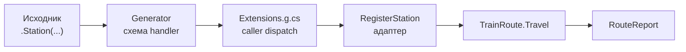
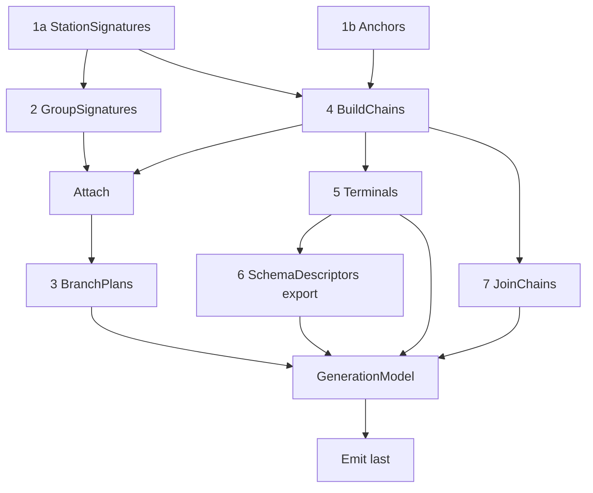
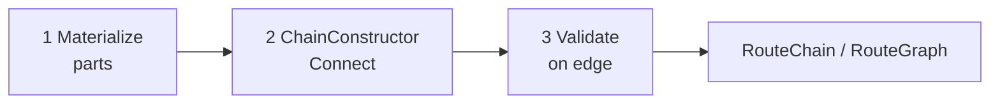
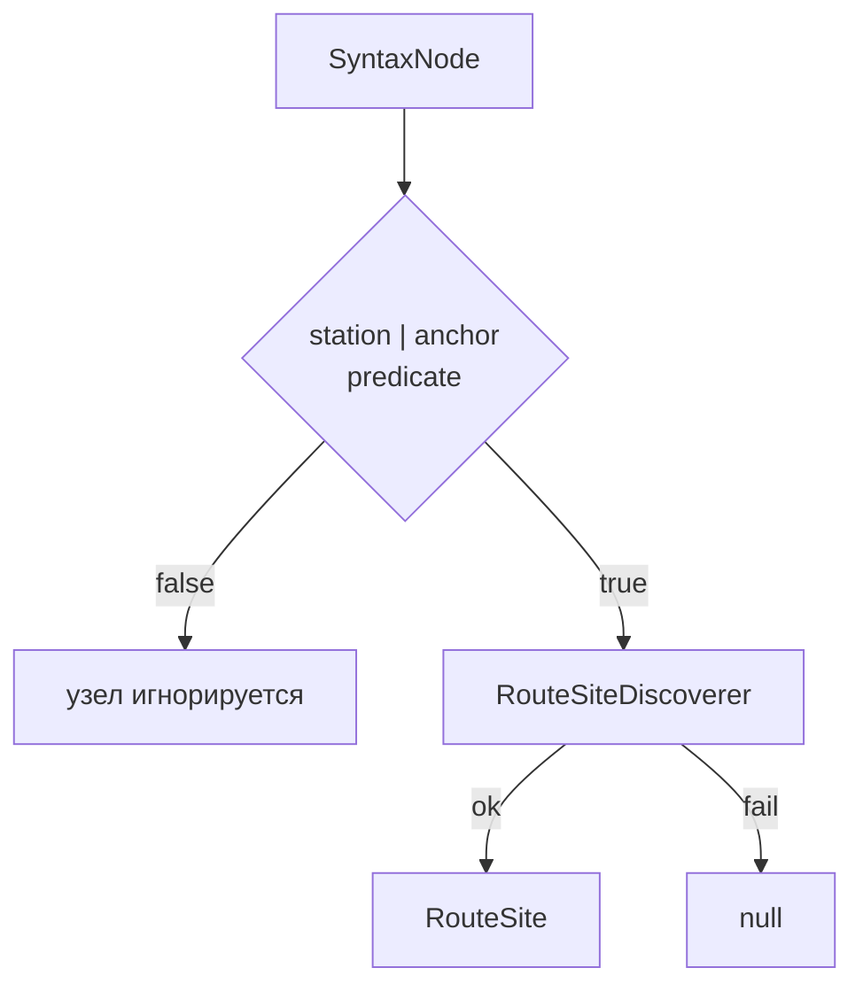
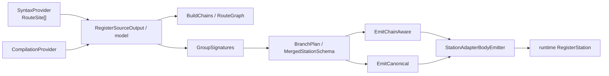
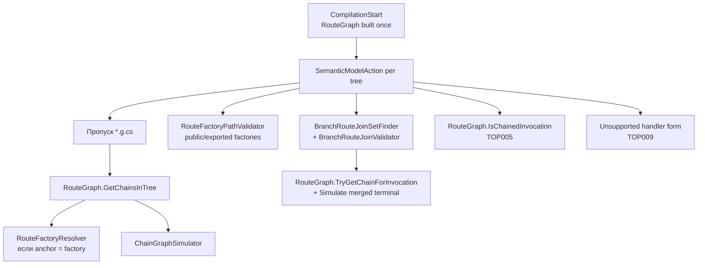
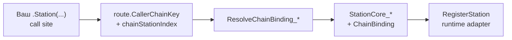
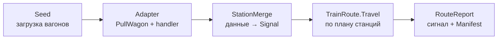

# Архитектура TrainOP: как устроены генератор, caller dispatch и runtime

Документ для разработчика, который знает C#, но только поверхностно — source generators, Roslyn analyzers и caller dispatch. Здесь полный путь от `.Station(...)` в исходнике до `RouteReport` в runtime.

Связанные документы: [учебник](textbook.md) (последовательное введение), [getting-started](getting-started.md), [core-api](core-api.md), [cross-assembly-routes](cross-assembly-routes.md).

---

## Главная идея в одном абзаце

Вы пишете fluent-маршрут из лямбд. **Генератор** читает имена параметров как ключи вагонов, выводит форму возврата и эмитит типизированные расширения. **Анализатор** симулирует поток вагонов по цепочке и репортит TOP* до runtime. **Caller dispatch** различает call site'ы с одной CLR-сигнатурой через `CallerChainKey` + порядковый индекс станции. **Runtime** тянет поезд по списку адаптеров и записывает возвраты станций в `CargoManifest`.


```mermaid
flowchart LR
  A["Исходник<br/>.Station(...)"] --> B["Generator<br/>схема handler"]
  B --> C["Extensions.g.cs<br/>caller dispatch"]
  C --> D["RegisterStation<br/>адаптер"]
  D --> E["TrainRoute.Travel"]
  E --> F["RouteReport"]
```

---

## 1. Метафора и публичные типы

Railway Oriented Programming: станции — шаги пайплайна, зелёный сигнал — продолжить, красный — стоп (опционально через `ServiceStation`). Данные живут в мутабельном манифесте вагонов.

| Термин | Тип | Роль |
|--------|-----|------|
| Манифест | `CargoManifest` | словарь `string → object` между станциями |
| Маршрут | `TrainRoute` | builder + `Travel` / `TravelAsync` |
| Сигнал | `Signal` / `GreenSignal` / `RedSignal` | только управление (без манифеста) |
| DSL | `RailwaySignals.*` | что возвращает data-handler |
| Отчёт | `RouteReport` | визиты, failure, `Manifest`, `Get<T>(wagon)` |

### Минимальный маршрут

```csharp
var route = new TrainRoute()
    .Station("Seed", () => new { paymentId = "pay-1", amount = 100m })
    .Station("Discount", (string paymentId, decimal amount) =>
        new { paymentId, amount = amount * 0.9m })
    .Station("Validate", (string paymentId, decimal amount) =>
        amount > 0
            ? RailwaySignals.Green(new { paymentId, amount })
            : RailwaySignals.Red("INVALID_TOTAL", "amount must be positive"));

var report = route.Travel();
var paymentId = report.Get<string>("paymentId");
var amount = report.Get<decimal>("amount");
```

- Имена параметров handler'а = ключи вагонов.
- Первая станция без параметров — seed: загружает стартовый груз.
- `Travel()` всегда стартует с **пустого** манифеста; входные данные задаются только seed-станцией (или замыканием внешних переменных в seed).

---

## 2. Compile-time: что делает генератор

`TrainRouteStationGenerator` — `IIncrementalGenerator` в проекте `src/TrainOP.Generators`. Он не «магически» меняет ваши лямбды: он находит вызовы `.Station(...)`, строит схему handler'а и эмитит C#-файлы в compilation.

Параллельно `ChainValidationAnalyzer` использует тот же discovery + граф цепочек и симулирует вагоны (TOP001–TOP013). Целевая модель: **одна data-oriented IR** для generator и analyzer; analyzer — потребитель без `AddSource`.

### IR-first, emit-last

Стабильная ментальная модель пайплайна: этапы **1a–7** только наполняют data-oriented IR (`GenerationModel`). **`AddSource` — только в конце** (Extensions + RouteSchemas). Ранний emit schema-файла не считается концептуальным порядком стадий.

До Emit в модели запрещены: писатели codegen, исходный `StringBuilder`, `AddSource`. «Ветвление» canonical vs chain-aware — это **план в данных** (`BranchPlan`), не генерация строк.


```mermaid
flowchart TB
  St["1a StationSignatures"] --> G["2 GroupSignatures"]
  An["1b Anchors"] --> C["4 BuildChains"]
  St --> C
  G --> Att["Attach"]
  C --> Att
  Att --> B["3 BranchPlans"]
  C --> T["5 Terminals"]
  T --> S["6 SchemaDescriptors export"]
  C --> J["7 JoinChains"]
  B --> M["GenerationModel"]
  T --> M
  S --> M
  J --> M
  M --> E["Emit last"]
```

Кратко:

```text
1a StationSignatures  ∥  1b Anchors (new/local/factory/external schema)
        │                         │
        ├────────────┬────────────┘
        ▼            ▼
2 GroupSignatures  4 BuildChains     ← независимы
        │            │
        └──── Attach ┘
               ▼
        3 BranchPlans
        5 Terminals (TerminalSet+Origin)
        6 SchemaDescriptors (export only)
        7 JoinChains
               ▼
        GenerationModel
               ▼
        Emit (last): Extensions + RouteSchemas
```

#### Этапы (данные до Emit)

| # | Этап | Параллельность | Вход → выход |
|---|------|----------------|--------------|
| 1a | **StationSignatures** | ∥ 1b | station site → `StationHandlerBinding` (+ site); все формы handler/return/param внутри этапа |
| 1b | **Anchors** | ∥ 1a | receiver/factory → якорь (`InitialWagons`, dispatch identity, kind). **Import внешней schema** — вариант resolve якоря, не отдельная стадия |
| 2 | **GroupSignatures** | ∥ 4 | bindings → группы **без** chain |
| 3 | **BranchPlans** | после Attach 2+4 | groups+chain → canonical ∥ chain-aware **как данные** (+ политика TOP007) |
| 4 | **BuildChains** | ∥ 2 | stations+anchors → `RouteGraph`: **Materialize → Construct → Validate** (Parts IR); entry points walker/peel — варианты входа |
| 5 | **Terminals** | после 4 (и 7 для join-origin) | → `TerminalSet` + `Origin` |
| 6 | **SchemaDescriptors** | после 5 | factory terminals → **только export**-descriptors в IR |
| 7 | **JoinChains** | после 4 | forks (`?:` / `??` / `switch`, factory fork) → join IR / merged terminals |
| — | **Emit** | после модели | один потребитель `GenerationModel` → `TrainRouteStation.Extensions.g.cs` + `RouteSchemas.g.cs` |

#### Текущее vs целевое

| | Сейчас (код) | Целевое (эта доку) |
|--|--------------|-------------------|
| Порядок в голове | IR-стадии 1a–7, затем Emit | то же |
| `AddSource` schema | только в финальном `EmitAll` вместе с Extensions | то же |
| Группировка | 2 GroupSignatures без chain → Attach → 3 BranchPlans (в одном callback) | то же; Cluster C — fan-out providers |
| Модель | явный `GenerationModel` (этапы → DTO) | то же |
| Параллель groups ∥ chains | логически есть, в одном callback | независимые `IncrementalValuesProvider` + `Combine` |

Детали ниже описывают discovery, binding и emit относительно контракта стадий.

### 4 BuildChains: Materialize → Construct → Validate

Внутренний IR этапа 4 — first-class **части маршрута** (`TrainOP.Generators.Parts`), не switch по `RouteChainAnchorKind`:


```mermaid
flowchart LR
  M["1 Materialize<br/>parts"] --> C["2 ChainConstructor<br/>Connect"]
  C --> V["3 Validate<br/>on edge"]
  V --> G["RouteChain / RouteGraph"]
```

| Шаг | Смысл | Код |
|-----|--------|-----|
| **Materialize** | syntax/semantic → `CreationSeed` / `FactoryCall` / `LocalBinding` / `StationLink` / `JoinArm` / `ExtensionTail` | `*Materializer`, `RouteAnchorDetector` |
| **Construct** | `TryBind` / `TryAppend` / `TryJoin` / `TryExtend` | `ChainConstructor`, `*ChainConnector` |
| **Validate** | structural ports + существующие TOP* / soft reject | `PartEdgeValidator`, join/factory validators |
| **Adapt** | вниз на legacy `RouteChainAnchor` / `RouteChain` | `LegacyRoutePartAdapter` |

Фасад: `BuildChainsStage` / `RouteGraphAssembler`. Peel одного fluent-шага: `RouteChainPeel`. Origin-window (preceding / Collect SL): `RouteOriginWindow`. Backward root walk: `RouteChainRootResolver`. План миграции: [`plan-route-parts-constructor.md`](plan-route-parts-constructor.md).

### Параллелизм

Два уровня (оба — через Roslyn incremental API, **не** `Task.WhenAll`):

1. **Discovery:** `1a StationSignatures` ∥ `1b Anchors`. Уже сегодня два `SyntaxProvider` (station / anchor), потом `Combine`. External schema import ⊂ resolve якоря (1b).
2. **После станций:** `2 GroupSignatures` ∥ `4 BuildChains`. Группировке нужны только сигнатуры; цепочкам — сайты + якоря. Склейка — **Attach**, затем `3 BranchPlans`.

Оркестрация (целевой псевдокод):

```csharp
var stations = SyntaxProvider.Stations(...).Select(ResolveSignatures); // 1a
var anchors  = SyntaxProvider.Anchors(...).Select(ResolveAnchor);      // 1b
var groups   = stations.Select(GroupSignatures);                       // 2 ∥
var graph    = stations.Combine(anchors).Combine(comp)
                       .Select(BuildChains);                           // 4 ∥
var model    = groups.Combine(graph).Select(BuildGenerationModel);
// Attach → BranchPlans → Terminals → SchemaExport → JoinChains
RegisterSourceOutput(model, EmitAll);
```

### Variant folding

Разнесённый код с **одним контрактом выхода** — варианты одного этапа, не отдельные стадии.

| Этап / тип | Варианты | Единый контракт |
|------------|----------|-----------------|
| **1a StationSignatures** | lambda / anonymous / method group / local function; Station ∥ ServiceStation; sync ∥ async; классификация параметра; формы return | `StationHandlerBinding` (+ site). `MergePlan` handler→manifest — следствие return shape (1a / emit-prep), не JoinChains |
| **1b Anchors** | `new` / local / private·internal factory / **public + external schema** / seed после join | якорь с `InitialWagons`, dispatch identity, kind |
| **3 BranchPlans** | canonical ∥ chain-aware; TOP007 canonical vs non-chain | `BranchPlan` + diagnostics policy |
| **4 BuildChains** | Materialize parts → `ChainConstructor` Connect → Validate on edge; forward / ending-at / factory-extension | один `BuildChains` / `RouteGraph` |
| **5 Terminals** | linear sim / factory path sim / join merge / upstream `InitialWagons` | `TerminalSet` + `Origin` |
| **7 JoinChains** | `?:` / `??` / `switch`; analyzer join ∥ factory fork-join | один JoinChains API → join IR |
| **Потребитель IR** | generator emit ∥ analyzer | одна модель, два выхода (**не** этап) |

**Не варианты друг друга:**

| Пара | Почему разные |
|------|----------------|
| **MergePlan** ≠ **JoinChains** | запись возврата в манифест vs склейка веток маршрута (похожие имена, разный смысл) |
| **Schema export (6)** ≠ **import в 1b** | producer descriptors vs consumer resolve якоря |
| **GroupSignatures (2)** ≠ **BuildChains (4)** | параллельны, разный продукт |

### Независимость поставки

Логическая параллельность этапов ≠ независимость **мержа**.

**Можно отдельными PR (низкий риск):** docs / контракты; фасады 1a·1b без смены семантики; перенос grouping key; скелет `GenerationModel`; дедуп **7 JoinChains**; свертка entry **4 BuildChains** (контракт `RouteGraph` тот же); **5 TerminalSet+Origin** через адаптеры; **6** SchemaDescriptors как DTO.

**Только кластером:**

| Кластер | Что вместе | Иначе |
|---------|------------|--------|
| **A** | grouping без chain + Attach + единый BranchPlan / `RequiresChainDispatch` | ломается chain-aware / TOP007 |
| **B** | emit-ready модель + один `EmitAll` (выполнен) | пустой/дублирующий output |
| **C** | fan-out providers groups∥graph + `Combine`/Attach | потеря chain index на группах |
| **D** | смена контракта Terminals вместе с schema export | неверные `[RouteSchema*]` / TOP011 |

Порядок: независимые куски → **A** → descriptors → **B** (+ при необходимости **C**).

### Discovery и RegisterSourceOutput (как устроено сейчас)

Точка входа — `TrainRouteStationGenerator.Initialize` → `RegisterSourceOutput`. Callback срабатывает, когда меняются compilation или collected station/anchor sites.

Два `SyntaxProvider` (station ∥ anchor) + `Collect` + `Combine` + `CompilationProvider` — уже соответствует параллели 1a ∥ 1b на уровне discovery:

```csharp
var stationSites = context.SyntaxProvider.CreateSyntaxProvider(
    RouteSiteDiscoverer.IsCandidateStationSite,
    RouteSiteDiscoverer.TryDiscoverStation);

var anchorSites = context.SyntaxProvider.CreateSyntaxProvider(
    RouteSiteDiscoverer.IsCandidateAnchorSite,
    RouteSiteDiscoverer.TryDiscoverAnchor);

var allSites = stationSites.Collect()
    .Combine(anchorSites.Collect())
    .Select(RouteSiteDiscoverer.MergeSites);

var combined = context.CompilationProvider.Combine(allSites);

context.RegisterSourceOutput(combined, (productionContext, source) => { ... });
```

| Компонент | Тип | Роль |
|-----------|-----|------|
| `CompilationProvider` | `Compilation` | Текущая compilation |
| `SyntaxProvider` (station + anchor) + `Collect()` | `ImmutableArray<RouteSite>` | Call site'ы и якоря |
| `RouteGraphAssembler.Build` | `RouteGraph` | Цепочки, `ChainIndex`, chained-set |

SyntaxProvider: дешёвый predicate → semantic transform только для прошедших узлов.

#### RouteSiteDiscoverer

`TryDiscoverStation` — semantic resolve handler'а (`HandlerSchemaResolver`) → `RouteSite` с `HandlerBinding` / `Receiver` / `StationName` или `null`.


```mermaid
flowchart TB
  Node["SyntaxNode"] --> Pred{"station | anchor<br/>predicate"}
  Pred -->|false| Skip["узел игнорируется"]
  Pred -->|true| RSD["RouteSiteDiscoverer"]
  RSD -->|ok| Out["RouteSite"]
  RSD -->|fail| Null["null"]
```

| Не входит в transform | Где |
|-----------------------|-----|
| TOP009 | Analyzer → `TryGetUnsupportedStationHandler` |
| TOP005 | Analyzer → `RouteGraph.IsChainedInvocation` |
| TOP001–TOP003 | Analyzer → `ChainGraphSimulator` |
| TOP007 | grouping / BranchPlan (`ToMerged` сегодня) |
| Chain id / station index | `RouteGraphAssembler` из collected `RouteSite` |

Handler schema строится **один раз** в discovery; walk цепочки использует pre-built binding.

##### TryGetDataRouteHandlerInvocation

Обе `TryGetData*Invocation` → общий `TryGetDataRouteHandlerInvocation` (любой `false` → `null`):

| # | Проверка | Зачем |
|---|----------|-------|
| 1 | `MatchesRouteHandlerShape` | Защита формы вне predicate |
| 2 | `IsTrainRouteReceiver(...)` | Receiver — `TrainRoute` или рекурсивно сводимое выражение (`new`, fluent, `?:`, `??`, switch) |
| 3 | `IsBuiltinTrainRouteHandler` | Пропуск built-in `TrainRoute.Station` / `ServiceStation` |
| 4 | `TryResolveHandler` | Лямбда / anonymous / однозначный method group·local function **в текущей** compilation |
| 5 | `IsLikelyBuiltinServiceStationHandler` | Отсев built-in `(RedSignal red)` без data-вагонов |
| 6 | `HandlerInputSchemaBuilder.TryBuild` | Полная схема входов/выхода |
| 7 | `stationName` | Literal или fallback `Arguments[0]` |

`handlerLocation` — из handler-выражения, не из всего invocation.

##### TryResolveHandler

| Форма | `HandlerKind` | `IMethodSymbol` |
|-------|---------------|-----------------|
| `(…) => …` / `x => …` | `Lambda` | `GetSymbolInfo(lambda)` |
| `delegate(…) { … }` | `AnonymousMethod` | `GetSymbolInfo` |
| `LocalHandler` / `this.Handler` | `MethodGroup` | ровно одна подходящая overload |
| `Func<…>` variable | — | **не поддерживается** → `null` |

Для method group / local function: `IsInspectableInCompilation` (есть syntax в этой compilation); тело для return inference.

##### HandlerInputSchemaBuilder.TryBuild

**Входы:** Wagon / `CargoManifest` / `RedSignal` / `SignalIssue` / `CancellationToken`; `ref` → `IsByRef` (только `RefKind.Ref`); ServiceStation пишет только обновления существующих ключей; optional nullable → `IsOptional`; слоты → `HandlerCallSlot[]`.

**Выход:** `HandlerReturnInference` — void, anonymous/record, tuple, `Task<T>`, Green/Red/White, `CargoManifest`, unknown; имена членов tuple/record (иначе позже TOP006).

Невалидная схема → discovery `null`.

##### RouteSite

Объединяет station и anchor: `HandlerBinding`, `Receiver`, `StationName`, `IdentityLocation`; у якоря — `AnchorKind`, `FactoryMethod`, `InitialWagons`.

#### Что делает callback сегодня

Порядок в `TrainRouteStationGenerator` совпадает с контрактом стадий (emit last):

1. **SchemaDescriptors** — collect в IR (без `AddSource`).
2. **BuildChains** — `BuildChainsStage.Build` → `RouteGraph`.
3. **GenerationModel.Build** — signatures / anchors / JoinChains / terminals / descriptors.
4. **GroupSignatures → Attach → BranchPlans** — grouping без chain, затем attach, затем `BranchPlanStage`.
5. **EmitAll** — diagnostics + `RouteSchemas.g.cs` + `TrainRouteStation.Extensions.g.cs`.

`RouteGraphAssembler.Build` (этап **4 BuildChains**):

1. Station sites + якоря (`RouteSiteKind.Anchor`).
2. **Materialize** origin parts (`CreationSeed` / `FactoryCall` / `LocalBinding`) и station links.
3. **Construct** — `ChainConstructor` / `LinearChainConnector` (Bind·Append; Extend / Join — отдельные connectors).
4. **Validate** на каждом ребре (`PartEdgeValidator` + существующие TOP* / soft reject).
5. Адаптер вниз → legacy `RouteChain` / `RouteGraph` (`Chains`, `ChainIndex`, chained-set). Peel одного шага — `RouteChainPeel.TryAdvanceChain`; origin window — `RouteOriginWindow`; root walk — `RouteChainRootResolver`.

Внутренний IR частей: [`plan-route-parts-constructor.md`](plan-route-parts-constructor.md). `RouteChainAnchorKind` — legacy adapter stamp (не switch в горячих путях; Parts-порты предпочтительны).

Analyzer: `RouteSiteDiscoverer.CollectAll` + `RouteGraphAssembler.Build` раз на compilation; per-tree — `GetChainsInTree` / `IsChainedInvocation`.

Если `BranchPlans` пуст — Extensions не эмитятся; schema output всё равно может появиться из descriptors в том же `EmitAll`.

#### Grouping / BranchPlan: SignatureGrouping → Attach → BranchPlan

```csharp
var groups = SignatureGroupingStage.Group(generationModel.RouteGraph);
AttachChainContextStage.Attach(groups.Values, generationModel.RouteGraph.ChainIndex);
var branchPlans = BranchPlanStage.Build(groups.Values, productionContext);
```

`ToBranchPlan`:

1. `MergedStationSchema(canonicalBinding, delegateTypeId)`.
2. Объединение return shapes → `ReturnMembers`.
3. `ChainDispatchPolicy.RequiresChainDispatch`: есть chain bindings **и** (несколько наборов имён вагонов при одной type-сигнатуре **или** per-site return metadata). Anonymous/`object` с разными членами **не** форсят chain: `ReturnMembers` консолидируются.
4. Chain → `SetChainBindings` + `ReportNonChainConflicts` (TOP007 orphans).
5. Иначе → `ReportCanonicalConflicts` (TOP007 non-chain).

`UsesChainDispatch` требует `!IsServiceStation`. Non-mergeable return → `StationMerge.ToSignal` с per-site metadata.

`BranchPlan` оборачивает `MergedStationSchema` для emit.

#### Emit Extensions (финальный codegen станций)

1. `BuildMetadataConsolidation` — non-chain группы с одним `delegateTypeId + wagon names` делят `ReturnMembers_*`.
2. Заголовок `TrainRouteStationExtensions`.
3. На каждый `MergedStationSchema` (dedupe `emissionKey`) — `EmitSchemaMembers`:

| `UsesChainDispatch` | Emit |
|---------------------|------|
| `true` | Chain-aware: `ChainStationBinding_*`, `ChainBinding_*`, `ResolveChainBinding_*`, публичный `.Station` → `StationCore_*` + `CallerChainKey` / ordinal |
| `false` | Canonical: `WagonNames_*`, optional `RefFlags_*` / `ReturnMembers_*`, один `.Station` + `NextChainRegistrationOrdinal()` |

4. `StationAdapterBodyEmitter.EmitRegistration` → `RegisterStation` (Pull → invoke → StationMerge).
5. `AddSource("TrainRouteStation.Extensions.g.cs", ...)`.

#### Chain-aware vs canonical: что видит runtime

**Canonical:**

```csharp
public static TrainRoute Station(this TrainRoute route, string stationName, TrainStationHandler_Abc handler)
{
    route.NextChainRegistrationOrdinal();
    return route.RegisterStation(stationName, manifest => { /* Pull по WagonNames_Abc */ });
}
```

**Chain-aware:**

```csharp
public static TrainRoute Station(this TrainRoute route, string stationName, TrainStationHandler_Abc handler)
{
    return StationCore_Abc(route, stationName, handler, route.CallerChainKey, route.NextChainRegistrationOrdinal());
}

private static ChainStationBinding_Abc ResolveChainBinding_Abc(string chainKey, int chainStationIndex)
{
    switch (chainKey) {
        case "Routes/Payment.cs:12:PaymentRoute":
            switch (chainStationIndex) { case 1: return ChainBinding_Abc_..._1; }
            break;
    }
    return DefaultChainBinding_Abc;
}
```

При `RegisterStation` binding уже несёт `inputNames` / `returnMembers` / `refFlags` для конкретной станции цепочки.

#### Инкрементальность и побочные эффекты

| Действие | Где | Когда |
|----------|-----|-------|
| `AddSource` | `GenerationEmit.EmitAll` → Extensions + RouteSchemas | Новый/обновлённый `.g.cs` |
| `ReportDiagnostic(TOP007)` | BranchPlan / `ChainDispatchPolicy` | Конфликт имён без chain dispatch |
| Rebuild graph | `BuildChainsStage` / `RouteGraphAssembler.Build` | Каждый callback из collected sites |

Инкрементальность SyntaxProvider — на transform узлов; граф пересчитывается в callback целиком.

#### Связь компонентов


```mermaid
flowchart LR
  SP["SyntaxProvider<br/>RouteSite[]"] --> CB["RegisterSourceOutput / model"]
  CP["CompilationProvider"] --> CB
  CB --> RGA["BuildChains / RouteGraph"]
  CB --> TSG["GroupSignatures"]
  TSG --> MSS["BranchPlan / MergedStationSchema"]
  MSS --> E1["EmitChainAware"]
  MSS --> E2["EmitCanonical"]
  E1 --> SAB["StationAdapterBodyEmitter"]
  E2 --> SAB
  SAB --> RS["runtime RegisterStation"]
```

Analyzer: те же discovery / graph / walk-primitives (`RouteSiteDiscoverer`, `RouteGraphAssembler`, `ChainDetector`, `StationSyntaxHelper`).

### Что эмитится (оба файла — финальный Emit)

- **`TrainRouteStation.Extensions.g.cs`** — типизированные `Station` / `ServiceStation`, `StationCore_*`, таблицы caller dispatch.
- **`RouteSchemas.g.cs`** — schema attributes для public route factory (cross-assembly). В IR сначала **SchemaDescriptors** (этап 6); import на consumer — вариант **1b Anchors**.

### Допустимые формы handler'а

- лямбда: `(string paymentId, decimal amount) => …`
- anonymous method: `delegate(string paymentId, decimal amount) { … }`
- method group / local function в этом проекте

Не поддерживаются: `Func<>` без dataflow, неоднозначные перегрузки, методы только из referenced DLL — **TOP009**.

**Почему `Func<>` нельзя.** Схема (имена вагонов, `ref`, return) читается только из лямбды / anonymous / однозначного method group в текущей compilation. `Func<>` — непрозрачный делегат без имён вагонов; значение можно переназначить — схема перестала бы быть детерминированной.

### Валидные формы сборки цепочки

```csharp
// 1) Прямая fluent-цепочка
var route = new TrainRoute()
    .Station("Seed", () => new { id = 1 })
    .Station("Next", (int id) => new { id = id + 1 });

// 2) Локальная после new + fluent-присваивание
var route = new TrainRoute();
route = route
    .Station("Seed", () => new { id = 1 })
    .Station("Next", (int id) => new { id = id + 1 });

// 3) Private/internal factory extension
var route = CreateSeed()
    .Station("Next", (int id) => new { id = id + 1 });

// 4) Public factory из referenced assembly (exported schema)
var route = PaymentModule.Build()
    .Station("Finalize", (string paymentId, decimal amount) =>
        new { paymentId, status = "done" });
```

**Statement-local** (одна цепочка на локали после known origin):

```csharp
var route = new TrainRoute();
route.Station("Seed", () => new { id = 1 });
route.Station("Next", (int id) => new { id = id + 1 });

var route = CreateSeed();
route.Station("Next", (int id) => new { id = id + 1 });

var route = new TrainRoute().Station("Seed", () => new { id = 1 });
route.Station("Next", (int id) => new { id = id + 1 });

var route = CreateSeed().Station("Mid", (int id) => new { id });
route.Station("Tail", (int id) => new { id = id + 1 });

var route = flag ? new TrainRoute() : CreateSeed();
route.Station("Next", (int id) => new { id = id + 1 });

var route = kind switch { 0 => new TrainRoute(), _ => CreateSeed() };
route.Station("Next", (int id) => new { id = id + 1 });

TrainRoute route = null;   // заготовка OK
route = new TrainRoute();  // init known origin
route.Station("Seed", () => new { id = 1 });
```

Сборщик: `CollectLocalStatementStationLinks` в `RouteChainWalker` + `BuildAnchorKey` по location origin. Ключевые файлы: `RouteChainWalker.cs`, `RouteGraphAssembler.cs`.

**Init before Station:** `null` / `default` не запрещены; `.Station` без предшествующей init known origin → **TOP005**.

Прозрачные обёртки receiver (`ReceiverExpressionSyntaxPeel`): paren, `!`, cast, `await`, `Task.FromResult`. Cast над `new` / factory — OK; cast над opaque (`(TrainRoute)GetObject()`) — **TOP005**.

Параметр / поле / свойство / делегат как receiver **не поддерживаются** (**TOP005**; не отложено — opaque upstream). Алиас локали и CFG statement-`if`/`else` регистрации станций — тоже **TOP005** / вне модели.

---

## 3. Работа анализатора

Генератор **эмитит** код. Анализатор **не эмитит** ничего: он только ходит по синтаксису/семантике и репортит диагностики в IDE / `dotnet build`. Оба живут в проекте `TrainOP.Generators` и поставляются внутри NuGet-пакета `TrainOP`, но это разные механизмы Roslyn.

Точка входа: `ChainValidationAnalyzer` (`[DiagnosticAnalyzer(LanguageNames.CSharp)]`).


```mermaid
flowchart TB
  Start["CompilationStart<br/>RouteGraph built once"] --> PerTree["SemanticModelAction per tree"]
  PerTree --> Skip["Пропуск *.g.cs"]
  Skip --> Chains["RouteGraph.GetChainsInTree"]
  Chains --> FactoryRes["RouteFactoryResolver<br/>если anchor = factory"]
  Chains --> Sim["ChainGraphSimulator"]
  PerTree --> Factories["RouteFactoryPathValidator<br/>public/exported factories"]
  PerTree --> Joins["BranchRouteJoinSetFinder<br/>+ BranchRouteJoinValidator"]
  Joins --> Downstream["RouteGraph.TryGetChainForInvocation<br/>+ Simulate merged terminal"]
  PerTree --> Orphans["RouteGraph.IsChainedInvocation<br/>TOP005"]
  PerTree --> Unsupported["Unsupported handler form<br/>TOP009"]
```

### Что делает за один проход syntax tree

| Этап | Компонент | Результат |
|------|-----------|-----------|
| Найти цепочки | `RouteGraph` | `RouteChain` (anchor + станции по порядку) |
| Factory как anchor | `RouteFactoryResolver` | Подтянуть upstream schema / TOP011 |
| Симуляция вагонов | `ChainGraphSimulator` | TOP001, TOP002, TOP003, TOP004, TOP006, TOP010 |
| Public factory paths | `RouteFactoryPathAnalyzer` + `RouteFactoryPathValidator` | TOP012 / TOP013 |
| Ветвление | `BranchRouteJoinSetFinder` + `BranchRouteJoinValidator` | TOP008; при успешном merge — симуляция хвоста |
| Orphans | `RouteGraph.IsChainedInvocation` | TOP005 на `.Station` вне цепочки |
| Форма handler'а | `StationSyntaxHelper.TryGetUnsupportedStationHandler` | TOP009 |

Сгенерированный код (`.g.cs`) анализатор **не** анализирует (`ConfigureGeneratedCodeAnalysis(None)` + явный skip по пути).

### Симуляция манифеста (`ChainGraphSimulator`)

Это сердце вагонных проверок. Анализатор **не** вызывает runtime: он station-by-station обновляет модель:

- **Live** — какие вагоны сейчас «есть» и какого типа, где произведены;
- **Removed** — какие были сняты partial-return'ом;
- **HasUnknownReturn** — возврат не разобран статически → дальше осторожнее (в т.ч. factory/join).

На каждой станции:

1. Проверяет, что все required wagon inputs есть в Live (иначе **TOP001**).
2. Сверяет типы Live vs параметр (**TOP002**).
3. Если вагон был Removed, а снова нужен — **TOP003**.
4. Учитывает return: добавляет/обновляет вагоны, снимает обычные входы, которых нет в возврате (как при записи возврата во время выполнения).
5. `return CargoManifest` → **TOP004** (warning).
6. Tuple без имён → **TOP006** (новые `ItemN` после unload, не позиционный map во входы).
7. `GreenSignal`/`RedSignal` вместо DSL → **TOP010**.

После симуляции известен **terminal** набор вагонов — его же используют factory schema export и join веток.

### Ветки и join (TOP008)

Когда маршрут развилками сходится обратно в `.Station(...)`:

1. `BranchRouteJoinSetFinder` находит набор веток + downstream-станцию.
2. `BranchRouteJoinValidator` проверяет: все ветки resolvable, нет unknown terminal, нет конфликтов типов одного имени между ветками.
3. Если ok — строится **merged** terminal; хвост симулируется уже от него.
4. Если нет — **TOP008**; на fork-downstream **TOP005** подавляется (join-ошибка важнее orphan).

### Factory return paths (TOP012 / TOP013)

Для exported public factory (`returns TrainRoute`):

1. `RouteFactoryPathAnalyzer` собирает все `return` / expression-body пути.
2. Каждый путь симулируется как цепочка.
3. `RouteFactoryPathValidator` требует согласованный terminal между путями:
   - разные terminal sets → **TOP012**;
   - unknown terminal на пути → **TOP013**.

Именно это позволяет consumer-сборке валидно продолжать `.Station(...)` после `PaymentModule.Build()`.

### Generator vs Analyzer: кто репортит что

Не все TOP* идут из analyzer. Часть возникает при **emit** генератора.

| Код | Кто репортит | Где логика |
|-----|--------------|------------|
| TOP001–TOP006, TOP008–TOP014 | **Analyzer** | `ChainValidationAnalyzer` + simulator / join / factory / same-line |
| TOP007 | **Generator** | `TypeSignatureGroup`: два call site с одной type-сигнатурой, но разными именами вагонов (конфликт канона группы) |
| TOP005 / TOP009 | Analyzer | orphans / unsupported form |
| TOP010 | Analyzer (и учитывается при schema) | runtime Signal return |
| TOP014 | Analyzer | несколько `new TrainRoute()` на одной строке |

`WagonParameterAnalyzer` — не DiagnosticAnalyzer, а хелпер: `ref`, nullable value-type, effective type для совместимости вагонов (им пользуются и generator, и симуляция).

### Чем analyzer отличается от generator на практике

| | Generator | Analyzer |
|--|-----------|----------|
| Цель | эмитить `.g.cs` | красные/жёлтые волны в IDE |
| Нужен для сборки data-oriented API | да (без него нет `.Station` overload) | нет (сборка может пройти, если код уже «счастливый») |
| Видит цепочку | да (`ChainStationCallIndex`) | да (`ChainDetector`) |
| Симулирует вагоны | косвенно (для chain bindings / schema) | да, полный walk + TOP* |
| Caller dispatch | эмитит `ResolveChainBinding_*` | не участвует (только валидация цепочек) |

Без анализатора библиотека «едет», но ошибки вагонов вылезут в runtime (`KeyNotFoundException` / cast) или вообще как неверный merge. Analyzer переносит эти проверки на compile-time.

---

## 4. Зачем caller dispatch (и почему без него ломается)

### Проблема CLR-сигнатур

Два handler'а `(string, decimal)` — один и тот же тип делегата. Но вагоны могут называться `paymentId`/`amount` в одной цепочке и `orderId`/`total` в другой. Одна overload-расширение не знает, какие имена взять на конкретном call site.


```mermaid
flowchart LR
  Call["Ваш .Station(...)<br/>call site"] --> Key["route.CallerChainKey<br/>+ chainStationIndex"]
  Key --> Resolve["ResolveChainBinding_*"]
  Resolve --> Core["StationCore_*<br/>+ ChainBinding"]
  Core --> Reg["RegisterStation<br/>runtime adapter"]
```

| Ситуация | Поведение |
|----------|-----------|
| Без caller dispatch | Одна overload на `(string, decimal)`. Имена вагонов канонические для группы — два call site с разными именами параметров смешиваются. То же для named vs default-ItemN tuple return при одной CLR Func. |
| С caller dispatch | На `new TrainRoute()` штампуется `CallerChainKey`. Каждая `.Station` передаёт key + ordinal в `ResolveChainBinding_*` и получает compile-time `inputNames` / `returnMembers` / `AllocateDefaultItemN` для своей цепочки. |

### Упрощённый вид сгенерированного chain-dispatch

```csharp
// Публичный extension (упрощённо)
public static TrainRoute Station(this TrainRoute route, string stationName, TrainStationHandler_Abc handler)
{
    return StationCore_Abc(route, stationName, handler, route.CallerChainKey, route.NextChainRegistrationOrdinal());
}

// Resolve по ключу цепочки и индексу станции
internal static TrainRoute StationCore_Abc(..., string chainKey, int chainStationIndex)
{
    return StationCore_Abc(..., ResolveChainBinding_Abc(chainKey, chainStationIndex));
}

// Регистрация с уже известным binding
internal static TrainRoute StationCore_Abc(..., ChainStationBinding_Abc binding)
{
    var inputNames = binding.InputNames;   // ["paymentId", "amount"] или ["orderId", "total"]
    var returnMembers = binding.ReturnMembers;
    return route.RegisterStation(stationName, manifest => { /* pull + handler + merge */ });
}
```

### Caller dispatch (единственный режим)

Генератор всегда эмитит **ctor+ordinal dispatch**: идентичность цепочки штампуется на `new TrainRoute()`, resolve идёт по `CallerChainKey` + `chainStationIndex` через compile-time lookup tables.

Бенчмарки: [`benchmarks/README.md`](../benchmarks/README.md).

---

## 5. Runtime: как едет поезд


```mermaid
flowchart LR
  Seed["Seed<br/>загрузка вагонов"] --> Adapter["Adapter<br/>PullWagon + handler"]
  Adapter --> Merge["StationMerge<br/>данные → Signal"]
  Merge --> Travel["TrainRoute.Travel<br/>по плану станций"]
  Travel --> Report["RouteReport<br/>сигнал + Manifest"]
```

| Шаг | Что происходит |
|-----|----------------|
| `RegisterStation` | Сгенерированный адаптер кладётся в список `StationPlan` на `TrainRoute` |
| `Travel` / `TravelAsync` | Снимок плана + пустой `CargoManifest`; обход: обычная после зелёного, сервисная после красного, иначе пропуск |
| Adapter | `PullWagon` по именам → handler → запись возврата в манифест рейса → Green\|Red (без груза в сигнале) |
| Зелёный | Манифест рейса идёт дальше; визит пишется; следующие обычные входят, сервисные пропускаются |
| Красный | Визит пишется; следующие сервисные входят, обычные пропускаются; если красный в конце плана — стоп + `FailureCode` / `FailureMessage` |
| Exception | Кроме `OperationCanceledException` → Red с `STATION_EXCEPTION` / `SERVICE_STATION_EXCEPTION` |

### Sync vs Async

Есть async-станция (`Task` / `Task<T>`) → только `TravelAsync`. Синхронный `Travel()` бросит `InvalidOperationException` («Use TravelAsync»).

```csharp
var route = new TrainRoute()
    .Station("Seed", () => new { counter = 10 })
    .Station("Fetch", async (int counter, CancellationToken token) =>
    {
        await Task.Delay(50, token);
        return new { counter = counter * 2 };
    });

var report = await route.TravelAsync();
```

### ServiceStation

Шаг в общем плане маршрута. Вход только после красного предыдущего шага; после зелёного — пропуск. На входе получает `RedSignal` (и при необходимости вагоны, `SignalIssue` / цепочку). Успешное восстановление (зелёный / `White`) снова открывает обычные станции дальше по плану.

Data-oriented ServiceStation работает как обычная станция (по значению или `ref`, `Green` / `Red` / `White` / данные), но запись возврата **не меняет состав** манифеста: только обновление уже существующих ключей. Добавление вагона (**TOP015**), опуск входного non-`ref` (**TOP016**) или `CargoManifest` (**TOP017**) — ошибки analyzer'а. Хвост маршрута уже проверен на исходный набор вагонов, а техобслуживание вызывается только на красном. C# запрещает `async` + `ref`/`in`/`out` (**CS1988**); асинхронное восстановление с вагонами — по значению. Запасной вариант без вагонов — `(RedSignal red, CargoManifest manifest)` / `(RedSignal red, CargoManifest manifest, CancellationToken token)` и правки через `manifest.LoadWagon`. Пользовательский контракт — [core-api.md → параметры `ref`](core-api.md#параметры-ref).

```csharp
var route = new TrainRoute()
    .Station("Seed", () => new { paymentId = "pay-recover", amount = -10m })
    .Station("Validate", (string paymentId, decimal amount) =>
        amount > 0
            ? RailwaySignals.Green(new { paymentId, amount })
            : RailwaySignals.Red("INVALID_TOTAL", "amount must be positive"))
    .ServiceStation("Recovery", (string paymentId, decimal amount, RedSignal red) =>
        RailwaySignals.Green(new { paymentId, amount = 50m }))
    .Station("ApplyDiscount", (string paymentId, decimal amount) =>
        new { paymentId, amount = amount * 0.9m });
```

---

## 6. Как возврат попадает в манифест

Handler обычно не трогает манифест руками. Он возвращает данные; адаптер записывает их в манифест (`StationMerge` в `src/TrainOP/StationMerge.cs`).

| Возврат handler'а | Поведение |
|-------------------|-----------|
| anonymous / record / named tuple | поля записываются в манифест → Green |
| `RailwaySignals.Green(...)` с данными | данные из аргумента записываются в манифест → Green |
| `RailwaySignals.Red(code, msg)` | `RedSignal` + `SignalIssue`, стоп |
| `RailwaySignals.White` | манифест без изменений (**без** записи `ref`) |
| `void` / `new { }` | Station: частичный возврат — `ref` пишутся, обычные входные вагоны выгружаются. ServiceStation: опуск non-`ref` входа — **TOP016** |
| `CargoManifest` | Station: полная замена (TOP004). ServiceStation: **TOP017** |
| `GreenSignal` / `RedSignal` | запрещено — **TOP010** |

### Частичный возврат

Если станция принимает `paymentId` и `amount`, а возвращает только `new { amount = 90m }`, вагон `paymentId` снимается с манифеста (как «обычный вход, не вернутый»). Лишние вагоны, которые станция **не** принимала, остаются.

**ServiceStation** состав не меняет: analyzer запрещает добавление (**TOP015**) и снятие входов (**TOP016**); симуляция техобслуживания — no-op по live-составу, хвост проверяется так, будто сервисная станция могла не вызваться. Runtime overlay по-прежнему не добавляет и не снимает ключи (защитный слой).

### Value tuple

Рекомендуются именованные кортежи или inference. Default ItemN (**TOP006**) не маппится во входы: после unload omitted входов элементы аллоцируются как новые `ItemN` (`max` + 1). Неименованные формы по возможности избегайте — счёт уже живых `ItemN` трудно отследить, особенно при сборке маршрута по частям.

```csharp
// OK — явное имя
.Station("Discount", (string paymentId, decimal amount) =>
    (paymentId: paymentId + "-disc", amount: amount * 0.9m));

// OK — inference
.Station("Discount", (string paymentId, decimal amount) =>
    (paymentId, amount));

// Warning TOP006 — новые вагоны Item1/Item2 (входы paymentId/amount сняты)
.Station("Discount", (string paymentId, decimal amount) =>
    (paymentId + "-disc", amount * 0.9m));
```

### Framework-параметры

Помимо вагонов handler может принимать:

- `CargoManifest` — читать лишнее без формального input;
- `CancellationToken`;
- для ServiceStation — `RedSignal` / `SignalIssue` (последний) / `IReadOnlyList<SignalIssue>` (цепочка);
- `ref` параметры вагонов — обратная запись через сгенерированные `refLocalValues` (только `RefKind.Ref`; несовместимо с `async` из‑за CS1988). На ServiceStation `ref` необязателен.

Nullable value-type wagon: `HasWagon(...) ? PullWagon<T>() : default`.

---

## 7. Примеры сценариев

Исходники: `samples/TrainOP.Samples/Examples/`.

### A. Data-oriented happy path

`DataOrientedStationExample.cs` — seed → discount → validate → `report.Get<T>`.

### B. Red + ServiceStation recovery

`DataOrientedRedSignalExample.cs` — см. раздел ServiceStation выше.

### C. Async + CancellationToken

`AsyncRouteExample.cs` — `TravelAsync`.

### D. Partial wagon return

`PartialWagonReturnExample.cs` — демонстрация снятия входных вагонов, которых нет в возврате.

### E. Framework-параметры Station / ServiceStation

`FrameworkParametersExample.cs` — `CargoManifest`, `CancellationToken`, `SignalIssue`, `IReadOnlyList<SignalIssue>`, `RedSignal` (в т.ч. цепочка issues из подмаршрута).

### F. Cross-assembly

`tests/TrainOP.RouteLib.Tests/PaymentModule.cs` + `tests/TrainOP.RouteConsumer.Tests/AppRoute.cs` — public factory со schema export.

---

## 8. Диагностики TOP*

Сводка. Подробный пайплайн — в [разделе 3](#3-работа-анализатора).

| Код | Смысл | Severity | Источник |
|-----|-------|----------|----------|
| TOP001 | Нужный вагон не появился раньше в цепочке | Error | Analyzer (simulator) |
| TOP002 | Конфликт типов одного имени вагона | Error | Analyzer (simulator) |
| TOP003 | Вагон снят, но нужен позже | Error | Analyzer (simulator) |
| TOP004 | `return CargoManifest` — полная замена | Warning | Analyzer (simulator) |
| TOP005 | Handler вне поддерживаемой цепочки | Error | Analyzer (orphans) |
| TOP006 | Tuple `ItemN` без имени | Warning | Analyzer (simulator) |
| TOP007 | Разные имена вагонов при одной type-сигнатуре | Error | **Generator** (`TypeSignatureGroup`) |
| TOP008 | Ветки маршрута не сходятся | Error | Analyzer (branch join) |
| TOP009 | Неподдерживаемая форма handler'а | Error | Analyzer |
| TOP010 | `return GreenSignal`/`RedSignal` вместо DSL | Error | Analyzer (simulator) |
| TOP011 | External factory без schema | Info | Analyzer (factory resolve) |
| TOP012 | Factory paths с разным терминалом | Error | Analyzer (factory paths) |
| TOP013 | Factory path с unknown terminal | Error | Analyzer (factory paths) |
| TOP014 | Больше одного `new TrainRoute()` на одной строке | Error | Analyzer (validation) |

Описания: `src/TrainOP.Generators/TrainRouteDiagnostics.cs`.

---

## 9. Карта репозитория

| Путь | Назначение |
|------|------------|
| `src/TrainOP` | Runtime + единственный NuGet-пакет |
| `src/TrainOP.Generators` | Generator + analyzer (упаковывается в `TrainOP`) |
| `samples/TrainOP.Samples` | Консольные сценарии |
| `tests/` | Runtime + generator + cross-assembly |
| `docs/` | Руководства пользователя и этот документ |
| `benchmarks/` | Library vs manual pipelines |

Ключевые файлы генератора:

| Файл | Роль |
|------|------|
| `TrainRouteStationGenerator.cs` | Точка входа: `Initialize` → `RegisterSourceOutput` |
| `ChainStationCallIndex.cs` | Индекс chain bindings по location + chainId |
| `TypeSignatureGroup.cs` | Группировка call site'ов, TOP007, chain vs canonical (целевое: GroupSignatures + BranchPlan) |
| `MergedStationSchema.cs` | Объединённая схема перед emit (целевое: BranchPlan в GenerationModel) |
| `StationSyntaxHelper.cs` | Predicate + `TryGetData*Invocation` + `TryResolveHandler` (используются в `GetRouteHandlerCall` и analyzer) |
| `HandlerInputSchemaBuilder.cs` | Wagon/framework classification → `StationHandlerBinding` |
| `HandlerReturnInference.cs` | Return shape и member names из тела handler'а |
| `ChainAwareStationCodegen.cs` | Таблицы `ResolveChainBinding_*` |
| `StationAdapterBodyEmitter.cs` | Тело адаптера (Pull → invoke → merge) |
| `ChainDetector.cs` | Обнаружение fluent-цепочек (используется и generator, и analyzer) |
| `ChainValidationAnalyzer.cs` | DiagnosticAnalyzer: TOP* (кроме TOP007) |
| `ChainGraphSimulator.cs` | Виртуальный walk манифеста по цепочке |
| `BranchRouteJoinValidator.cs` | Сходимость веток (TOP008) |
| `RouteFactoryPathAnalyzer.cs` / `RouteFactoryPathValidator.cs` | Return paths factory (TOP012/013) |
| `RouteSchemaExporter.cs` | Cross-assembly schema export (целевое: SchemaDescriptors → Emit last) |

---

## Порядок чтения

1. Метафора и минимальный пример (раздел 1).
2. Как возврат попадает в манифест (раздел 6) — без этого поведение возвратов неочевидно.
3. Пайплайн генератора: IR-first этапы 1a–7 и Emit-last (раздел 2).
4. Работа анализатора (раздел 3) — чем TOP* ловятся до runtime.
5. Caller dispatch (раздел 4).
6. Travel loop (раздел 5).
7. Сводка TOP* (раздел 8), когда IDE краснеет.

Дальше по необходимости: [core-api](core-api.md) для деталей API, [cross-assembly-routes](cross-assembly-routes.md) для библиотек маршрутов.
