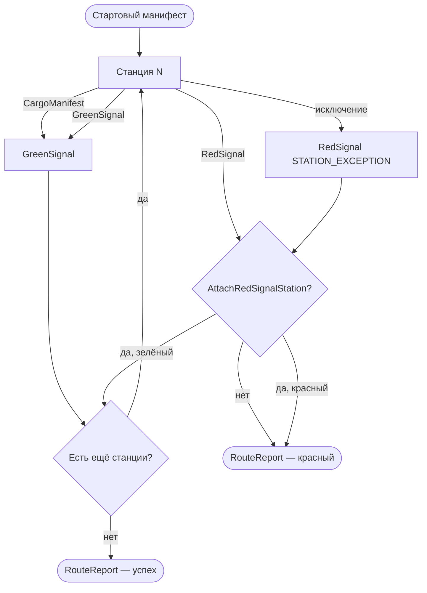

# Основной API

## CargoManifest

Неизменяемый контейнер вагонов. Любая мутация возвращает **новый** экземпляр.

| Метод | Описание |
|-------|----------|
| `HasCar(string carName)` | Проверка наличия вагона |
| `PullCar<T>(string carName)` | Чтение типизированного значения (бросает, если вагон отсутствует или тип не совпадает) |
| `LoadCar(string carName, object cargo)` | Добавить или заменить вагон |
| `UnloadCar(string carName)` | Удалить вагон |
| `InspectCars()` | Снимок всех вагонов (`IReadOnlyDictionary<string, object>`) |

```csharp
var manifest = new CargoManifest()
    .LoadCar("id", "pay-1")
    .LoadCar("amount", 100m);

var next = manifest
    .LoadCar("amount", 90m)   // замена
    .UnloadCar("temporary");  // удаление
```

Имена вагонов чувствительны к регистру (сравнение ordinal).

## TrainRoute и Train

### Построение маршрута

```csharp
var route = new TrainRoute()
    .AttachStation("A", manifest => manifest.LoadCar("a", 1))
    .AttachStation("B", manifest => manifest.LoadCar("b", 2));
```

### Запуск

```csharp
var train = route.DispatchTrain();

// Пустой стартовый манифест
var report = train.Travel();

// С начальным манифестом
var report2 = train.Travel(new CargoManifest().LoadCar("id", 1));

// С отменой
var report3 = train.Travel(cancellationToken);
```

### Асинхронное выполнение

Для станций с `Task` / `Task<T>` используйте `TravelAsync`:

```csharp
var route = new TrainRoute()
    .AttachStation("Fetch", async (manifest, token) =>
    {
        await Task.Delay(50, token);
        return manifest.LoadCar("loaded", true);
    });

var report = await route.DispatchTrain().TravelAsync();
```

> **Важно:** вызов `Travel()` на маршруте с async-станциями бросает `InvalidOperationException` с текстом «Use TravelAsync».

### Перегрузки AttachStation

Станция может принимать разные сигнатуры обработчика:

| Возврат | Синхронно | С `CancellationToken` |
|---------|-----------|------------------------|
| `CargoManifest` | `Func<CargoManifest, CargoManifest>` | `Func<CargoManifest, CancellationToken, CargoManifest>` |
| `Signal` | `Func<CargoManifest, Signal>` | `Func<CargoManifest, CancellationToken, Signal>` |
| `Task<CargoManifest>` | `Func<CargoManifest, Task<CargoManifest>>` | `Func<CargoManifest, CancellationToken, Task<CargoManifest>>` |
| `Task<Signal>` | `Func<CargoManifest, Task<Signal>>` | `Func<CargoManifest, CancellationToken, Task<Signal>>` |

Если обработчик возвращает `CargoManifest`, библиотека автоматически оборачивает результат в `GreenSignal`. `null` манифест трактуется как «оставить прежний».

## Сигналы

### Зелёный сигнал

Маршрут продолжается. Манифест из сигнала передаётся на следующую станцию.

```csharp
return RailwaySignals.Green(manifest);
// или просто return manifest;  — в through-перегрузках
```

### Красный сигнал

Маршрут останавливается на этой станции (последующие станции **не** выполняются).

**Manifest-стиль:**

```csharp
return RailwaySignals.Red(
    manifest,
    new SignalIssue("REQ_MISSING", "request-id is required", "Validation"));
```

**Data-oriented стиль** (handler без `RailwaySignals`):

```csharp
.Station("Validate", (string paymentId, decimal amount) =>
    amount > 0
        ? Data.Ok(new { paymentId, amount })
        : Data.Fail("INVALID_TOTAL", "amount must be positive"))
```

Адаптер преобразует `Data.Fail` в `RailwaySignals.Red` с `SignalIssue(code, message, stationName)`.

Допустимые возвраты data-handler'а:

| Возврат | Поведение |
|---------|-----------|
| анонимный тип / record | merge в манифест → зелёный сигнал |
| `Data.Ok(payload)` | merge payload → зелёный сигнал |
| `Data.Fail(code, msg)` | красный сигнал, маршрут останавливается |
| `Data.Skip()` | манифест без изменений → зелёный сигнал |

`SignalIssue` содержит:

- `Code` — машиночитаемый код ошибки
- `Message` — описание для человека
- `StationName` — имя станции, вернувшей красный сигнал

### Проверка результата

```csharp
var report = route.DispatchTrain().Travel();

if (report.ReachedDestination)
{
    // TerminalSignal — GreenSignal
    var manifest = report.TerminalSignal.Manifest;
}
else
{
    var red = (RedSignal)report.TerminalSignal;
    Console.WriteLine(red.Issue.Code);
}

// История прохождения
foreach (var visit in report.Visits)
{
    Console.WriteLine($"{visit.StationName}: {(visit.Signal.IsGreen ? "green" : "red")}");
}
```

## Обработка красного сигнала (AttachRedSignalStation)

Один глобальный обработчик на маршрут. Вызывается при любом красном сигнале от обычной станции. Может вернуть зелёный сигнал и **продолжить** маршрут с оставшихся станций.

```csharp
var route = new TrainRoute()
    .AttachStation("Validation", manifest =>
        RailwaySignals.Red(manifest, new SignalIssue("FAIL", "validation failed", "Validation")))
    .AttachRedSignalStation("Recovery", red =>
    {
        var recovered = red.Manifest.LoadCar("recovered", true);
        return RailwaySignals.Green(recovered);
    })
    .AttachStation("AfterRecovery", manifest =>
        manifest.LoadCar("after", "ok"));

var report = route.DispatchTrain().Travel();
// Visits: Validation → SignalControl → AfterRecovery
```

Async-вариант:

```csharp
.AttachRedSignalStation("Recovery", async (red, token) =>
{
    await Task.Delay(10, token);
    return RailwaySignals.Green(red.Manifest);
});
```

Если обработчик красного сигнала не зарегистрирован, маршрут завершается с красным `TerminalSignal`.

**Data-oriented handler + recovery:** станция валидации возвращает `Data.Fail`; recovery остаётся manifest-level:

```csharp
var route = new TrainRoute()
    .Station("Seed", () => new { amount = -1m })
    .Station("Validate", (decimal amount) =>
        amount > 0 ? Data.Ok(new { amount }) : Data.Fail("INVALID", "amount must be positive"))
    .AttachRedSignalStation("Recovery", red =>
        RailwaySignals.Green(red.Manifest.LoadCar("amount", 1m)))
    .Station("Double", (decimal amount) => new { amount = amount * 2m });
```

## Отмена (CancellationToken)

```csharp
using var cts = new CancellationTokenSource(TimeSpan.FromSeconds(2));

var route = new TrainRoute()
    .AttachStation("Work", (manifest, token) =>
    {
        token.ThrowIfCancellationRequested();
        return manifest;
    });

route.DispatchTrain().Travel(cts.Token);
// или
await route.DispatchTrain().TravelAsync(cts.Token);
```

`OperationCanceledException` пробрасывается наружу и **не** преобразуется в красный сигнал.

## Необработанные исключения

Исключение внутри станции (кроме отмены) преобразуется в красный сигнал:

| Поле | Значение |
|------|----------|
| `Issue.Code` | `STATION_EXCEPTION` |
| `Issue.Message` | `Unhandled station exception: {сообщение}` |
| `Issue.StationName` | имя станции |

Аналогично для `AttachRedSignalStation` — код `RED_SIGNAL_STATION_EXCEPTION`.

## Схема выполнения


