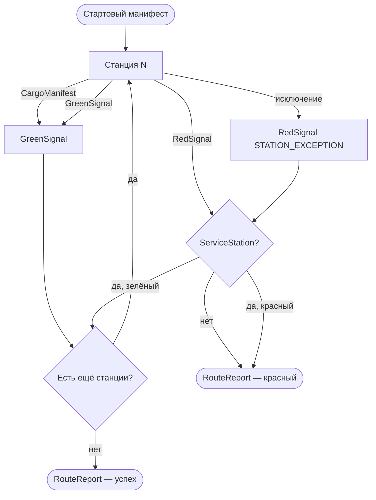

# Основной API

## CargoManifest

Неизменяемый контейнер вагонов. Любая мутация возвращает **новый** экземпляр.

| Метод | Описание |
|-------|----------|
| `HasWagon(string wagonName)` | Проверка наличия вагона |
| `PullWagon<T>(string wagonName)` | Чтение типизированного значения (бросает, если вагон отсутствует или тип не совпадает) |
| `LoadWagon(string wagonName, object cargo)` | Добавить или заменить вагон |
| `UnloadWagon(string wagonName)` | Удалить вагон |
| `InspectWagons()` | Снимок всех вагонов (`IReadOnlyDictionary<string, object>`) |

```csharp
var manifest = new CargoManifest()
    .LoadWagon("id", "pay-1")
    .LoadWagon("amount", 100m);

var next = manifest
    .LoadWagon("amount", 90m)   // замена
    .UnloadWagon("temporary");  // удаление
```

Имена вагонов чувствительны к регистру (сравнение ordinal).

## TrainRoute и Train

### Построение маршрута (data-oriented)

```csharp
var route = new TrainRoute()
    .Station("Seed", () => new { paymentId = "pay-1", amount = 100m })
    .Station("Discount", (string paymentId, decimal amount) =>
        new { paymentId, amount = amount * 0.9m });
```

Имена параметров handler'а = ключи вагонов. Первая станция без параметров — seed. Генератор создаёт адаптеры вызовов станций.

### Запуск

```csharp
var train = route.DispatchTrain();

// Пустой стартовый манифест
var report = train.Travel();

// С начальным манифестом
var report2 = train.Travel(new CargoManifest().LoadWagon("id", 1));

// С отменой
var report3 = train.Travel(cancellationToken);
```

### Асинхронное выполнение

Для станций с `Task` / `Task<T>` используйте `StationAsync` и `TravelAsync`:

```csharp
var route = new TrainRoute()
    .Station("Seed", () => new { counter = 10 })
    .StationAsync("Fetch", async (int counter, CancellationToken token) =>
    {
        await Task.Delay(50, token);
        return new { counter = counter * 2 };
    });

var report = await route.DispatchTrain().TravelAsync();
```

> **Важно:** вызов `Travel()` на маршруте с async-станциями бросает `InvalidOperationException` с текстом «Use TravelAsync».

## Сигналы

### Зелёный сигнал

Маршрут продолжается. Манифест из сигнала передаётся на следующую станцию.

```csharp
return RailwaySignals.Green(manifest);
```

### Красный сигнал

Маршрут останавливается на этой станции (последующие станции **не** выполняются).

```csharp
.Station("Validate", (string paymentId, decimal amount) =>
    amount > 0
        ? RailwaySignals.Green(new { paymentId, amount })
        : RailwaySignals.Red("INVALID_TOTAL", "amount must be positive"))
```

Адаптер преобразует `RailwaySignals.Red(code, message)` в `RedSignal` с `SignalIssue(code, message, stationName)`.

Допустимые возвраты data-handler'а:

| Возврат | Поведение |
|---------|-----------|
| анонимный тип / record | merge в манифест → зелёный сигнал |
| `RailwaySignals.Green(payload)` | merge payload → зелёный сигнал |
| `RailwaySignals.Red(code, msg)` | красный сигнал, маршрут останавливается |
| `RailwaySignals.Pass` | манифест без изменений → зелёный сигнал (в т.ч. `ref`-вагоны: мутации в handler не попадают в манифест) |
| `void` (без return) | эквивалент `new { }` → partial merge: `ref`-вагоны обновляются, обычные входы выгружаются |
| `GreenSignal` / `RedSignal` | возврат как есть (например, при пробросе сигнала из подмаршрута) |

`RailwaySignals.Pass` пропускает merge целиком: следующая станция получит тот же манифест, что и до вызова handler'а. Изменения `ref`-параметров в теле handler'а при `Pass` **не сохраняются**. Чтобы записать новые значения `ref`-вагонов в манифест, используйте void (без `return`) или явный partial return (`new { }`, подмножество полей).

`SignalIssue` содержит:

- `Code` — машиночитаемый код ошибки
- `Message` — описание для человека
- `StationName` — имя станции, вернувшей красный сигнал

### Проверка результата

```csharp
var report = route.DispatchTrain().Travel();

if (report.ReachedDestination)
{
    // TerminalSignal — GreenSignal
    var manifest = report.TerminalSignal.Manifest;
    var paymentId = report.Get<string>("paymentId");
}
else
{
    var red = (RedSignal)report.TerminalSignal;
    Console.WriteLine(red.Issue.Code);
}

// История прохождения
foreach (var visit in report.Visits)
{
    Console.WriteLine($"{visit.StationName}: {(visit.Signal.IsGreen ? "green" : "red")}");
}
```

`RouteReport` поддерживает readonly индексатор `report["wagonName"]` и typed-метод `report.Get<T>("wagonName")` для чтения терминального вагона по имени.  
Если вагона нет, бросается `KeyNotFoundException`.

## Станция техобслуживания (ServiceStation)

Один глобальный обработчик на маршрут — «станция техобслуживания». Вызывается при любом красном сигнале от обычной станции. Может вернуть зелёный сигнал и **продолжить** маршрут с оставшихся станций.

**Data-oriented** (рекомендуется):

```csharp
var route = new TrainRoute()
    .Station("Seed", () => new { amount = -1m })
    .Station("Validate", (decimal amount) =>
        amount > 0 ? RailwaySignals.Green(new { amount }) : RailwaySignals.Red("INVALID", "amount must be positive"))
    .ServiceStation("Recovery", (decimal amount, SignalIssue issue) =>
        issue.Code == "INVALID"
            ? RailwaySignals.Green(new { amount = 1m })
            : RailwaySignals.Red("CANNOT_RECOVER", "unsupported failure"))
    .Station("Double", (decimal amount) => new { amount = amount * 2m });
```

Параметры handler'а станции техобслуживания:

| Параметр | Источник |
|----------|----------|
| вагоны (`amount`, …) | `red.Manifest` |
| `CargoManifest manifest` | `red.Manifest` |
| `SignalIssue issue` | `red.Issue` (код, сообщение, станция-источник) |
| `RedSignal red` | полный красный сигнал (escape hatch) |

Возврат — тот же контракт, что у обычных data-станций: `RailwaySignals.Green` / `Red` / `Pass`, анонимный тип, record, tuple.

Handler с сигнатурой `Func<RedSignal, Signal>` (и async-вариант) — escape hatch без codegen-адаптера; читайте `red.Manifest` и `red.Issue` напрямую.

Async-вариант data-handler'а:

```csharp
.ServiceStation("Recovery", async (decimal amount, SignalIssue issue, CancellationToken token) =>
{
    await Task.Delay(10, token);
    return RailwaySignals.Green(new { amount = 1m });
});
```

Если станция техобслуживания не зарегистрирована, маршрут завершается с красным `TerminalSignal`.

## Вложенные маршруты и ветвление

TrainOP не имеет отдельного API «switch/fork». Вложенные маршруты и ветвление собираются **композицией**:

1. **Подмаршруты** — отдельные `TrainRoute`, обычно в статических фабриках (`Build()`).
2. **Станция ветвления** — data-oriented `.Station`, которая по данным вагонов выбирает подмаршрут и вызывает `subRoute.DispatchTrain().Travel(manifest)`.
3. **Красный сигнал** подмаршрута пробрасывается наверх как `TerminalSignal` родительского маршрута.

Каждый подмаршрут с цепочкой `.Station(...)` анализируется генератором **независимо**. Станция ветвления входит в data-oriented граф родительского маршрута.

```csharp
internal static class PremiumBranchRoute
{
    public static TrainRoute Build() => new TrainRoute()
        .Station("ApplyPremiumDiscount", (string paymentId, decimal amount) =>
            new { paymentId = paymentId + "-premium", amount = amount * 0.8m, channel = "premium" });
}

internal static class StandardBranchRoute
{
    public static TrainRoute Build() => new TrainRoute()
        .Station("ApplyStandardFee", (string paymentId, decimal amount) =>
            new { paymentId = paymentId + "-standard", amount = amount + 2m, channel = "standard" });
}

var route = new TrainRoute()
    .Station("Seed", () => new { paymentId = "pay-branch", amount = 100m, tier = "premium" })
    .Station("Branch", (string paymentId, decimal amount, string tier) =>
    {
        var manifest = new CargoManifest()
            .LoadWagon("paymentId", paymentId)
            .LoadWagon("amount", amount)
            .LoadWagon("tier", tier);

        var subRoute = tier == "premium"
            ? PremiumBranchRoute.Build()
            : StandardBranchRoute.Build();

        var subReport = subRoute.DispatchTrain().Travel(manifest);
        if (!subReport.ReachedDestination)
        {
            return subReport.TerminalSignal;
        }

        var subManifest = subReport.TerminalSignal.Manifest;
        return new
        {
            paymentId = subManifest.PullWagon<string>("paymentId"),
            amount = subManifest.PullWagon<decimal>("amount"),
            channel = subManifest.PullWagon<string>("channel"),
        };
    })
    .Station("Finalize", (string paymentId, decimal amount, string channel) =>
        new { paymentId, amount, channel, status = "completed" });
```

Полный runnable-пример: `samples/TrainOP.Samples/Examples/NestedBranchingRouteExample.cs`.

## Отмена (CancellationToken)

```csharp
using var cts = new CancellationTokenSource(TimeSpan.FromSeconds(2));

var route = new TrainRoute()
    .Station("Seed", () => new { })
    .Station("Work", (CancellationToken token) =>
    {
        token.ThrowIfCancellationRequested();
        return RailwaySignals.Pass;
    });

route.DispatchTrain().Travel(cts.Token);
// или
await route.DispatchTrain().TravelAsync(cts.Token);
```

`OperationCanceledException` пробрасывается наружу и **не** преобразуется в красный сигнал.

## Необработанные исключения

Исключение внутри станции (кроме отмены) преобразуется в красный сигнал:

| Поле | Значение |
|------|----------|
| `Issue.Code` | `STATION_EXCEPTION` |
| `Issue.Message` | `Unhandled station exception: {сообщение}` |
| `Issue.StationName` | имя станции |

Аналогично для `ServiceStation` — код `SERVICE_STATION_EXCEPTION`.

## Схема выполнения


