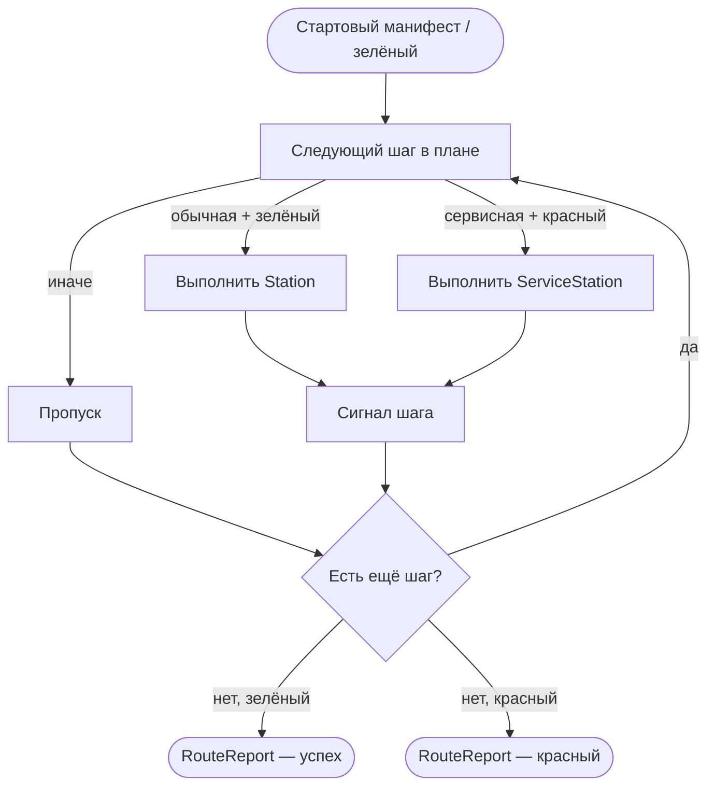

# Основной API

## CargoManifest

Мутабельный контейнер вагонов. `LoadWagon` / `UnloadWagon` изменяют экземпляр **на месте** и возвращают `this` (удобно для fluent-цепочек).

| Метод | Описание |
|-------|----------|
| `HasWagon(string wagonName)` | Проверка наличия вагона |
| `TryGetWagon(string wagonName, out object cargo)` | Чтение без исключения, если вагона нет |
| `PullWagon<T>(string wagonName)` | Чтение типизированного значения (бросает, если вагон отсутствует или тип не совпадает) |
| `LoadWagon(string wagonName, object cargo)` | Добавить или заменить вагон (in-place) |
| `UnloadWagon(string wagonName)` | Удалить вагон (in-place) |
| `InspectWagons()` | Live view вагонов (`IReadOnlyDictionary<string, object>`) |

```csharp
var manifest = new CargoManifest()
    .LoadWagon("id", "pay-1")
    .LoadWagon("amount", 100m);

manifest
    .LoadWagon("amount", 90m)   // замена
    .UnloadWagon("temporary");  // удаление
```

Имена вагонов чувствительны к регистру (сравнение ordinal).

## TrainRoute и Travel

### Построение маршрута (обработчики над данными)

```csharp
var route = new TrainRoute()
    .Station("Seed", () => new { paymentId = "pay-1", amount = 100m })
    .Station("Discount", (string paymentId, decimal amount) =>
        new { paymentId, amount = amount * 0.9m });
```

Имена параметров handler'а = ключи вагонов. Первая станция без параметров — seed. Генератор создаёт адаптеры вызовов станций.

**Допустимые формы handler'а** (в текущей compilation, доступной генератору):

- лямбда: `(string paymentId, decimal amount) => …`
- anonymous method: `delegate(string paymentId, decimal amount) { … }`
- method group / local function: `.Station("Discount", Discount)` где `Discount` объявлен в этом проекте

Не поддерживаются: переменные/`Func<>` без dataflow, неоднозначные перегрузки, методы только из referenced DLL без исходников — analyzer сообщает **TOP009**.

**Почему `Func<>` нельзя.** Source generator читает схему станции (имена параметров-вагонов, `ref`, форму возврата) только из лямбды, anonymous method или однозначного method group / local function в текущей compilation. Ссылка на `Func<>` — непрозрачный делегат без этих метаданных; dataflow к инициализатору не выполняется. У `Func<T1,T2,TResult>` нет ваших имён вагонов, а значение можно переназначить — compile-time схема маршрута перестала бы быть детерминированной.

**Валидные формы сборки цепочки** (analyzer / chain-dispatch):

```csharp
// 1) Прямая fluent-цепочка
var route = new TrainRoute()
    .Station("Seed", () => new { id = 1 })
    .Station("Next", (int id) => new { id = id + 1 });

// 2) Локальная после new TrainRoute()
var route = new TrainRoute();
route = route
    .Station("Seed", () => new { id = 1 })
    .Station("Next", (int id) => new { id = id + 1 });

// 3) Private/internal factory extension
var route = CreateSeed()
    .Station("Next", (int id) => new { id = id + 1 });

// 4) Public factory from referenced assembly (exported schema)
var route = PaymentModule.Build()
    .Station("Finalize", (string paymentId, decimal amount) => new { paymentId, status = "done" });
```

`PaymentRoute.Build()` с цепочкой **внутри** и вызовом только `.Travel()` снаружи по-прежнему поддерживается.

`CreateSeed().Station(...)` поддерживается для **private/internal** factory (inter-procedural analysis). **Public** factory использует generated schema (`[RouteSchemaFor]`). См. [cross-assembly-routes.md](cross-assembly-routes.md).

Параметр / поле / свойство / делегат как receiver (`baseRoute.Station(...)`, `buildRoute().Station(...)`) пока **не** поддерживаются (TOP005).

### Запуск

Стартовые вагоны появляются из станций: часто первая без параметров (`"Seed"` + замыкание / константы), иногда вызов метода, иногда несколько ранних станций, которые постепенно набирают состав. `"Seed"` — имя в примерах, не особый тип станции.

```csharp
RouteReport Handle(string paymentId, decimal amount) =>
    new TrainRoute()
        .Station("Seed", () => new { paymentId, amount })
        .Station("Discount", (string paymentId, decimal amount) =>
            new { paymentId, amount = amount * 0.9m })
        .Travel();

var report = route.Travel();
var paymentId = report.Get<string>("paymentId");
var amount = report.Get<decimal>("amount");
// или report["paymentId"]

// С отменой
var reportWithCt = route.Travel(cancellationToken);
```

**Правильно:** `() => new { paymentId, amount }`, `() => repo.Get(id)`, или несколько станций, пока analyzer видит произведённые вагоны.  
**Неправильно:** читать вагон до его появления (TOP001).

Доступ к терминальным вагонам — через `RouteReport` (`Get<T>` / индексатор). Typed deconstruct (`var (a, b) = …Travel()`) **не** используется: при C# 15 и ниже конфликты декомпозиции кортежей на общем terminal-типе не решаются языком.

### Асинхронное выполнение

Для станций с `Task` / `Task<T>` используйте `async`-лямбду в `Station` и `TravelAsync`:

```csharp
var route = new TrainRoute()
    .Station("Seed", () => new { counter = 10 })
    .Station("Fetch", async (int counter, CancellationToken token) =>
    {
        await Task.Delay(50, token);
        return new { counter = counter * 2 };
    });

var report = await route.TravelAsync();
```

> **Важно:** вызов `Travel()` на маршруте с async-станциями бросает `InvalidOperationException` с текстом «Use TravelAsync».

### Параметры `ref`

`ref` на вагоне — синтаксический сахар вместо явного возврата нового значения стандартным способом (`new { amount = … }` / `RailwaySignals.Green(...)`). Handler меняет параметр на месте; библиотека после вызова записывает значение обратно в манифест, даже если поля нет в возврате. Итог тот же, что у обычного возврата обновлённого вагона — короче только форма записи.

| Контекст | `ref` на вагонах | Почему |
|----------|------------------|--------|
| `.Station` | необязателен | по значению читает вагон; `ref` — сахар вместо возврата того же поля |
| `.ServiceStation` | необязателен | тот же контракт, что у `.Station`; возврат может только **обновить** уже существующие вагоны (добавление / снятие / замена манифеста — TOP015–TOP017) |
| `async` handler | **запрещён** | ограничение языка C# (**CS1988**): `async`-метод не может иметь параметры `ref`, `in` или `out` |

**Причина CS1988.** Компилятор превращает `async`-метод в машину состояний. Значения, которые переживают `await`, сохраняются в полях этой машины (обычно на куче). Параметр по ссылке — адрес чужой переменной; его нельзя безопасно удержать между `await`. Поэтому `async (ref decimal amount, …)` не компилируется.

Следствия для TrainOP:

- Асинхронная `.Station` принимает вагоны **по значению** и возвращает новые данные (`new { … }` / `RailwaySignals.Green`).
- `.ServiceStation` над данными — тот же вход/выход, но запись возврата **не меняет состав** манифеста (добавление / снятие / `CargoManifest` — TOP015–TOP017): последующие станции уже ждут этот набор, а техобслуживание может вовсе не вызваться.
- `async` + `ref` по-прежнему запрещены языком. Асинхронное восстановление с вагонами — по значению + возврат с обновлением существующих полей. Запасной вариант без вагонов: `(RedSignal red, CargoManifest manifest)` / `(RedSignal red, CargoManifest manifest, CancellationToken token)` и правки через `manifest.LoadWagon(...)`.

TrainOP считает вагоном по ссылке только `ref`. Параметры `in` / `out` в обратную запись не входят и с `async` тоже запрещены языком.

`RailwaySignals.White` **не записывает** возврат в манифест: изменения `ref` в handler при `White` в манифест **не** попадают (см. [возвраты handler'а](#красный-сигнал)).

## Сигналы

### Зелёный сигнал

Маршрут продолжается. Манифест из сигнала передаётся на следующую станцию.

### Красный сигнал

Маршрут останавливается на этой станции (последующие станции **не** выполняются).

```csharp
.Station("Validate", (string paymentId, decimal amount) =>
    amount > 0
        ? RailwaySignals.Green(new { paymentId, amount })
        : RailwaySignals.Red("INVALID_TOTAL", "amount must be positive"))
```

Адаптер преобразует `RailwaySignals.Red(code, message)` в `RedSignal` с `SignalIssue(code, message, stationName)`.

Допустимые возвраты data-handler'а:

| Возврат | Поведение |
|---------|-----------|
| анонимный тип / record | поля записываются в манифест → зелёный сигнал |
| `RailwaySignals.Green(...)` с данными | данные из аргумента записываются в манифест → зелёный сигнал |
| `RailwaySignals.Red(code, msg)` | красный сигнал, маршрут останавливается |
| `RailwaySignals.White` | манифест без изменений → продолжение маршрута (лунно-белый) (в т.ч. `ref`-вагоны: мутации в handler не попадают в манифест) |
| `void` (без return) | эквивалент `new { }` → частичный возврат: `ref`-вагоны обновляются, обычные входы выгружаются. На `ServiceStation` опуск non-`ref` входа — **TOP016** |

> **Не используйте** `GreenSignal` / `RedSignal` в возврате handler'а — это внутренние типы движка. Для остановки маршрута — `RailwaySignals.Red(code, msg)`; для успеха — данные или `RailwaySignals.Green(...)`. Возврат внутреннего сигнала диагностируется как **TOP010**.

### Примеры: что станет в манифесте

Исходный манифест: `paymentId` = `"pay-1"`, `amount` = `100m`, `note` = `"keep"` (`note` станция не принимает). Handler: `(string paymentId, decimal amount) => …`, если не указано иное.

| Возврат | Манифест после |
|---------|----------------|
| `new { paymentId, amount = 90m }` | `paymentId`, `amount` = `90`, `note` |
| `RailwaySignals.Green(new { paymentId, amount = 90m })` | то же |
| `new { amount = 90m }` | `amount` = `90`, `note` — **`paymentId` снят** |
| `new { paymentId, amount, status = "ok" }` | плюс новый `status`; `note` на месте |
| `RailwaySignals.White` | без изменений |
| `void` / `new { }` | только `note` — оба обычных входа сняты |
| `(string paymentId, ref decimal amount) => { amount *= 0.9m; }` | `amount` = `90`, `note` — **`paymentId` снят**, `amount` из `ref` |
| `(ref decimal amount) => { amount = 1m; return RailwaySignals.White; }` | без изменений — `White` не пишет даже `ref` |
| `RailwaySignals.Red(...)` | успешная запись не выполняется; дальше красная ветка обхода |

На `.ServiceStation` при том же исходном манифесте и входе `(decimal amount, …)`:

| Возврат | Результат |
|---------|-----------|
| `Green(new { amount = 1m })` | манифест: `paymentId`, `amount` = `1`, `note` |
| `new { amount = 1m, status = "x" }` | **TOP015** — нельзя добавить `status` |
| `new { amount = 1m }` (вход только `amount`) | то же обновление: входы **не** снимаются |
| `(string paymentId, decimal amount, …) => new { amount = 1m }` | **TOP016** — нельзя опустить вход `paymentId` |
| `return new CargoManifest()…` | **TOP017** — нельзя заменить манифест целиком |

Развёрнутый разбор тех же случаев — в [учебнике, глава 5](textbook.md#5-как-текут-данные).

### Value tuple returns

**Рекомендуется:** именованные кортежи — `(paymentId: id, amount: amt)` — или идентификаторы с inference — `(paymentId, amount)`.

**Почему избегать unnamed.** Неименованные кортежи аллоцируют `ItemN` по `max` живых `Item*` + 1; при разнесённой сборке маршрута (части в разных местах / сборках) легко потерять счёт, сколько и каких `ItemN` уже есть. Предпочитайте именованные формы, анонимные типы или records.

**Избегать default ItemN** (нет имени в исходнике и inference не сработал):

| Форма | Диагностика | Поведение |
|-------|-------------|-----------|
| `(paymentId + "-x", amount * 0.9m)` | **TOP006** (Warning, на tuple literal) | Omitted входы снимаются; элементы аллоцируются как новые `ItemN` (`max` существующих `Item*` + 1) |
| `(Item1: x, Item2: y)` | нет | Имена заданы явно (ключ манифеста = `ItemN`) |
| `(paymentId, amount)` | нет | Имена выведены из идентификаторов |
| `(paymentId, amount: amt)` | нет | Inference + явное имя |

```csharp
// ✅ явное имя
.Station("Discount", (string paymentId, decimal amount) =>
    (paymentId: paymentId + "-disc", amount: amount * 0.9m));

// ✅ inference
.Station("Discount", (string paymentId, decimal amount) =>
    (paymentId, amount));

// ⚠️ TOP006 — default ItemN → новые вагоны Item1/Item2
.Station("Discount", (string paymentId, decimal amount) =>
    (paymentId + "-disc", amount * 0.9m));
```

**Как обращаться после default ItemN.** Читайте аллоцированные ключи: `report.Get<string>("Item1")` / следующая станция `(string Item1, decimal Item2)`. Входы, которых нет в возврате по имени, уже сняты. Если `Item*` остались живы, следующий unnamed кортеж продолжит нумерацию (`Item3`…). Паттерн «создал → сразу потратил» на соседних станциях снова даёт `Item1`/`Item2` после unload. На `ServiceStation` добавление `ItemN` — **TOP015**.

`RailwaySignals.White` оставляет манифест как был: следующая станция получит тот же состав, что и до вызова handler'а. Изменения `ref`-параметров в теле handler'а при `White` **не сохраняются**. Чтобы записать новые значения `ref`-вагонов в манифест, используйте void (без `return`) или явный частичный возврат (`new { }`, подмножество полей).

`SignalIssue` содержит:

- `Code` — машиночитаемый код ошибки
- `Message` — описание для человека
- `StationName` — имя станции, вернувшей красный сигнал

`RedSignal` хранит **цепочку** issues: `Issues` (от корневой/вложенной причины к непосредственной остановке), `Issue` — последний элемент (та же семантика, что у `FailureCode` / `FailureMessage` в отчёте). Одна станция без вложенных поездов — один элемент.

При провале подмаршрута пробрасывайте цепочку в родительский red:

```csharp
if (!subReport.ReachedDestination)
{
    return RailwaySignals.Red("BRANCH_FAILED", "branch did not complete", subReport.FailureIssues);
}
```

`RouteReport.FailureIssues` — read-only вид той же цепочки из `TerminalSignal`.

### Проверка результата

```csharp
var report = route.Travel();

if (report.ReachedDestination)
{
    var paymentId = report.Get<string>("paymentId");
}
else
{
    Console.WriteLine($"{report.FailureCode}: {report.FailureMessage}");
}

// История прохождения
foreach (var visit in report.Visits)
{
    Console.WriteLine($"{visit.StationName}: {(visit.IsGreen ? "green" : "red")}");
}
```

`RouteReport` поддерживает readonly индексатор `report["wagonName"]`, typed-метод `report.Get<T>("wagonName")` и свойства `FailureCode` / `FailureMessage` для красного терминального сигнала.  
Если вагона нет, бросается `KeyNotFoundException`.

## Станция техобслуживания (ServiceStation)

`ServiceStation` — шаг в том же плане маршрута, что и обычные станции. Обход единый:

| Шаг | Входим, если предыдущий сигнал… | Иначе |
|-----|----------------------------------|--------|
| обычная `.Station` | зелёный | **пропуск** |
| `.ServiceStation` | красный | **пропуск** |

Поэтому рабочий сценарий: `Station → ServiceStation → Station → ServiceStation`. Упала обычная — вызывается **следующая за ней** сервисная (и далее по цепочке, пока сигнал красный). После зелёного сервисные шаги не трогаются. Если до конца маршрута красный так и не снят — итоговый отчёт красный.

**По позиции:**

```csharp
// Восстановление + продолжение хвоста — сразу после риска
.Station("Validate", …)
.ServiceStation("Recovery", …)
.Station("Charge", …)

// Финальный лог / аудит без восстановления — в конце нормально
.Station("Validate", …)
.Station("Charge", …)
.ServiceStation("LogFailure", (SignalIssue issue) =>
{
    logger.LogWarning("{Code}: {Message}", issue.Code, issue.Message);
    return RailwaySignals.Red(issue.Code, issue.Message);
})
```

Конечная ServiceStation не «догоняет» обычные станции, уже пропущенные при красном сигнале: для продолжения маршрута после починки ставьте восстановление **перед** нужным хвостом.

На техобслуживании возврат **не меняет состав** манифеста: можно обновить значения уже существующих вагонов. Попытка добавить новый вагон (**TOP015**), опустить входной non-`ref` вагон (**TOP016**) или вернуть `CargoManifest` (**TOP017**) — ошибка анализатора. На обычной станции частичный возврат как раз может снимать невозвращённые входы — на сервисной так нельзя.

**Рекомендуемый стиль (обработчик над данными):**

```csharp
var route = new TrainRoute()
    .Station("Seed", () => new { amount = -1m })
    .Station("Validate", (decimal amount) =>
        amount > 0 ? RailwaySignals.Green(new { amount }) : RailwaySignals.Red("INVALID", "amount must be positive"))
    .ServiceStation("Recovery", (decimal amount, SignalIssue issue) =>
        issue.Code == "INVALID"
            ? RailwaySignals.Green(new { amount = 1m })
            : RailwaySignals.Red("CANNOT_RECOVER", "unsupported failure"))
    .Station("Double", (decimal amount) => new { amount = amount * 2m });
```

Параметры handler'а станции техобслуживания:

| Параметр | Источник |
|----------|----------|
| вагоны (`amount`, …) | манифест рейса (по значению или необязательный `ref`, как у `.Station`) |
| `CargoManifest manifest` | тот же манифест рейса (framework-параметр / escape hatch) |
| `SignalIssue issue` | `red.Issue` — **последний** элемент цепочки (непосредственная остановка) |
| `IReadOnlyList<SignalIssue> issues` | `red.Issues` — полная цепочка (корень → непосредственная остановка) |
| `RedSignal red` | полный красный сигнал (issues; без груза) |

При одной ошибке без вложенных поездов `issue` и `issues[0]` — одна и та же запись. При провале подмаршрута `issue` — обёртка родителя; корневая причина — в `issues[0]`.

Возврат — тот же контракт, что у обычных станций над данными: `RailwaySignals.Green` / `Red` / `White`, анонимный тип, record, tuple. Отличие одно: запись в манифест **не меняет его состав**. Успешный возврат обновляет значения уже существующих ключей. Добавление ключа, снятие входного вагона или замена манифеста — **TOP015** / **TOP016** / **TOP017**. Красный сигнал и `RailwaySignals.White` манифест не трогают (в т.ч. изменения `ref` при `White` не записываются).

Handler с сигнатурой `Func<RedSignal, CargoManifest, Signal>` (и асинхронный вариант) — запасной низкоуровневый вариант без сгенерированного адаптера вагонов; правьте `manifest`, читайте `red.Issue` / `red.Issues`.

Вагоны на ServiceStation — как на станции (по значению или `ref`). C# запрещает `async` + `ref` (**CS1988**). Асинхронное восстановление с вагонами — по значению:

```csharp
.ServiceStation("Recovery", async (decimal amount, SignalIssue issue, CancellationToken token) =>
{
    await Task.Delay(10, token);
    return issue.Code == "INVALID"
        ? RailwaySignals.Green(new { amount = 1m })
        : RailwaySignals.Red("CANNOT_RECOVER", "unsupported failure");
});
```

Низкоуровневый вариант без вагонов остаётся: `Func<RedSignal, CargoManifest, CancellationToken, Task<Signal>>` и правки через `manifest.LoadWagon(...)`.

Если после красного сигнала дальше по плану нет подходящей ServiceStation (или все снова вернули красный), маршрут завершается с красным `TerminalSignal`.

Runnable-обзор всех служебных параметров Station / ServiceStation: `samples/TrainOP.Samples/Examples/FrameworkParametersExample.cs`.

## Вложенные маршруты и ветвление

TrainOP не имеет отдельного API «switch/fork». Вложенные маршруты и ветвление собираются **композицией**:

1. **Подмаршруты** — отдельные `TrainRoute`, обычно в статических фабриках `Build(...)` с собственной первой загрузочной станцией.
2. **Станция ветвления** — `.Station` над данными, которая по вагонам выбирает подмаршрут (`Build(paymentId, amount, …)`) и вызывает `subRoute.Travel()`.
3. **Результат подмаршрута** — родительская станция читает `RouteReport` подмаршрута и **сама** формирует возврат: данные (`new { … }`) или `RailwaySignals.Red(...)`. Проброс `TerminalSignal` / `GreenSignal` / `RedSignal` не используется.

Каждый подмаршрут с цепочкой `.Station(...)` анализируется генератором **независимо**. Станция ветвления входит в граф родительского маршрута. Манифест в пользовательском коде не собирают: данные уходят в первую станцию дочернего маршрута.

```csharp
internal static class PremiumBranchRoute
{
    public static TrainRoute Build(string paymentId, decimal amount) => new TrainRoute()
        .Station("Seed", () => new { paymentId, amount })
        .Station("ApplyPremiumDiscount", (string paymentId, decimal amount) =>
            new { paymentId = paymentId + "-premium", amount = amount * 0.8m, channel = "premium" });
}

internal static class StandardBranchRoute
{
    public static TrainRoute Build(string paymentId, decimal amount) => new TrainRoute()
        .Station("Seed", () => new { paymentId, amount })
        .Station("ApplyStandardFee", (string paymentId, decimal amount) =>
            new { paymentId = paymentId + "-standard", amount = amount + 2m, channel = "standard" });
}

var route = new TrainRoute()
    .Station("Seed", () => new { paymentId = "pay-branch", amount = 100m, tier = "premium" })
    .Station("Branch", (string paymentId, decimal amount, string tier) =>
    {
        var subRoute = tier == "premium"
            ? PremiumBranchRoute.Build(paymentId, amount)
            : StandardBranchRoute.Build(paymentId, amount);

        var subReport = subRoute.Travel();
        if (!subReport.ReachedDestination)
        {
            return RailwaySignals.Red(
                "BRANCH_FAILED",
                $"tier '{tier}' did not complete",
                subReport.FailureIssues);
        }

        return new
        {
            paymentId = subReport.Get<string>("paymentId"),
            amount = subReport.Get<decimal>("amount"),
            channel = subReport.Get<string>("channel"),
        };
    })
    .Station("Finalize", (string paymentId, decimal amount, string channel) =>
        new { paymentId, amount, channel, status = "completed" });
```

Полный runnable-пример: `samples/TrainOP.Samples/Examples/NestedBranchingRouteExample.cs`.

## Отмена (CancellationToken)

```csharp
using var cts = new CancellationTokenSource(TimeSpan.FromSeconds(2));

var route = new TrainRoute()
    .Station("Seed", () => new { })
    .Station("Work", (CancellationToken token) =>
    {
        token.ThrowIfCancellationRequested();
        return RailwaySignals.White;
    });

route.Travel(cts.Token);
// или
await route.TravelAsync(cts.Token);
```

`OperationCanceledException` пробрасывается наружу и **не** преобразуется в красный сигнал.

## Необработанные исключения

Исключение внутри станции (кроме отмены) преобразуется в красный сигнал:

| Поле | Значение |
|------|----------|
| `Issue.Code` | `STATION_EXCEPTION` |
| `Issue.Message` | `Unhandled station exception: {сообщение}` |
| `Issue.StationName` | имя станции |

Аналогично для `ServiceStation` — код `SERVICE_STATION_EXCEPTION`.

## Диагностики (analyzer)

| ID | Severity | Условие |
|----|----------|---------|
| `TOP001` | Error | Станция требует вагон, не произведённый ранее |
| `TOP002` | Error | Конфликт типов вагона между станциями |
| `TOP003` | Error | Вагон удалён частичным возвратом, но нужен дальше |
| `TOP004` | Warning | Handler вернул `CargoManifest` — полная замена манифеста |
| `TOP005` | Error | Data-handler вне легитимного якоря `TrainRoute` |
| `TOP006` | Warning | Value tuple с default ItemN → новые вагоны ItemN после unload omitted входов |
| `TOP007` | Error | Конфликт имён вагонов для одной сигнатуры handler'а (вне цепочки; внутри цепочки — разведение по месту вызова) |
| `TOP008` | Error | Нельзя соединить ветки маршрута перед downstream Station |
| `TOP009` | Error | Handler не лямбда / anonymous / однозначный method group |
| `TOP010` | Error | Handler возвращает `GreenSignal` / `RedSignal` вместо data / `RailwaySignals` |
| `TOP011` | Info | Public factory в referenced assembly без exported schema |
| `TOP012` | Error | Return-paths factory имеют разное terminal-множество |
| `TOP013` | Error | Return-path factory с unknown terminal state |
| `TOP014` | Error | Больше одного `new TrainRoute()` на одной строке исходника в методе |
| `TOP015` | Error | ServiceStation возвращает новый вагон (меняет состав манифеста) |
| `TOP016` | Error | ServiceStation опускает входной non-`ref` вагон (меняет состав манифеста) |
| `TOP017` | Error | ServiceStation возвращает `CargoManifest` (полная замена манифеста) |

### Chain-dispatch

При нескольких цепочках с одной сигнатурой типов, но разными именами вагонов генератор разводит привязки по месту вызова: `new TrainRoute()` идентифицирует цепочку, каждая `.Station` получает привязку на этапе компиляции по `CallerChainKey` + порядковому индексу.

Cross-assembly: [cross-assembly-routes.md](cross-assembly-routes.md). Release tracking: `AnalyzerReleases.Shipped.md`.

## Advanced / generator surface (не для ручного API)

Следующие типы остаются **public** (generated adapters и cross-assembly schema читают их через reflection), но скрыты из IntelliSense через `[EditorBrowsable(Never)]`:

| Тип | Назначение |
|-----|------------|
| `TrainRoute.RegisterStation(...)` | Низкоуровневая регистрация адаптеров (генератор) |
| `StationMerge` | Запись возврата handler → манифест / сигнал |
| `WagonStationReturn` | Чтение членов возврата (запасной путь записи в манифест) |
| `RouteSchemaForAttribute` / `RouteSchemaWagonAttribute` | Metadata exported schema (генератор) |
| `CallerChainKeyFormat` | Формат caller-dispatch keys |

Поддерживаемый пользовательский API — fluent `.Station` / `.ServiceStation`, `RailwaySignals`, `Travel()`.

## Схема выполнения


```mermaid
flowchart TD
    Start([Стартовый манифест / зелёный]) --> Hop[Следующий шаг в плане]
    Hop -->|обычная + зелёный| Station[Выполнить Station]
    Hop -->|сервисная + красный| Service[Выполнить ServiceStation]
    Hop -->|иначе| Skip[Пропуск]
    Skip --> More{Есть ещё шаг?}
    Station --> Signal[Сигнал шага]
    Service --> Signal
    Signal --> More
    More -->|да| Hop
    More -->|нет, зелёный| Done([RouteReport — успех])
    More -->|нет, красный| Fail([RouteReport — красный])
```
