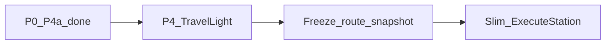

# План: ускорение библиотеки TrainOP (продолжение)

> **Статус:** не начат.  
> **Цель:** снизить стоимость инфраструктуры hop в `Travel()` / `TravelAsync` без изменения data-oriented UX handler'ов.  
> **Метрика успеха:** снижение Ratio и/или Alloc в `LibraryVsManualBenchmarks` (TravelOnly; отдельно — TravelLight). Цель — не догнать manual ns.  
> **Связанный план:** [`plan-performance.md`](plan-performance.md) (P0–P3 + P4a выполнены; P5 снято; P4 pending).

---

## Контекст

Базовый разрыв с manual (~70–150× на TravelOnly) — цена манифеста, адаптеров и отчёта, не арифметика станций. P0–P3 и P4a уже сделаны; P5 (typed bags) откатили из‑за регрессии CPU.



### Что уже даёт выигрыш без нового кода

- Кэшировать `TrainRoute` и гонять только `Travel()` (бенчмарки разделяют BuildAndTravel vs TravelOnly).
- В handler'ах предпочитать named / `ValueTuple` вместо `new { ... }` — меньше аллокаций на hop (сторона вызывающего кода, не runtime).

---

## Курс работ

### 1. P4 — Lightweight travel API

Opt-in без накопления `StationVisit`: `TravelLight()` + async-пара (имя зафиксировано; не overload `Travel(recordVisits: false)`).

- В [`src/TrainOP/TrainRouteRuntime.cs`](../src/TrainOP/TrainRouteRuntime.cs): ветка в `TravelCore` / `TravelCoreAsync` — не вызывать `visits.Add`; в `RouteReport` отдавать пустую коллекцию (не `null`).
- `TerminalSignal` / `Manifest` / `Get` / `Failure*` без изменений семантики.
- Docs: [`core-api.md`](core-api.md), строка в [`plan-performance.md`](plan-performance.md) §7; при необходимости бенчмарк TravelLight vs TravelOnly.

**Ожидание:** средний выигрыш Alloc на длинных маршрутах, когда журнал шагов не нужен.

### 2. Freeze маршрута — убрать snapshot на каждый Travel

Сейчас каждый прогон копирует список:

```csharp
var route = new List<StationPlan>(_route);
```

- Публичный `Freeze()` + ленивый freeze-on-first-`Travel`: после freeze `RegisterStation` / `.Station` бросают; executor читает `_route` / `StationPlan[]` **без** `new List<>(_route)`.
- Контракт: «мутации builder после старта run не влияют» через freeze (документировать).

**Решение по умолчанию:** freeze-on-first-`Travel` (ленивый), с публичным `Freeze()` для явной фиксации до первого прогона. Паттерн «собрал маршрут → много Travel» сохраняется; snapshot-аллокация исчезает после первого прогона.

**Ожидание:** −1 `List` + копирование N ссылок на каждый повторный TravelOnly.

### 3. Slim диспетчер hop

В `ExecuteStation` / `ExecuteStationAsync` — цепочка `if (plan.X != null)` по нескольким делегатам ([`StationPlan.cs`](../src/TrainOP/StationPlan.cs)).

- Ввести `enum StationInvokeKind` (или аналог) + один релевантный делегат на plan при регистрации.
- Убрать лишние null-проверки на hot path; поведение async/sync и service station без изменений.

**Ожидание:** небольшой, но стабильный выигрыш CPU на hop (особенно короткие маршруты вроде Payment).

### 4. Не делать (уже отвергнуто / высокий риск)

- **P5 typed bags** — не возобновлять (регрессия на Payment/Checkout).
- Полная генерация unrolled `Travel` под цепочку — отдельный spike только после профилирования post-P4/freeze; в этот курс не входит.
- Смена `Dictionary<string,object>` на слоты по индексу — только как отдельный эксперимент после замеров; не смешивать с P4/freeze.

---

## Файлы

| Файл | Назначение |
|------|------------|
| [`src/TrainOP/TrainRouteRuntime.cs`](../src/TrainOP/TrainRouteRuntime.cs) | `Travel` / freeze / executor |
| [`src/TrainOP/StationPlan.cs`](../src/TrainOP/StationPlan.cs) | kind + один делегат |
| [`docs/plan-performance.md`](plan-performance.md) | история / статус P4 |
| [`docs/core-api.md`](core-api.md) | публичный API |
| [`benchmarks/TrainOP.Benchmarks/LibraryVsManualBenchmarks.cs`](../benchmarks/TrainOP.Benchmarks/LibraryVsManualBenchmarks.cs) | метрики |

---

## История

| Дата | Изменение |
|------|-----------|
| 2026-09-16 | Создание плана продолжения: P4 → freeze → slim dispatch |
