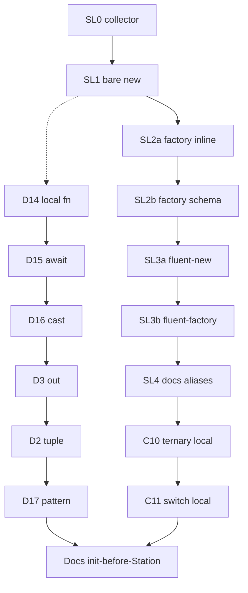

# План реализации: statement-local + прочие якоря

> **Статус:** **закрыт** — SL + D + C-10/C-11 + DOC-4 сделаны (gate — у оператора).  
> **Детализация:** [`plan-statement-local-chains.md`](plan-statement-local-chains.md), [`plan-misc-csharp-anchors.md`](plan-misc-csharp-anchors.md).  
> **Аудитория:** разработчики и AI-агенты.

---

Сводка из планов statement-local и «Прочий C#». Opaque без явной схемы манифеста и отвергнутый «прочий C#» **не** входят.

**Сделано:** A0-матрица misc; принципы; заметка opaque+схема манифеста; **SL-0…SL-4**; **D-***; **C-10**; **C-11**; **DOC-4**.

**Build gate** (агент не гоняет без явной просьбы):

```bash
dotnet test tests/TrainOP.Generators.Tests/TrainOP.Generators.Tests.csproj -c Release
dotnet test tests/TrainOP.Tests/TrainOP.Tests.csproj -c Release
```

SL-2b + RouteConsumer; финал — `dotnet test TrainOP.sln -c Release`.

Ключевые файлы: [`RouteChainWalker.cs`](../src/TrainOP.Generators/RouteGraph/RouteChainWalker.cs), [`RouteGraphAssembler.cs`](../src/TrainOP.Generators/RouteGraph/RouteGraphAssembler.cs), [`RouteFactoryPathSimulator.cs`](../src/TrainOP.Generators/Discovery/RouteFactoryPathSimulator.cs).



## ToDo

| Id | Работа | Статус |
|----|--------|--------|
| SL-0 | `CollectLocalStatementStationLinks`; `BuildAnchorKey` по origin; preceding-origin API | 🟢 сделано |
| SL-1 | `LocalVariable` после bare `new` + EndingAt + тесты + gate | 🟢 сделано (gate — у оператора) |
| SL-2a | Локаль после private/internal factory + gate | 🟢 сделано (gate — у оператора) |
| SL-2b | Локаль после public `FactorySchema` + RouteConsumer gate | 🟢 сделано (gate — у оператора) |
| SL-3a | Fluent-RHS root `new` + gate | 🟢 сделано (gate — у оператора) |
| SL-3b | Fluent-RHS root factory + gate | 🟢 сделано (gate — у оператора) |
| SL-4 | Docs statement-local; алиасы TOP005; финальный gate | 🟢 сделано (gate — у оператора) |
| D-14 | Local function = factory | 🟢 сделано (gate — у оператора) |
| D-15 | `await` — все origin/factory | 🟢 сделано (gate — у оператора) |
| D-16 | Cast docs/тесты | 🟢 сделано (gate — у оператора) |
| D-3 | `out TrainRoute` ≈ return/factory | 🟢 сделано (gate — у оператора) |
| D-2 | Узкий tuple/deconstruct | 🟢 сделано (gate — у оператора) |
| D-17 | Pattern `is`/`switch` с known origin | 🟢 сделано (gate — у оператора) |
| C-10 | `?:` assign локали + join (после SL) | 🟢 сделано (gate — у оператора) |
| C-11 | `switch` assign локали + join (после SL) | 🟢 сделано (gate — у оператора) |
| DOC-4 | Init-before-Station + README | 🟢 сделано (gate — у оператора) |

## Вне скоупа

- Параметр / поле / свойство / делегат; opaque без утверждённой схемы манифеста.
- Массив, indexer, reflection, `dynamic`, LINQ, dual-writer алиасы, static field, collection expr, `ref`/`in`.
- CFG statement-`if`/`else` без join; using/IDisposable (N/A).

## Handoff

```text
Планы якорей закрыты: @docs/plan-anchors-implementation.md
Детали: @docs/plan-statement-local-chains.md @docs/plan-misc-csharp-anchors.md
Не запускай dotnet test/build, пока я явно не попрошу.
TrainOP; когитатор; not-work-project.
```
