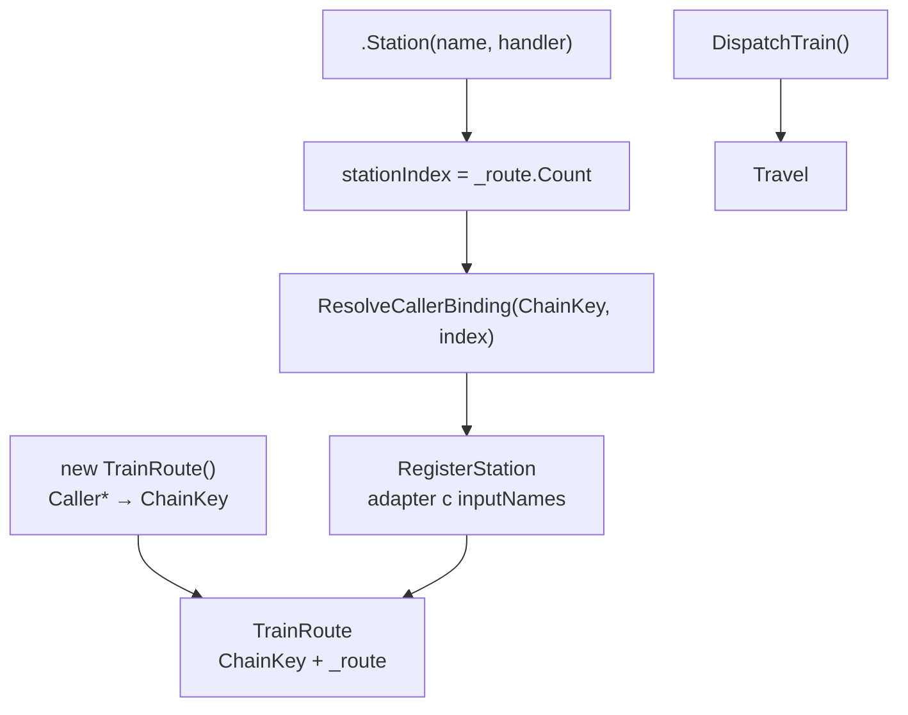

# План: data-oriented handlers (только данные на вход и выход)

> **Статус:** **выполнено** фазы 0–8 (включая factory anchors + schema export/import, merge ветвлений §3.8.5); **отложено** якоря параметр / поле / свойство / делегат; **идея** альтернатива Station-interceptors через Caller* (§4.3); **снято** typed Travel (фазы 9–12).  
> **Терминалы:** `RouteReport` indexer / `Get<T>` (C# ≤15 — конфликты декомпозиции кортежей нерешаемы).  
> **Цель:** handler станции = чистая функция над данными; `CargoManifest`, `LoadWagon`, `PullWagon`, `RailwaySignals` скрыты в сгенерированном адаптере.  
> **Производительность Travel:** см. [`plan-performance.md`](plan-performance.md) (P0–P3 + P4a; P5 снято).  
> **Аудитория:** разработчики и AI-агенты, продолжающие работу над TrainOP.

---

## 1. Целевое состояние

### 1.1. Как выглядит код пользователя

```csharp
public static class PaymentRoute
{
  public static TrainRoute Build() => new TrainRoute()
      .Station("Init", () => new { paymentId = "pay-1", amount = 100m })
      .Station("Discount", (string paymentId, decimal amount) =>
          new { paymentId, amount = amount * 0.9m })
      .Station("Validate", (string paymentId, decimal amount) =>
          amount > 0
              ? RailwaySignals.Green(new { paymentId, amount })
              : RailwaySignals.Red("INVALID_TOTAL", "amount must be positive"));
}

var report = PaymentRoute.Build().DispatchTrain().Travel();
var paymentId = report.Get<string>("paymentId");
var amount = report.Get<decimal>("amount");
```

Расширение factory без локальной «seed»-станции — тоже нормальный паттерн:

```csharp
public static TrainRoute Build() =>
    PaymentModule.Build()
        .Station("Finalize", (string paymentId, decimal amount) =>
            new { paymentId, status = "completed" });
```

**Без атрибутов на handler'ах.** Analyzer находит цепочку по `new TrainRoute()`…`.Station(…)`; `chainId` = FQN метода/типа-контейнера (например `PaymentRoute.Build`).

**В теле handler'а нет:**
- `CargoManifest`, `LoadWagon`, `PullWagon`, `UnloadWagon`
- `new CargoManifest()`

### 1.2. Принципы

| Принцип | Описание |
|---------|----------|
| **Data in** | Параметры handler'а = вагоны; имя параметра = ключ манифеста |
| **Data out** | Анонимный тип / record / tuple / `RailwaySignals.Green` / `RailwaySignals.Red` / `RailwaySignals.Pass` |
| **Adapter generated** | Маппинг manifest ↔ handler — только в `*.g.cs` |
| **Chain validated** | Компилятор проверяет поток вагонов по цепочке станций |
| **Library at boundary** | TrainOP API только в точке сборки маршрута и в runtime-движке |
| **No handler attributes** | Data-oriented маршруты без атрибутов на lambda; схема из анализа кода |
| **Infer, don't declare** | Цепочка, вагоны, типы — из `new TrainRoute()` + `.Station`, return type; upstream — из factory при extension |

### 1.2.1. Минимальный пользовательский API

1. `new TrainRoute()` + `.Station(...)` — единственный публичный API построения маршрута.
2. `.Station(name, (params…) => data)` — handler; имена параметров = ключи вагонов.
3. `DispatchTrain().Travel()` — запуск с пустым стартовым манифестом.

**Начальные данные** (не обязательная отдельная станция): если цепочка начинается с `new TrainRoute()` и upstream пуст, первая станция должна **произвести** вагоны — обычно handler без wagon-параметров (замыкание / аргументы `Build(...)`). Analyzer называет такую станцию *seed*; это роль в графе, а не требование имени или отдельного шага. При extension после factory (`PaymentModule.Build().Station(...)`) локальная seed-станция **не нужна** — вагоны приходят из upstream.

Всё остальное (адаптеры, `PullWagon`/`LoadWagon`, id цепочки, валидация) — **генератор и analyzer**.

### 1.3. Не-цели

- Динамическая сборка маршрута в runtime (`foreach` + `RegisterStation`)
- Автоматический анализ произвольных тел lambda (только сигнатура + известные типы возврата)
- Plugin-загрузка станций из произвольных DLL без перекомпиляции
- Typed `var (a, b) = …Travel()` / deconstruct на `RouteReport` (см. §3.10)

---

## 2. Текущее состояние

| Компонент | Статус |
|-----------|--------|
| Data-oriented `.Station` + codegen-адаптеры | ✅ |
| Chain analyzer (`TOP001`–`TOP013`) | ✅ |
| Якоря: `new TrainRoute()`, локальная после `new`, factory invocation, branch merge | ✅ |
| Cross-assembly: `[RouteSchemaFor]` + `[RouteSchemaWagon]` export/import | ✅ |
| Terminal-доступ: `RouteReport.Get<T>` / indexer | ✅ |
| Legacy `[TrainTuple]` / `[Wagon]` / `WagonTupleGenerator` | ❌ удалены |
| `[TrainRouteChain]`, `DataRouteBuilder` | ❌ удалены |

---

## 3. Архитектура

```
User handler: (T1, T2, ...) => TOut | RailwaySignals.*
        │ per-station adapter (*.g.cs)
StationAdapter: PullWagon → invoke → StationMerge → Signal
        │
TrainRoute.RegisterStation (runtime, codegen-only)

Parallel compile-time:
  ChainDetector → ChainGraph → ChainValidator (TOP001+)
```

### 3.1. API ошибок

**Выбор:** `RailwaySignals.Green` / `Red` / `Pass`.

| Возврат | Поведение адаптера |
|---------|-------------------|
| Анонимный тип / record / struct | merge по именам полей → `Green` |
| `(T1, T2, …)` ValueTuple | merge по ordinal = порядок wagon-параметров (§3.4) |
| `RailwaySignals.Green(payload)` | merge `payload` → `Green` |
| `RailwaySignals.Red(code, msg)` | `RedSignal` |
| `RailwaySignals.Pass` | манифест без изменений |
| `CargoManifest` | escape hatch: заменяет манифест целиком; `TOP004` |

Runtime-типы: `GreenPayload<T>`, `RedFailure`, `GreenPass` (`StationDataResult.cs`).

### 3.2. Якорь цепочки

| Роль | Механизм |
|------|----------|
| Граница цепочки | `new TrainRoute()` + `.Station(...)` или extension после factory |
| Идентификатор | FQN containing method или call-site key (`RouteChainIdBuilder`) |
| Схема handler'а | SemanticModel: параметры и return type lambda |
| Seed (роль в графе) | Станция без wagon-параметров, производящая вагоны при пустом upstream; **не обязательна** при extension после factory |

**Валидные якоря:**

| Якорь | Пример |
|-------|--------|
| Прямая fluent-цепочка | `new TrainRoute().Station(...)` |
| Локальная после `new` | `var r = new TrainRoute(); r.Station(...)` |
| Factory invocation | `PaymentModule.Build().Station(...)` — wagons из factory; локальная seed не требуется |
| Branch join | `cond ? a : b` → merge terminal-состояний перед downstream `.Station` |

**Factory resolution:**

| Видимость factory | Механизм |
|-------------------|----------|
| `private`, non-exported `internal` | Inter-procedural анализ тела в текущей compilation |
| `public` / exported | Generated schema: `[RouteSchemaFor]` + `[RouteSchemaWagon]` |

Return-paths factory: set equality (имя + тип terminal-вагонов); расхождение → **TOP012**; unknown return → **TOP013**.

**Отложено:** параметр / поле / свойство / делегат как якорь (`baseRoute.Station`, `_route.Station`, `buildRoute().Station`). Возможное решение — §4.2.2.

### 3.3. Cross-assembly composition

Библиотека с generators emit'ит schema для public factory. Consumer резолвит terminal wagons и валидирует локальный хвост.

Подробности: [`docs/cross-assembly-routes.md`](cross-assembly-routes.md).

PoC: `tests/TrainOP.RouteLib.Tests/`, `tests/TrainOP.RouteConsumer.Tests/`.

### 3.4. Маппинг возврата

**Рекомендуется:** анонимные типы, records, **именованные кортежи** `(name: value, …)`, `RailwaySignals.Green` / `Red` / `Pass` — merge по **именам** полей.

**Избегать:** выражения без имён, дающие default `ItemN` — `(expr1, expr2)`. Они поддерживаются, но merge идёт по ordinal = порядок wagon-параметров handler'а. Analyzer предупреждает на tuple literal: **TOP006** (default ItemN). Имена из inference `(paymentId, amount)` и явные `(Item1: x)` предупреждением не считаются.

Остальные допустимые возвраты из §3.1 — OK.

### 3.5. Начальные данные в цепочке

*Seed* — термин analyzer'а для станции **без wagon-параметров**, которая вводит вагоны при пустом upstream. Это не отдельный тип станции и не обязательный шаг маршрута.

| Сценарий | Правило |
|----------|---------|
| `new TrainRoute()` без upstream | Нужна станция, производящая первые вагоны; часто — handler без параметров (замыкание / `Build(...)`) |
| Extension после factory | Локальная seed **не нужна**; первая `.Station` consumer'а может сразу требовать вагоны из factory |
| Станция без wagon-параметров | Seed-роль в графе; имя станции произвольное |
| Только `CancellationToken` | Не wagon; станция всё ещё считается seed |
| `CargoManifest` первым параметром | Не seed |
| Две такие станции подряд | Допустимо: вторая merge'ит поверх результата первой |

### 3.6. Terminal-доступ — `RouteReport.Get<T>`

Typed `var (a, b) = …Travel()` **не реализуется**: C# ≤15 не решает конфликты декомпозиции кортежей для общего `RouteReport`; interceptors не меняют bound return type `Travel()`.

Station-interceptors для chain-dispatch (TOP007) сохранены. Возможная альтернатива без перехватчиков `.Station` — §4.3 (Caller* на `new TrainRoute`).

### 3.7. Branch merge (§3.8.5)

Для `?:`, `??`, `switch` на receiver:

1. `BranchRouteGraphDiscoverer` — графы по рукавам
2. `BranchRouteJoinSetFinder` — общий downstream
3. `BranchRouteJoinValidator` — совместимость terminal-вагонов
4. Ошибка → **TOP008**; успех → `BranchRouteJoinMerger` + продолжение цепочки

---

## 4. Фазы реализации

| Категория | Содержание |
|-----------|------------|
| **Выполнено** | Фазы **0–8** (см. §4.1) |
| **Отложено** | Якоря параметр / поле / свойство / делегат |
| **Идея** | Альтернатива Station-interceptors: Caller* + штамп на `new TrainRoute` (§4.3) |
| **Снято** | Фазы **9–12** (typed Travel / deconstruct) |

### 4.1. Выполненное (сводка)

| Фаза | Итог |
|------|------|
| **0** | Дизайн: якорь, `RailwaySignals`, кортежи, диагностики, удаление `[TrainTuple]` |
| **1** | `TrainRouteStationGenerator`, адаптеры `.Station`, `StationMerge` |
| **2** | `ChainDetector`, `ChainGraphValidator`, `TOP001`–`TOP007` |
| **3** | `TravelAsync`, `RouteReport.Get` / indexer |
| **4** | `RailwaySignals.Red` / `Pass` в возврате handler'а |
| **5** | `ref`-вагоны, `CargoManifest` escape, nullable-вагоны |
| **6** | Удаление legacy API, docs, end-to-end sample |
| **7** | Якоря `new TrainRoute()`, локальная после `new`, `TOP005` |
| **7D + 8** | Factory invocation, schema export/import, `TOP011`–`TOP013`, cross-assembly PoC |
| **3.8.5** | Branch merge: `TOP008`, подавление `TOP005` на join |

Ключевые файлы реализации §4.5: `RouteFactoryPathAnalyzer`, `RouteFactoryResolver`, `ExternalRouteSchemaResolver`, `RouteSchemaExporter`, `TerminalWagonsComparer`.

### 4.2. Отложено

| Якорь | Пример |
|-------|--------|
| Параметр метода | `baseRoute.Station(...)` |
| Поле / свойство | `_route.Station(...)` |
| Делегат (invoke) | `buildRoute().Station(...)`, `Func<TrainRoute>` / custom delegate |

Conditional / switch / coalesce на call site — **реализовано** (§3.7). Parenthesized / cast на внешнем factory (`(GetRoute()).Station(...)`) — **реализовано** (`ReceiverExpressionPeel`).

#### 4.2.1. Причина отложения

Analyzer'у для extension-цепочки нужны **terminal wagons upstream** до первой downstream `.Station`. Поддерживаемые якоря дают **один статически привязанный origin** (`new TrainRoute()`, локальная после `new`, factory invocation с анализом тела или exported schema).

Для §4.2 происхождение `TrainRoute` **не зафиксировано в точке `.Station(...)`**:

| Якорь | Проблема |
|-------|----------|
| Параметр | Значение приходит от call sites вызывающего метода; inter-procedural анализ не реализован |
| Поле | Значение — результат присваиваний в разных местах; нет единого return-body |
| Свойство | Getter близок к factory-методу, но call site — `MemberAccess`, не `Invocation`; для public — нет schema export на property |
| Делегат | `buildRoute()` резолвится в `Invoke` делегата; target (метод / lambda) не анализируется; тот же opaque upstream, что у parameter / field |

Попытка extension от delegate invoke без opt-in схемы → **TOP005** (не легитимный якорь). Ранее ошибочно мог распознаваться как factory `Invoke` (TOP011 / TOP001); исправлено: `IsUserDefinedRouteFactory` отвергает `TypeKind.Delegate`.

Альтернатива полному data-flow / inter-procedural анализу — **opt-in декларация upstream-схемы** пользователем (§4.2.2).

#### 4.2.2. Возможное решение: явная фиксация upstream-схемы

**Идея:** для parameter / field / property / **delegate** как receiver **обязать** пользователя явно указать upstream-схему. Analyzer не выводит происхождение маршрута, а читает **заявленный контракт** и использует его как `InitialWagons` для downstream-цепочки (аналогично factory extension).

**Политика:** infer по умолчанию (`new`, factory invocation); **declare — opt-in** только для отложенных якорей §4.2. Не отменяет §1.2 «No handler attributes» (атрибуты не на data-handler lambda).

**Предпочтительный API — ссылка на factory** (reuse `[RouteSchemaFor]` / `ExternalRouteSchemaResolver`, без дублирования wagons):

```csharp
public static TrainRoute Extend(
    [RouteUpstream(typeof(PaymentModule), nameof(PaymentModule.Build))]
    TrainRoute baseRoute) =>
    baseRoute.Station("Finalize", (string paymentId, decimal amount) =>
        new { paymentId, status = "completed" });

public static TrainRoute Extend(
    [RouteUpstream(typeof(PaymentModule), nameof(PaymentModule.Build))]
    Func<TrainRoute> buildRoute) =>
    buildRoute().Station("Finalize", (string paymentId, decimal amount) =>
        new { paymentId, status = "completed" });

public class RouteHost
{
    [RouteUpstream(typeof(PaymentModule), nameof(PaymentModule.Build))]
    private TrainRoute _route;

    public TrainRoute Extend() =>
        _route.Station("Finalize", (string paymentId, decimal amount) =>
            new { paymentId, status = "completed" });
}
```

**Альтернатива — inline wagons** на символе (повтор `[RouteSchemaWagon]` на parameter / field / property / delegate). Покрывает opaque source без именованного factory; риск drift между декларацией и реальностью.

**Ожидаемые изменения реализации** (оценка — умеренный diff):

| Компонент | Изменение |
|-----------|-----------|
| Новый атрибут `[RouteUpstream]` (и/или разрешение `[RouteSchemaWagon]` на пользовательских символах) | Маркер upstream для parameter / field / property / delegate |
| `ChainDetector` | Ветка: receiver с атрибутом → новый `RouteChainAnchorKind`; delegate `Invoke` не считается factory |
| Resolver | Читать wagons с символа или делегировать в `ExternalRouteSchemaResolver` по ссылке на factory |
| `RouteSchemaExporter` | Опционально: export schema для public property-getter (если не только `RouteUpstream`) |

**Диагностики** (часть — новые ID, часть — reuse):

| ID | Условие |
|----|---------|
| `TOP005` | Receiver parameter / field / property / delegate invoke **без** upstream-атрибута |
| `TOP011` | `[RouteUpstream]` ссылается на public factory без exported schema |
| `TOP001` / `TOP002` | Заявленные wagons не сходятся с downstream handler'ом |

**Ограничения контракта** (compile-time ожидание, не доказательство runtime):

- Caller мог передать в parameter маршрут с другими terminal wagons — без inter-procedural анализа не проверяется.
- Поле могли переприсвоить — атрибут не отслеживает flow присваиваний.

**Статус:** реализовано (caller-mode). Обновления уже сделаны в §3.2, `core-api.md`, и правилах для generated adapters.

### 4.3. Идея: альтернатива Station-interceptors через Caller*

**Статус:** идея реализована. Текущий канон — caller-mode (ctor+ordinal dispatch) или explicit `reflection` opt-out (`TrainOP_ChainDispatchMode=reflection`).

#### 4.3.1. Проблема, которую решают interceptors

Одна CLR-сигнатура handler'а `(T1, T2, …)` → одна публичная `Station(...)`. Имена вагонов на разных call site могут отличаться (`paymentId`/`amount` vs `orderId`/`total`). Без site-specific identity overload берёт канонические имена группы или reflection по `ParameterInfo`.

Сейчас identity доставляет `[InterceptsLocation]` → `StationCore_*(…, ChainBinding_*)`. Подмена **`new TrainRoute()` → `new TrainRoute(id)` генератором невозможна**: source generator не переписывает user source; Roslyn interceptors не перехватывают конструкторы (только вызовы методов).

#### 4.3.2. Идея

Протащить уникальность якоря цепочки в runtime через caller-info на конструкторе:

```csharp
public TrainRoute(
    [CallerFilePath] string file = null,
    [CallerLineNumber] int line = 0,
    [CallerMemberName] string member = null)
{
    // ChainKey = стабильный ключ call site создания маршрута
}
```

Компилятор сам подставляет path/line/member на call site `new TrainRoute()` — отдельный interceptor на `new` не нужен.

При `.Station` резолв имён вагонов:

1. `chainKey` с экземпляра `TrainRoute` (штамп ctor);
2. `stationIndex =` число уже зарегистрированных станций (`_route.Count`);
3. сгенерированный lookup / `switch` → `ChainStationBinding_*` (как сегодня `ResolveChainBinding_`, но ключ — caller location, не `RouteChainIdBuilder` FQN).

Station-interceptors тогда не обязательны для доставки identity; таблицы binding'ов по-прежнему эмитит generator из `ChainStationCallIndex` / симуляции цепочки.

#### 4.3.3. Предпочтительный штамп: ctor + Count, не Caller* на каждом `.Station`

| Место Caller* | Оценка |
|---------------|--------|
| ctor `TrainRoute` + index = `_route.Count` | Предпочтительно: один штамп на цепочку; fluent one-liner `.Station().Station()` на одной строке безопасен |
| каждый `.Station(..., [CallerFilePath], [CallerLineNumber])` | Плохо: нет `CallerColumnNumber` → коллизия нескольких вызовов на одной строке |

#### 4.3.4. Плюсы / минусы

| Плюсы | Минусы / риски |
|-------|----------------|
| Не нужны Station-interceptors и opt-in SDK interceptors | `CallerFilePath` абсолютный → хрупкость CI, разных машин, path mapping |
| Не нужен перехват конструктора | Ключ ≠ текущий `RouteChainIdBuilder` (FQN / `@local` / `@Factory`) — новая схема таблиц |
| AOT-friendly без reflection имён параметров | `#line` / generated sources могут разъехаться с путём analyzer'а |
| Caller* на ctor — обычный C# | Factory continuation: `Build().Station(...)` в consumer — analyzer `chainId` = `Method@Factory`, а штамп ctor живёт внутри factory → нужен отдельный протокол continuation |
| | IntelliSense может показывать optional caller-параметры ctor |

**Не заменяет:** analyzer TOP*; reflection-режим как fallback; необходимость генератора эмитить lookup по ключу call site.

#### 4.3.5. Ожидаемые изменения (если брать в работу)

| Компонент | Изменение |
|-----------|-----------|
| `TrainRoute` | ctor с Caller*; хранение `ChainKey` (internal); `.Station` / `RegisterStation` использует key + Count |
| Generator | Эмит lookup `(file, line[, member]) → bindings` по `ObjectCreation` якорям; согласовать path-нормализацию с `CallerFilePath` |
| Chain-dispatch modes | Новый режим или замена `stable` interceptors; сохранить reflection |
| Factory extension | Явная политика: наследование key / re-stamp / Caller* на первом consumer `.Station` только для continuation |
| Docs / benchmarks | `architecture-internals.md`, `core-api.md`, `ChainDispatchBenchmarks` |

**Критерий отказа:** если path-нормализация или factory-continuation окажутся дороже/хрупче Station-interceptors — оставить идею в бэклоге, канон не менять.

#### 4.3.6. Сравнение с текущим каноном

| Аспект | Interceptors (`stable`) | Caller* + Count (`caller`, идея) | Reflection |
|--------|------------------------|----------------------------------|------------|
| **Точка инъекции identity** | Каждый call site `.Station` | `new TrainRoute()` (ctor) + порядковый index | Имена с `ParameterInfo` handler'а |
| **SDK / MSBuild** | ≥ 8.0.400 + opt-in interceptors | Обычный C# | Любой SDK |
| **AOT / trimming** | Хорошо | Хорошо (без reflection имён) | Зависит от metadata параметров |
| **One-liner fluent** | OK | OK (index по Count) | OK |
| **Два `(string,decimal)` на одной строке** | OK (разные interceptors) | OK (разный Count) | OK, если имена параметров различаются |
| **Factory extension** | Отдельный `chainId` на consumer call site | Нужен протокол §4.3.9 | Имена с lambda consumer |
| **Travel hot path** | Binding закэширован при register (P3) | То же, если resolve один раз при register | Reflection при register |
| **Compile-time analyzer** | `RouteChainIdBuilder` FQN | Lookup по `(file,line,member)` якоря `ObjectCreation` | Без chain table |

Interceptors решают **site identity на `.Station`**. Caller* переносит identity на **origin маршрута** и порядковый номер станции. Это не дублирует текущий `chainId` analyzer'а — потребуется **параллельная** таблица ключей или замена `RouteChainIdBuilder` для режима `caller`.

#### 4.3.7. Формат ChainKey и нормализация path

**Предлагаемый runtime-ключ** (internal, не публичный API):

```text
ChainKey = NormalizePath(file) + ":" + line + ":" + member
```

| Поле | Источник | Заметки |
|------|----------|---------|
| `file` | `[CallerFilePath]` | Абсолютный путь на машине сборки |
| `line` | `[CallerLineNumber]` | Строка **вызова** `new TrainRoute()` |
| `member` | `[CallerMemberName]` | Различает два `new` на одной строке в разных методах (редко); не заменяет column |

**Generator** при эмите lookup должен вычислять **тот же** ключ из `ObjectCreationExpressionSyntax` якоря цепочки:

1. Взять `Location` узла `new TrainRoute()` (или start span `ObjectCreation`).
2. Применить **ту же** `NormalizePath`, что и runtime (см. ниже).
3. `member` = имя containing method (`RouteChainIdBuilder.BuildContainingMethodFqn` уже есть — можно reuse только `.Name` или FQN без `@local`).

**Кандидаты `NormalizePath`** (выбрать один в spike):

| Стратегия | Плюс | Минус |
|-----------|------|-------|
| Raw absolute path | Просто | CI / другая машина → miss lookup |
| Path relative to `Compilation` / MSBuild `ProjectDirectory` | Стабильнее в repo | Нужен global analyzer config / build property в generator |
| File name only + line + member | Короткий ключ | Коллизия одноимённых файлов в solution |
| Hash `(relativePath, line, member)` | Компактно | Отладка сложнее |

**Spike-обязательство:** один и тот же ключ на dev machine, CI (ubuntu/windows), и после `dotnet build` из subdirectory. Тест: два проекта с `Routes.cs` в разных папках — ключи не пересекаются.

**Пустой / default ctor:** если caller-info недоступен (ручной `new TrainRoute(null, 0, null)` из тестов) → fallback на reflection или default binding группы (как сегодня `chainKey == null`).

#### 4.3.8. Поток runtime (целевой)



На **register** (не на Travel): один lookup → closure над `inputNames` / `returnMembers` / `refFlags` (аналог P3). Switch на hot path Travel **не** требуется, если binding разрешён при регистрации.

#### 4.3.9. Factory continuation — варианты политики

Сценарий: `PaymentModule.Build()` внутри lib создаёт маршрут; consumer добавляет `.Station("Finalize", …)`.

| Вариант | Поведение | Оценка |
|---------|-----------|--------|
| **A. Re-stamp на первом consumer `.Station`** | Первый `.Station` после factory получает Caller* (extension internal) → новый `ChainKey` на том же `TrainRoute` | Точнее для consumer chain; ломает «один key на весь объект» |
| **B. Наследование + offset index** | `ChainKey` от factory ctor; consumer stations: index = `_route.Count` но lookup table = **consumer** chain (отдельный sub-table по factory call site) | Сложнее generator; ближе к текущему `Method@Factory.Method` |
| **C. Только direct `new` chains** | Режим `caller` не поддерживает extension после factory; TOP005 / docs | Минимальный spike; режим niche |
| **D. Hybrid** | Direct `new` → Caller*; factory extension → оставить interceptors или reflection только для хвоста | Практичный компромисс для поэтапного внедрения |

**Рекомендация для spike:** начать с **варианта C** (direct chains only), затем **D**, затем решать A vs B по данным тестов.

#### 4.3.10. Режим ChainDispatch `caller` (предложение)

Расширить `TrainOP_ChainDispatchMode`:

| Режим | Поведение |
|-------|-----------|
| `stable` / `experimental` | Канон сегодня — Station-interceptors |
| `reflection` | Fallback по parameter names |
| **`caller`** (новый) | Caller* на ctor + lookup по ChainKey/Count; interceptors **не** эмитятся для chain-dispatch |

MSBuild: opt-in, не default. Default остаётся `stable` или reflection по SDK (как сейчас). NativeAOT: `caller` предпочтительнее reflection, если lookup стабилен.

#### 4.3.11. Spike — фазы и чеклист

**Фаза S0 — ключи без runtime** (generator-only proof):

- [ ] `CallerChainKeyBuilder` (или расширение `RouteChainIdBuilder`) — ключ из `ObjectCreation` + containing method
- [ ] `NormalizePath` + unit tests на sample trees (same file, different line; two `Routes.cs`)
- [ ] Эмит статической таблицы `CallerBinding_*` в `.g.cs` (без изменения `TrainRoute`)

**Фаза S1 — runtime ctor** (minimal):

- [ ] Internal ctor с `[CallerFilePath]`, `[CallerLineNumber]`, `[CallerMemberName]`
- [ ] `TrainRoute` хранит `ChainKey`; public ctor без параметров делегирует в internal
- [ ] `RegisterStation` overload принимает `(chainKey, stationIndex)` или резолвит из route
- [ ] Generated `.Station` → `ResolveCallerBinding` при register (режим `caller`)

**Фаза S2 — parity tests**:

- [ ] Те же сценарии, что `ChainDispatchInterceptorTests` / TOP007 conflict sites — те же wagon names
- [ ] One-liner `new TrainRoute().Station().Station()` на одной строке
- [ ] Local variable reassignment после `new`
- [ ] Два chain с одной сигнатурой типов, разными именами вагонов

**Фаза S3 — factory & CI**:

- [ ] Политика continuation (§4.3.9 C или D)
- [ ] Сборка на ubuntu + windows CI; ключи совпадают с generator table
- [ ] `ChainDispatchBenchmarks`: `caller` vs `stable` vs `reflection` (register + TravelOnly)

**Фаза S4 — docs & ship decision**:

- [ ] `architecture-internals.md` §4 — ветка `caller`
- [ ] `core-api.md`, `nuget.md` — новый режим
- [ ] Go/no-go по §4.3.12

#### 4.3.12. Go / no-go

**Go** (можно делать режим `caller` opt-in):

- Lookup hit rate 100% на S2 matrix в CI
- Нет регрессии семантики Travel vs interceptors
- Benchmark: register + Travel не хуже reflection; желательно на уровне stable
- Factory policy задокументирована и покрыта тестами

**No-go** (оставить §4.3 в бэклоге):

- Path normalization нестабилен между OS / drive letters / `$(MSBuildProjectDirectory)`
- Factory continuation требует interceptors на consumer `.Station` anyway → выигрыш только для subset
- Два `new TrainRoute()` на одной строке в одном method дают коллизию (без column — неразличимо)

**Не блокирует релиз 0.x:** spike может идти параллельно P4 и NuGet block B; смена default mode — только после S4.

### 4.4. Снято с очереди (фазы 9–12)

| Что снято | Почему |
|-----------|--------|
| Typed `var (a, b) = …Travel()` | Interceptor не меняет bound return type |
| `TravelTyped(marker)` | Хуже эргономики, чем `Get` / indexer |
| `Deconstruct` на `RouteReport` | Конфликты декомпозиции кортежей в C# ≤15 |
| `[TrainRouteTerminal]` | Вместе с typed Travel |

---

## 5. Диагностики

| ID | Severity | Условие |
|----|----------|---------|
| `TOP001` | Error | Станция требует вагон, не произведённый ранее |
| `TOP002` | Error | Конфликт типов вагона между станциями |
| `TOP003` | Error | Вагон удалён частичным возвратом, но нужен дальше |
| `TOP004` | Warning | Handler вернул `CargoManifest` — полная замена |
| `TOP005` | Error | Data-lambda вне легитимного якоря `TrainRoute` |
| `TOP006` | Warning | Default ItemN в value tuple (нет явного имени и нет inference) |
| `TOP007` | Error | Конфликт имён вагонов для одной сигнатуры handler'а |
| `TOP008` | Error | Нельзя соединить ветки маршрута перед downstream Station |
| `TOP009` | Error | Handler не лямбда / anonymous / однозначный method group |
| `TOP010` | Error | Handler возвращает `GreenSignal` / `RedSignal` вместо data / `RailwaySignals` |
| `TOP011` | Info | Public factory в referenced assembly без exported schema |
| `TOP012` | Error | Return-paths factory имеют разное terminal-множество |
| `TOP013` | Error | Return-path factory с `HasUnknownReturn` |

Release tracking: `AnalyzerReleases.Shipped.md`.

---

## 6. Shared runtime helpers

- **`StationMerge`** — merge возврата handler'а в манифест (`Apply`, `ToSignal`)
- **`WagonStationReturn`** — чтение анонимных типов и кортежей; ordinal = `inputWagonNames`

---

## 7. Правила для AI-агентов

1. Читать этот файл перед изменениями в generators/analyzer.
2. Не добавлять атрибуты на data-handler lambda.
3. Атрибуты схемы — только на **generated** export type (`[RouteSchemaFor]`, `[RouteSchemaWagon]`).
4. Минимальный diff; не возвращать удалённый legacy API (`[TrainTuple]`, typed Travel).
5. Сверять ID диагностик с `TrainRouteDiagnostics.cs`.

**Целевой стиль handler'а:**

```csharp
// ✅
.Station("X", (string id, decimal amount) => new { id, amount = amount + 1 })

// ✅ ошибка как данные
.Station("X", (string id, decimal amount) =>
    amount > 0 ? RailwaySignals.Green(new { id, amount }) : RailwaySignals.Red("ERR", "..."))

// ⚠️ escape hatch
.Station("X", (CargoManifest m, string id) => new { id = id + m.PullWagon<string>("traceId") })

// ❌ в бизнес-handler'ах
.Station("X", (string id) => new CargoManifest().LoadWagon("id", id))
```

---

## 8. Критерии завершения проекта

- [x] Payment flow без `LoadWagon`/`PullWagon` в handler'ах
- [x] Analyzer: missing wagon, type conflict, orphan, factory schema, branch merge
- [x] Якоря: direct, local, factory, cross-assembly
- [x] Terminal-доступ: `RouteReport.Get` / indexer
- [x] Legacy API удалён
- [x] Документация: `getting-started`, `core-api`, `cross-assembly-routes`, `nuget`
- [ ] Якоря параметр / поле / свойство / делегат (отложено; возможное решение — §4.2.2)
- [x] Альтернатива Station-interceptors через Caller* (реализовано: канон — caller / `reflection` как opt-out)
  - [x] Spike S0–S1: ключи + runtime ctor (§4.3.11)
  - [ ] Spike S2–S4: parity, factory, go/no-go (§4.3.12)

---

## 9. Ссылки в репозитории

| Файл | Назначение |
|------|------------|
| `src/TrainOP/Railway.cs` | Runtime маршрута |
| `src/TrainOP/RouteSchemaForAttribute.cs` | Маркер exported schema |
| `src/TrainOP.Generators/TrainRouteStationGenerator.cs` | Data-oriented адаптеры |
| `src/TrainOP.Generators/RouteSchemaExporter.cs` | Emit schema для public factory |
| `src/TrainOP.Generators/ChainDetector.cs` | Обнаружение цепочек |
| `src/TrainOP.Generators/ChainValidationAnalyzer.cs` | Валидация графа |
| `tests/TrainOP.Tests/DataOrientedPaymentRouteEndToEndTests.cs` | Сквозной payment flow |
| `tests/TrainOP.RouteConsumer.Tests/` | Cross-assembly PoC |
| `docs/cross-assembly-routes.md` | Межсборочная композиция |
| `docs/plan-performance.md` | Roadmap оптимизаций Travel (P0–P3 + P4a; P5 снято) |

---

## 10. История изменений плана

| Дата | Изменение |
|------|-----------|
| 2026-07-02 | Первая версия; удалены `DataRouteBuilder`, `[TrainRouteChain]` |
| 2026-07-06–14 | Фазы 0–7, branch merge §3.8.5, снятие typed Travel (9–12) |
| 2026-07-16 | Factory anchors + schema export (§4.5) |
| 2026-07-17 | Очистка плана: свёрнуты выполненные фазы, удалены spike-чеклисты и legacy baseline |
| 2026-07-17 | Ссылка на план производительности Travel ([`plan-performance.md`](plan-performance.md)) |
| 2026-07-17 | §4.3: идея альтернативы Station-interceptors через Caller* на `new TrainRoute` + index по Count |
| 2026-07-20 | §4.3.6–4.3.12: сравнение с interceptors, ChainKey/path, factory continuation, режим `caller`, spike S0–S4, go/no-go |
