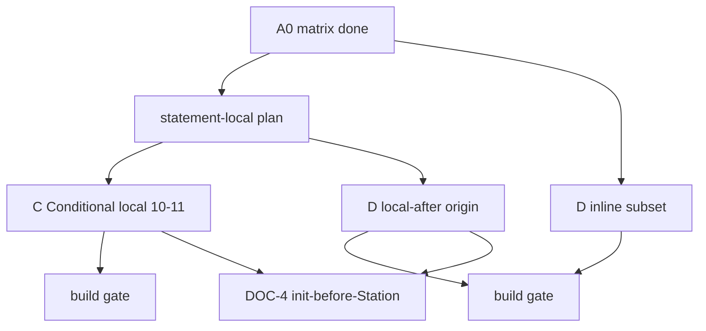

# План: якоря «Прочий C#»

> **Статус:** **закрыт** — A0 + C + D + DOC-4 сделаны (gate — у оператора).  
> **Имплементация (единый backlog):** [`plan-anchors-implementation.md`](plan-anchors-implementation.md).  
> **Цель:** расширить, что считается валидным origin **до первой станции**; после неё станции только добавляются в ту же цепочку.  
> **Связано:** [`plan-statement-local-chains.md`](plan-statement-local-chains.md) (добавление statement-станций на якоре); opaque §4.2 в [`plan-data-oriented-handlers.md`](plan-data-oriented-handlers.md).  
> **Аудитория:** разработчики и AI-агенты.

---

## Цель

Roadmap прочих способов установить `TrainRoute`-якорь (фаза **до** первой `.Station` / `.ServiceStation`), не покрытых классическим fluent/`new` и не являющихся opaque §4.2.

Отвергнутые формы (массив/indexer, reflection, `dynamic`, LINQ, алиасы dual-writer, property/field storage, `ref`/`in`, …) **не ведутся** в этом плане: покрываются общим **TOP005** / opaque §4.2 — без перечня работ.

## Общие принципы

1. **Якорь — всё, что до первой станции.** Пока `.Station` / `.ServiceStation` не вызван, устанавливаем origin (локаль, `out`, `await`, `?:`/`switch` assign, pattern, tuple… — если origin статически понятен). **После первой станции** — только **добавляем** станции в ту же цепочку (fluent или statement на том же якоре).
2. **Init before Station:** все якоря должны быть инициализированы перед регистрацией станций. `null`/`default`/заготовка допустимы; между ними и первой станцией обязана быть init known origin. Иначе TOP005.
3. Якорь допустим только при **одном статически привязанном origin** (`new` / user-defined factory / schema / поддержанный subset ниже) и детерминированном terminal seed. Иначе TOP005, без silent wrong-dispatch.
4. **statement-local** = механизм «добавляем» на уже установленном якоре ([`plan-statement-local-chains.md`](plan-statement-local-chains.md)), не отдельный вид origin. Пункты с хвостом на локали после сложного RHS **после** statement-local (или вместе с его хвостом).

### Заметка: opaque origins и схема манифеста

Классические opaque (параметр / поле / свойство / делегат и отвергнутые «прочий C#» без known origin) **сами по себе** origin не дают: у call site нет статически привязанного terminal seed → TOP005 ([§4.2](plan-data-oriented-handlers.md)).

**Единственный мыслимый путь поддержки opaque** (если оператор когда-либо пересмотрит отказ §4.2 / §4.2.2): **явная схема манифеста на якоре** — declare terminal wagons (имена + типы), по смыслу как exported `[RouteSchemaWagon]` / factory schema, но привязанная к параметру / полю / свойству / делегату / иному opaque receiver.

Без такой явной схемы opaque **не** поддерживать. Opt-in declare без доказательства, что caller реально несёт заявленные вагоны, ранее снимали (§4.2.2) — любая новая попытка обязана зафиксировать: (1) синтаксис схемы манифеста, (2) кто её автором гарантирует, (3) диагностику drift, если runtime/call site расходится со схемой. Этот план **не** ведёт работы по opaque, пока схема не утверждена отдельно.

## Матрица A0 (заполнено)

| # | Тема | Статус | Этап |
|---|------|--------|------|
| 2 | tuple / deconstruct (узкий literal; opaque GetPair → TOP005) | **сделано** | D |
| 3 | `out TrainRoute` — максимально как обычный return/factory | **сделано** | D |
| 4 | null/default — заготовка OK; init до 1-й Station | **сделано** (docs + тесты) | DOC-4 |
| 10 | `?:` assign локали + join ≡ | **сделано** | C (после statement-local) |
| 11 | `switch` assign локали | **сделано** | C |
| 14 | local function = обычный factory | **сделано** | D |
| 15 | await — все варианты origin/factory | **сделано** | D |
| 16 | cast — прозрачен над origin; opaque → TOP005 | **сделано** | D |
| 17 | pattern `is`/`switch` — где origin понятен | **сделано** | D |
| 18 | using / IDisposable | **N/A** | — |

Нумерация исходного реестра для живых пунктов сохранена.

## Этапы (todos)

| Id | Этап | Статус |
|----|------|--------|
| `a0-matrix` | A0: матрица без hard-no, принципы, живой реестр | **сделано** |
| `c-conditional-local` | C: п.10–11 | **сделано** (gate — у оператора) |
| `d-narrow` | D: п.2, 3 (`out` как return), 14, 15, 16, 17 | **сделано** (gate — у оператора) |
| `readme-link` | Актуализировать строку в `docs/README.md` | **сделано** (DOC-4) |

### ToDo имплементации (порядок)

| # | Id | Работа |
|---|-----|--------|
| 1 | `sl-0` … `sl-4` | Statement-local этапы 0–4 — **сделано** |
| 2 | `misc-d-14-local-fn` | п.14 local function = factory — **сделано** (gate — у оператора) |
| 3 | `misc-d-15-await` | п.15 await / все origin — **сделано** (gate — у оператора) |
| 4 | `misc-d-16-cast` | п.16 cast docs/тесты — **сделано** (gate — у оператора) |
| 5 | `misc-d-3-out` | п.3 `out TrainRoute` — **сделано** (gate — у оператора) |
| 6 | `misc-d-2-tuple` | п.2 узкий tuple/deconstruct — **сделано** (gate — у оператора) |
| 7 | `misc-d-17-pattern` | п.17 pattern `is`/`switch` — **сделано** (gate — у оператора) |
| 8 | `misc-c-10-ternary` | п.10 `?:` assign локали — **сделано** (gate — у оператора) |
| 9 | `misc-c-11-switch` | п.11 `switch` assign локали — **сделано** (gate — у оператора) |
| 10 | `misc-docs-4-init` | п.4 init-before-Station + README — **сделано** (gate — у оператора) |

Opaque + схема манифеста — **не** в ToDo, пока схема не утверждена отдельно.

## Build gate

```bash
dotnet test tests/TrainOP.Generators.Tests/TrainOP.Generators.Tests.csproj -c Release
dotnet test tests/TrainOP.Tests/TrainOP.Tests.csproj -c Release
```

## Реестр (детализация)

### 2. Tuple / deconstruct

**Статус:** **сделано** (этап D; gate — у оператора).

### 3. `out TrainRoute`

**Статус:** **сделано** (этап D; gate — у оператора).

Максимально близко к нормальному `return` / factory path: те же контракты эквивалентности путей (аналог TOP012), тот же статус якоря после `Get(out r)`, что после `r = Get()`. Не путать с `ref`/`in` (вне плана → TOP005).

### 4. `null` / `default` (правило)

```csharp
TrainRoute r = null;           // OK — заготовка
r = new TrainRoute();          // обязательная init
r.Station("X", ...);           // OK

TrainRoute r2 = null;
r2.Station("X", ...);          // TOP005 — Station без init
```

**Статус:** **сделано** (DOC-4; docs + analyzer-иллюстрации; gate — у оператора). Не запрет объявления `null`/`default`.

### 10. Условное присваивание локали

**Статус:** **сделано** (этап C; gate — у оператора).

### 11. `switch`-присваивание локали

**Статус:** **сделано** (этап C; gate — у оператора). То же, что п.10.

### 14. Локальная функция = обычный factory

**Статус:** **сделано** (этап D; gate — у оператора).

### 15. `await` — все варианты origin/factory

**Статус:** **сделано** (этап D; gate — у оператора).

### 16. Cast

**Статус:** **сделано** (docs/тесты; gate — у оператора).

### 17. Pattern matching

**Статус:** **сделано** (этап D; gate — у оператора).

### 18. `using` / disposable-обёртка

**Статус:** **N/A** — пока `TrainRoute` не `IDisposable` / нет API-обёртки.

---

## Порядок работы агента



- **C** и хвосты на локали в **D** опираются на statement-local («добавляем» после якоря).
- Inline-части D (где нет локали после сложного assign) могут идти параллельно statement-local.

### C — условное / switch присваивание локали (10, 11)

- Переиспользовать join/terminal equivalence (TOP008 / TOP012).
- Statement-хвост на локали после multi-origin assign только если все ветки эквивалентны.
- **Build gate** при реализации.

### D — узкие расширения якоря (2, 3, 14, 15, 16, 17)

| Пункт | Работа |
|-------|--------|
| 2 | tuple literal / deconstruct от known origin + негатив GetPair |
| 3 | `out` path analysis ≈ return/factory + якорь после `Get(out r)` |
| 14 | local function parity с ordinary factory + тесты |
| 15 | await для всех вариантов origin/factory |
| 16 | docs/тесты cast + origin / cast + opaque |
| 17 | pattern где origin понятен + негатив opaque RHS |

Каждый закрывается реализацией и/или docs/тестом + **build gate**.

---

## Вне этого плана

- Параметр / поле / свойство / делегат; прочие отвергнутые формы → TOP005 / §4.2 (без работ здесь).
- **Opaque + явная схема манифеста** — не реализуется в этом плане; см. заметку выше (предпосылка любого будущего пересмотра §4.2).
- Statement-цепочки bare new/factory/fluent-RHS — [`plan-statement-local-chains.md`](plan-statement-local-chains.md).
- CFG statement-`if`/`else` без общего join-контракта.
- Алиасы dual-writer (`r2 = r1` / `r2 = r1.Station`) — отказ, statement-local тоже TOP005.

## Handoff для нового чата

```text
План @docs/plan-misc-csharp-anchors.md закрыт (C/D/DOC-4).
Единый backlog: @docs/plan-anchors-implementation.md — тоже закрыт.
Не запускай dotnet test/build, пока я явно не попрошу.
Репозиторий TrainOP; стиль когитатора; not-work-project.
```
