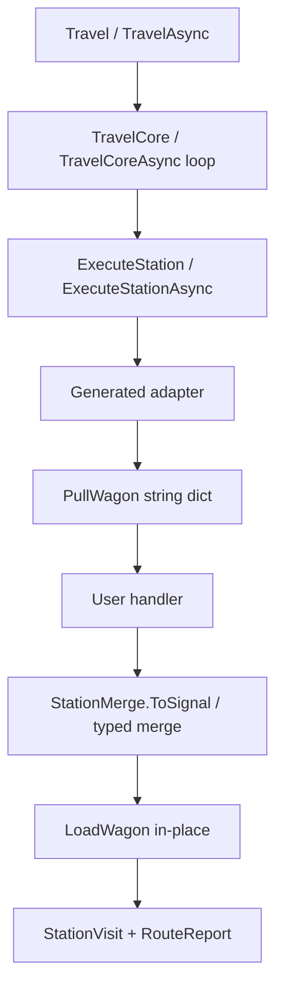
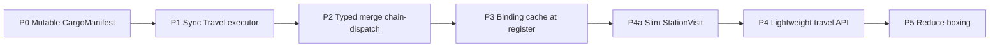

# План: производительность Travel / hot path

> **Статус:** **P0–P3 + P4a выполнены**; **P5 снято** (typed bags откачены — регрессия CPU); P4 не начат.  
> **Цель:** снизить стоимость инфраструктуры hop в `Travel()` / `TravelAsync` без изменения data-oriented UX handler'ов.  
> **Метрика успеха:** снижение Ratio и Alloc в `LibraryVsManualBenchmarks` (TravelOnly); **не** цель догнать manual ns.  
> **Аудитория:** разработчики и AI-агенты, продолжающие работу над TrainOP.  
> **Связанный план:** data-oriented handlers — [`plan-data-oriented-handlers.md`](plan-data-oriented-handlers.md) (фазы 0–8 выполнены).

---

## 1. Цель и не-цели

### 1.1. Цель

Ускорить **транспортный протокол** между станциями: манифест, адаптер, merge, executor, отчёт. Бизнес-логика handler'ов и публичный стиль `.Station((params) => data)` не меняются.

### 1.2. Не-цели

- Догнать hand-written pipeline по наносекундам
- Менять семантику сигналов / red recovery / cancellation
- Динамическая runtime-сборка маршрута

### 1.3. Зафиксированные решения

| Тема | Выбор |
|------|--------|
| Публичный API | `CargoManifest` **мутабелен** (`LoadWagon`/`UnloadWagon` in-place, возвращают `this`) |
| Запись на hop | Без clone словаря на каждую запись; один экземпляр манифеста на прогон |
| Sync path | Отдельный sync-цикл для `Travel()` / `Travel(CancellationToken)` без `async`/`await` на hop; `TravelAsync` без изменений по контракту |
| Chain merge | Typed merge для chain-aware при известном return shape; иначе `StationMerge.ToSignal` |
| Журнал (P4a) | В visit — имя + флаг; полный сигнал только в `TerminalSignal` (перезапись на hop) |
| Метрики | Ratio/Alloc в `LibraryVsManual*` TravelOnly |

### 1.4. Уже доступно без кода

Рекомендация: **`TrainOP_ChainDispatchMode=stable`** (Roslyn interceptors) там, где SDK это поддерживает — ~20–25% быстрее reflection на chain-dispatch (`ChainDispatchBenchmarks`). Не отдельная фаза реализации.

Идея альтернативы Station-interceptors (Caller* на `new TrainRoute` + resolve по key/Count) зафиксирована в [`plan-data-oriented-handlers.md`](plan-data-oriented-handlers.md) §4.3 — **не в работе**, канон не менять без spike.

---

## 2. Baseline

Источник: `BenchmarkDotNet.Artifacts/results/TrainOP.Benchmarks.LibraryVsManualBenchmarks-report-github.md` (.NET 10, Release, interceptor adapter).

| Сценарий | Manual | TrainOP TravelOnly | Ratio | Alloc (TrainOP) |
|----------|--------|--------------------|-------|-----------------|
| Payment (2 ст.) | ~4.7 ns | ~414 ns | **~89×** | ~1840 B |
| LongPayment (5 ст.) | ~16 ns | ~1094 ns | **~68×** | ~4208 B |
| Checkout (7 ст.) | ~17 ns | ~2531 ns | **~150×** | ~12448 B |

BuildAndTravel дороже TravelOnly на стоимость регистрации станций; оптимизационные фазы ориентируются на **TravelOnly**.

Запуск:

```bash
dotnet run -c Release --project benchmarks/TrainOP.Benchmarks -- --filter *LibraryVsManual*
```

Подробнее: [`benchmarks/README.md`](../benchmarks/README.md).

---

## 3. Горячий путь



Ключевые места:

| Символ / файл | Роль |
|---------------|------|
| `Train.Travel` → `TravelCore` | Sync-цикл без `async`/`await` на hop (`Railway.cs`) |
| `Train.TravelAsync` → `TravelCoreAsync` | Async-цикл с `await` на hop |
| `ExecuteStation` / `ExecuteStationAsync` / `ProcessStationStep*` | Диспетчер `StationPlan` + bookkeeping |
| `CargoManifest.LoadWagon` / `UnloadWagon` | In-place запись в `Dictionary<string,object>` (без clone) |
| Generated adapter (`TrainRouteStationGenerator`) | Pull → handler → merge → `Signal` |
| `StationMerge` / `WagonStationReturn` | Runtime merge; reflection для return members |
| Chain-dispatch | `UsesChainDispatch` → typed merge при известном return shape; иначе `StationMerge.ToSignal` |

Разрыв с manual — цена абстракции (манифест, адаптеры, сигналы, отчёт), а не арифметика станций. См. также [`code-volume-comparison.md`](code-volume-comparison.md).

---

## 4. Фазы

Порядок = ожидаемый impact. Каждая фаза самостоятельна по критериям готовности (§5).



### P0 — Mutable CargoManifest

**Статус:** сделано (2026-07-17).

**Суть:** `CargoManifest` мутабелен: `LoadWagon` / `UnloadWagon` пишут in-place и возвращают `this`. Убраны `CloneWagons`. Добавлен `TryGetWagon`. `InspectWagons` — live view внутреннего словаря.

**Файлы:** `src/TrainOP/Railway.cs`, `src/TrainOP/StationMerge.cs`, docs.

**Ожидание:** главный выигрыш по Gen0 и CPU на маршрутах с несколькими вагонами и hop'ами.

### P1 — Sync Travel executor

**Статус:** сделано (2026-07-17).

**Суть:** `Travel()` / `Travel(CancellationToken)` исполняют sync-цикл (`TravelCore`) без `async`/`await` на hop и без `GetAwaiter().GetResult()` вокруг `TravelCoreAsync`. Общие sync helpers (`ExecuteStation`, `ProcessStationStep`, `InvokeServiceStation`) и shared exception/visit helpers. `TravelAsync` сохраняет контракт через `TravelCoreAsync`.

**Файлы:** `src/TrainOP/Railway.cs` (executor ~789–1028).

**Ожидание:** снятие async state machine tax на sync hot path.

### P2 — Typed merge для chain-dispatch

**Статус:** сделано (2026-07-17).

**Суть:** расширить `TypedStationReturnCodegen` на chain-aware адаптеры (`EmitChainAware*`). Убрать runtime reflection через `WagonStationReturn` там, где return shape известен на compile-time. Interceptor/stable: `binding.ReturnMembers`; reflection: compile-time `string[]` из `ReturnShape.Members`.

**Файлы:** `src/TrainOP.Generators/TypedStationReturnCodegen.cs`, `TrainRouteStationGenerator.cs`, при необходимости `ChainAwareStationCodegen.cs`.

**Ожидание:** заметный выигрыш на сценариях бенчмарков Payment / LongPayment / Checkout (chain-dispatch).

### P3 — Cache chain binding

**Статус:** сделано (2026-07-17).

**Суть:** resolve `chainKey` + `chainStationIndex` (binding table) один раз при регистрации станции; travel lambda закрывается над стабильными `inputNames` / `returnMembers` / `refFlags`. Interceptor/stable: передача статического `ChainBinding_*` в overload `StationCore_*(..., binding)` без `ResolveChainBinding_*`.

**Файлы:** `ChainAwareStationCodegen.cs`, `TrainRouteStationGenerator.cs`, `TrainRouteStationInterceptorsEmitter.cs`.

**Ожидание:** средний выигрыш в interceptor/stable режиме.

### P4a — Slim StationVisit (флаг + только TerminalSignal)

**Статус:** сделано (2026-07-17).

**Суть:** облегчить **дефолтный** журнал без отказа от истории шагов.

**Было:** на каждый hop в `Visits` клался полный `Signal` — N сигналов удерживались до конца `Travel`. После P0 `visit.Signal.Manifest` редко давал исторический снимок. Главная цена — удержание промежуточных сигналов.

**Сделано:** `StationVisit` = `readonly struct` (`StationName` + `IsGreen`); `visit.Signal` удалён; полный сигнал только в `RouteReport.TerminalSignal`.

**Канон реализации:**

| Элемент | Поведение |
|---------|-----------|
| На hop | `terminalSignal = signal` (перезапись); в журнал — visit **без** полного сигнала |
| `StationVisit` | `StationName` + флаг исхода (`IsGreen` / эквивалент); предпочтительно `readonly struct` |
| `RouteReport.TerminalSignal` | единственный полный сигнал (финал green или стоп-red, в т.ч. после service station) |
| `visit.Signal` | убрать или `[Obsolete]` → breaking / migration в docs и samples |

**Семантика журнала после P4a:**

- История = имя станции + green/red на шаге (включая visit service station при recovery).
- Детали ошибки (`FailureCode` / `FailureMessage` / `Issue`) — только из `TerminalSignal`, не из промежуточных visit.
- Промежуточный red с успешным recovery: в журнале будет `IsGreen == false` у станции и visit service; код/текст исходного red в visit **не** сохраняются.

**Файлы:** `src/TrainOP/Railway.cs` (`StationVisit`, `ProcessStationStep*`, `CompleteRedSignalStep`, `RouteReport`), docs `core-api.md`, samples/tests, обращающиеся к `visit.Signal`.

**Ожидание:** средний выигрыш Alloc / давления на GC на любом `Travel()` с визитами; меньше, чем полный отказ от журнала (P4), но без нового API.

**Связь с P4:** P4a меняет **форму** дефолтного журнала; P4 — opt-in **без** журнала вовсе. Порядок: сначала P4a, затем P4.

### P4 — Lightweight travel API

**Статус:** не начато.

**Суть:** opt-in API без накопления списка `StationVisit` (например `TravelLight` / `recordVisits: false`), не ломая `Travel()` → `RouteReport` с визитами (уже slim после P4a). `Visits` в light-режиме — пустая коллекция (не `null`); `TerminalSignal` / `Get` / `Failure*` работают как обычно.

**Файлы:** `Railway.cs` (публичный API `Train`), docs `core-api.md`.

**Ожидание:** средний выигрыш alloc на длинных маршрутах, когда отчёт по шагам не нужен.

### P5 — Reduce boxing / typed slots

**Статус:** **снято** (2026-07-17) — откат к одному `Dictionary<string, object>`.

**Суть (попытка):** typed bags для value types + `LoadWagon<T>` + home-index. На коротких маршрутах (Payment/Checkout) CPU от multi-bag / typeof / home lookup оказался **хуже**, чем boxing в один словарь; home-index не вернул уровень post-P4a.

**Итог:** storage снова единый object-dict (как после P0/P4a). `LoadWagon<T>` удалён; codegen снова эмитит `LoadWagon(name, value)`.

**Файлы:** `src/TrainOP/Railway.cs` (`CargoManifest`).

---

## 5. Критерии готовности фазы

Для каждой фазы P0–P3, P4a, P4, P5:

- [ ] Поведение публичного API и семантика сигналов / отмены без регрессий (оператор гоняет тесты)
- [ ] `LibraryVsManualBenchmarks` TravelOnly: Ratio и/или Alloc ниже baseline §2 (артефакт в `BenchmarkDotNet.Artifacts` или обновление цифр в этом плане)
- [ ] Краткая запись в §7 истории этого плана
- [ ] При необходимости — строка в `CHANGELOG.md` / `benchmarks/README.md`

---

## 6. Ссылки в репозитории

| Файл | Назначение |
|------|------------|
| `src/TrainOP/Railway.cs` | `CargoManifest`, `Train.Travel`, executor |
| `src/TrainOP/StationMerge.cs` | Runtime merge / `ToSignal` |
| `src/TrainOP/WagonStationReturn.cs` | Reflection return members |
| `src/TrainOP.Generators/TrainRouteStationGenerator.cs` | Адаптеры, chain-dispatch |
| `src/TrainOP.Generators/TypedStationReturnCodegen.cs` | Typed merge (non-chain и chain-dispatch) |
| `src/TrainOP.Generators/ChainAwareStationCodegen.cs` | Binding tables, pull codegen |
| `benchmarks/README.md` | Запуск и категории бенчмарков |
| `benchmarks/TrainOP.Benchmarks/LibraryVsManualBenchmarks.cs` | Library vs manual |
| `benchmarks/TrainOP.Benchmarks/ManualPipelineScenarios.cs` | Manual baseline |
| `docs/code-volume-comparison.md` | Trade-off объём кода vs абстракция |
| `docs/plan-data-oriented-handlers.md` | UX / analyzer roadmap (выполнено) |

---

## 7. История изменений плана

| Дата | Изменение |
|------|-----------|
| 2026-07-17 | Создание плана по результатам `LibraryVsManualBenchmarks` и разбору hot path; фазы P0–P5 |
| 2026-07-17 | P0: `CargoManifest` сделан мутабельным in-place (вместо отдельного travel buffer + immutable snapshot) |
| 2026-07-17 | P1: sync `TravelCore` / `ExecuteStation` / `ProcessStationStep` / `InvokeServiceStation`; `Travel()` больше не блокирует `TravelCoreAsync` |
| 2026-07-17 | P2: typed merge в chain-aware адаптерах (`EmitChainAware*` / reflection); `BuildCompileTimeReturnMembersExpression` для reflection mode |
| 2026-07-17 | P3: кэш chain binding при регистрации — hoisted `inputNames`/`returnMembers`/`refFlags`; interceptor fast path через статический `ChainBinding_*` |
| 2026-07-17 | Добавлена фаза **P4a**: slim `StationVisit` (флаг + только `TerminalSignal`); P4 уточнён как opt-in без журнала |
| 2026-07-17 | P4a: `StationVisit` → `readonly struct` (`StationName` + `IsGreen`); `visit.Signal` удалён; полный сигнал только в `RouteReport.TerminalSignal` |
| 2026-07-17 | Pre-size visit journal: `List` capacity = `_route.Count` (×2 при наличии service station) |
| 2026-07-17 | P5: typed bags в `CargoManifest` (`decimal`/`int`/`long`/`bool`/`double`/`float` + object fallback); `LoadWagon<T>`; typed merge codegen → `LoadWagon<T>`; `InspectWagons` — combined snapshot |
| 2026-07-17 | P5 hot-path fix: home-index вместо `Remove`/`Contains` по всем bags на каждый `LoadWagon`/`PullWagon` |
| 2026-07-17 | **P5 снято:** откат typed bags → один `Dictionary<string,object>`; `LoadWagon<T>` удалён |
| 2026-07-17 | Ссылка на идею Caller*-альтернативы Station-interceptors ([`plan-data-oriented-handlers.md`](plan-data-oriented-handlers.md) §4.3) |
