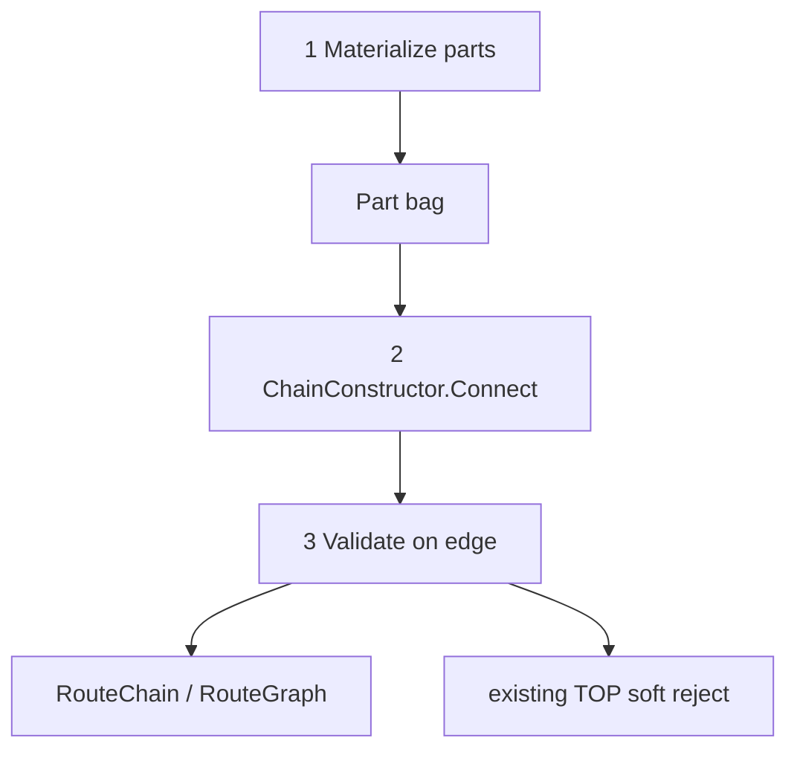
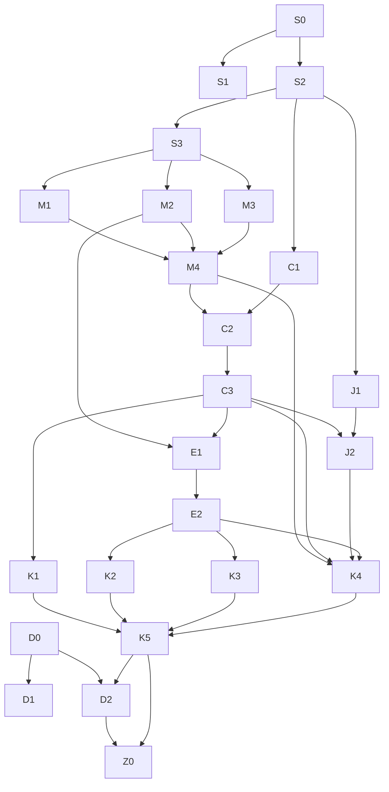

# План: модульные части маршрута (constructor IR)

> **Статус:** **закрыт** — D0–Z0, O1–O4, L0–L4 (Parts-native `RouteChain`, legacy adapter удалён). Gate финального контура — у оператора.  
> **Аудитория:** разработчики и AI-агенты.  
> **Скоуп:** только IR генератора + эта дока. Публичный `TrainRoute` / `.Station` **не** меняем.  
> **Семантика:** TOP* и пользовательские формы сборки — без изменений.

---

Внутренний IR: все потенциальные фрагменты маршрута — **first-class части**; `ChainConstructor` склеивает их и валидирует на каждом стыке (как конструктор). Замена switch-по-`RouteChainAnchorKind` в Walker / Assembler.

**Сделано:** **D0**; **D1**; **S0**; **S1**; **S2**; **S3**; **M1**; **M2**; **M3**; **M4**; **C1**; **C2**; **C3**; **J1**; **J2** (`JoinChainConnector` + `JoinChainsStage.Join` через parts).

**Build gate** (агент не гоняет без явной просьбы):

Core:

```bash
dotnet test tests/TrainOP.Generators.Tests/TrainOP.Generators.Tests.csproj -c Release
dotnet test tests/TrainOP.Tests/TrainOP.Tests.csproj -c Release
```

Factory/consumer (M2, E1, E2, K3, K5, Z0 и касания schema):

```bash
dotnet test tests/TrainOP.Generators.Tests/TrainOP.Generators.Tests.csproj -c Release
dotnet test tests/TrainOP.Tests/TrainOP.Tests.csproj -c Release
dotnet test tests/TrainOP.RouteConsumer.Tests/TrainOP.RouteConsumer.Tests.csproj -c Release
```

Docs-only (D0, D1, D2 без кода): review оператора; `dotnet` не обязателен.

Критерий: 0 failed; новые тесты этапа зелёные; регрессий по затронутому контуру нет.

Ключевые файлы (целевые): `src/TrainOP.Generators/Parts/*`, [`RouteChainWalker.cs`](../src/TrainOP.Generators/RouteGraph/RouteChainWalker.cs), [`RouteGraphAssembler.cs`](../src/TrainOP.Generators/RouteGraph/RouteGraphAssembler.cs), [`BuildChainsStage.cs`](../src/TrainOP.Generators/Pipeline/BuildChainsStage.cs), [`AnchorStage.cs`](../src/TrainOP.Generators/Pipeline/AnchorStage.cs), [`BranchRouteJoinValidator.cs`](../src/TrainOP.Generators/RouteGraph/BranchRouteJoinValidator.cs), [`FactoryDispatchMetadata.cs`](../src/TrainOP.Generators/Schema/FactoryDispatchMetadata.cs), [`CallerChainKeyBuilder.cs`](../src/TrainOP.Generators/Chain/CallerChainKeyBuilder.cs).



## Контракт частей (`TrainOP.Generators.Parts`)

| Часть | Смысл | Источник сегодня |
|-------|--------|------------------|
| `CreationSeed` | `new TrainRoute()` | ObjectCreation |
| `FactoryCall` | factory invoke; variant Inline vs Schema | MethodInvocation / FactorySchema |
| `LocalBinding` | локаль + origin window | LocalVariable + EnumerateOrigin* |
| `StationLink` | `.Station` / `.ServiceStation` шаг | station sites + TryAdvanceChain |
| `JoinArm` | рукав `?:` / `??` / `switch` | BranchRoute* / bare factory branch |
| `JoinSeed` | синтетический корень после merge | BranchJoin |
| `ExtensionTail` | продолжение после factory | FactoryExtension walk |

Минимальный контракт:

```csharp
internal interface IRoutePart
{
    Location Location { get; }
    // identity for dedupe / dispatch — part-owned, not kind-switch outside
}

internal readonly struct PartEdge { /* From, To, EdgeKind */ }

internal sealed class ChainConstructor
{
    // Append(seed/link), Bind(local, seed), Join(arms→JoinSeed), Extend(factory, tail)
    // каждый Connect вызывает PartEdgeValidator → Diagnostic[] / false
}
```

На каждом `Connect`:

1. **Structural** — совместимость портов (seed→local, local→station, arms→join, factory→tail).
2. **Существующие валидаторы** — statement-window / alias TOP005, join TOP008, factory path TOP012/013, wagon sim через Terminals; не дублировать логику.
3. Новые TOP* **не** вводить без отдельного решения оператора.

На миграции (закрыто): legacy `RouteChainAnchor` / `StationChainLink` / `LegacyRoutePartAdapter` **удалены**. `RouteChain` = `IRoutePart Origin` + `StationLink[]`. Конверт `RouteSite` снят: discovery (`RoutePartDiscoverer`) сразу отдаёт `IRoutePart` (`StationLink` и origin-части).

## Граф зависимостей этапов



## ToDo

| Id | Работа | Зависит от | Gate | Статус |
|----|--------|------------|------|--------|
| D0 | Этот backlog + контракт частей | — | docs review | 🟢 сделано |
| D1 | Ссылка в [`README.md`](README.md) | D0 | docs review | 🟢 сделано |
| S0 | `IRoutePart` + `PartEdge` stubs в `Parts/` | — | core | 🟢 сделано (gate — у оператора) |
| S1 | `ChainConstructor` + `PartEdgeValidator` stubs (без wiring) | S0 | core | 🟢 сделано (gate — у оператора) |
| S2 | Пустые sealed-типы всех 7 частей | S0 | core | 🟢 сделано (gate — у оператора) |
| S3 | ~~`ToLegacyAnchor` / `ToRouteChain` адаптер~~ → superseded: `RouteOriginPorts.TryToRouteChain` (L0–L3) | S2 | core | 🟢 удалено (legacy снят) |
| K5 | ~~deprecate `RouteChainAnchorKind`~~ → удалены `RouteChainAnchor` / Kind / `StationChainLink` / adapter | K1+K2+K3+K4 | core + factory/consumer | 🟢 удалено |
| L0–L4 | Parts-native `RouteChain` / `RouteSite`; потребители на порты; delete legacy; тесты/доки | Z0 | core + factory/consumer | 🟢 сделано (gate — у оператора) |
| M1 | Materialize `CreationSeed` + тесты | S3 | core | 🟢 сделано (gate — у оператора) |
| M2 | Materialize `FactoryCall` Inline/Schema + тесты | S3 | factory/consumer | 🟢 сделано (gate — у оператора) |
| M3 | Materialize `LocalBinding` + origin window + тесты | S3 | core | 🟢 сделано (gate — у оператора) |
| M4 | `AnchorStage` → parts → `RouteSite.CreateAnchor` | M1+M2+M3 | core (+ factory/consumer если schema) | 🟢 сделано (gate — у оператора) |
| C1 | Materialize `StationLink` + тесты | S2 | core | 🟢 сделано (gate — у оператора) |
| C2 | Connect seed/local → StationLink (linear + SL-fold) | M4+C1 | core | 🟢 сделано (gate — у оператора) |
| C3 | `RouteGraphAssembler` primary path через `ChainConstructor` | C2 | core | 🟢 сделано (gate — у оператора) |
| J1 | Materialize `JoinArm` + тесты | S2 | core (BranchRoute*) | 🟢 сделано (gate — у оператора) |
| J2 | `JoinSeed` + Connect arms→seed через `BranchRouteJoinValidator` | J1+C3 | core + BranchRoute* | 🟢 сделано (gate — у оператора) |
| E1 | Materialize `ExtensionTail` + Connect FactoryCall→tail | M2+C3 | factory/consumer | 🟢 сделано (gate — у оператора) |
| E2 | Dispatch/keys на `FactoryCall` (без kind-switch снаружи) | E1 | factory/consumer | 🟢 сделано (gate — у оператора) |
| K1 | Вычистить kind-switch из `RouteGraphAssembler` | C3 | core | 🟢 сделано (gate — у оператора) |
| K2 | Вычистить kind-switch из `CallerChainKeyBuilder` | E2 | core | 🟢 сделано (gate — у оператора) |
| K3 | Вычистить kind-switch из `FactoryDispatchMetadata` | E2 | factory/consumer | 🟢 сделано (gate — у оператора) |
| K4 | Распилить `RouteChainWalker` на materializers + thin peel | M4+C3+J2+E2 | core | 🟢 сделано (gate — у оператора) |
| D2 | [`architecture-internals.md`](architecture-internals.md): BuildChains = Materialize→Construct→Validate | D0+K5 | docs review | 🟢 сделано |
| Z0 | Финальная чистка мёртвого кода (shim'ы, helpers, stubs, мёртвые kind/тесты) | K5+D2 | core + factory/consumer | 🟢 сделано (gate — у оператора) |

## Порядок поставки

1. D0 → D1 (∥ S0→S1/S2→S3)
2. M1 ∥ M2 ∥ M3 → M4
3. C1 (∥ M*) → C2 → C3
4. J1 (∥) → J2; параллельно E1 → E2
5. K1 ∥ K2 ∥ K3 → K4 → K5 → D2 → Z0

## Вне скоупа

- Публичный builder / `RouteFragment` API для пользователя.
- Opaque якоря; новые формы C#; новые TOP*.
- Rewrite emit / `GenerationModel` (потребляют тот же `RouteGraph`).

## Post-Z0: nesting extract (O1–O4)

> **Статус:** **сделано** — вынос origin/SL и root-finding из `RouteChainWalker`; спрямление join-stamp в `LocalBindingMaterializer`. Gate — у оператора.

| Id | Работа | Код |
|----|--------|-----|
| O1 | `RouteOriginWindow` — Enumerate / Preceding / Collect / fluent-local | [`RouteOriginWindow.cs`](../src/TrainOP.Generators/RouteGraph/RouteOriginWindow.cs) |
| O2 | `RouteChainRootResolver` — flatten `TryFindChainRootEndingAt` + factory/peel helpers | [`RouteChainRootResolver.cs`](../src/TrainOP.Generators/RouteGraph/RouteChainRootResolver.cs) |
| O3 | `TryStampSharedFactoryOrigin` / early-return join path в `LocalBindingMaterializer` | [`LocalBindingMaterializer.cs`](../src/TrainOP.Generators/Parts/LocalBindingMaterializer.cs) |
| O4 | Docs (эта секция + `architecture-internals`) | — |

`RouteChainWalker` — тонкий BuildChains facade + forwarders на прежние имена. Parts callers (`LinearChainConnector`, `LocalBindingMaterializer`, `ExtensionChainConnector`) и `BranchRouteJoinSetFinder` зовут новые типы напрямую.

## Handoff

```text
План частей маршрута: @docs/plan-route-parts-constructor.md
План частей маршрута закрыт (D0–Z0); post-Z0 nesting extract O1–O4 сделан.
Gate core+factory/consumer — у оператора.
Не запускай dotnet test/build, пока я явно не попрошу.
TrainOP; когитатор; not-work-project.
```
