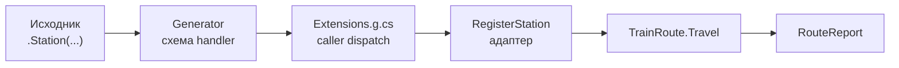
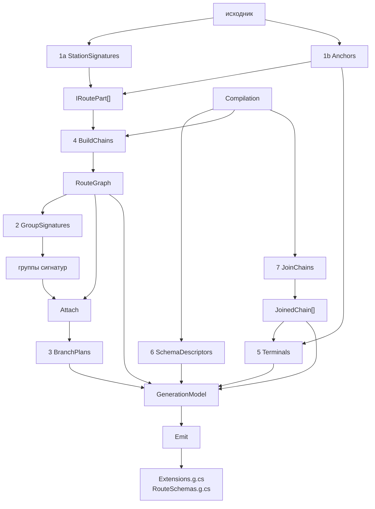
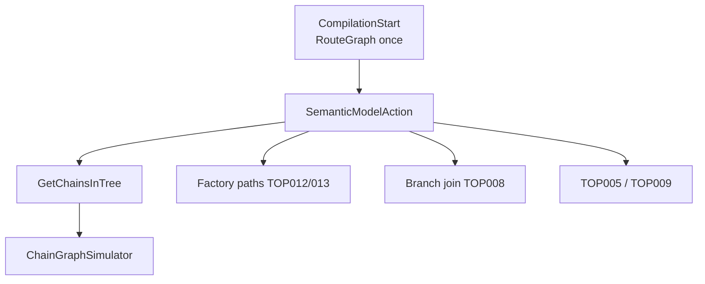
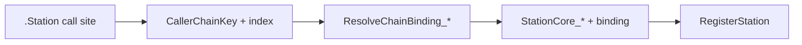
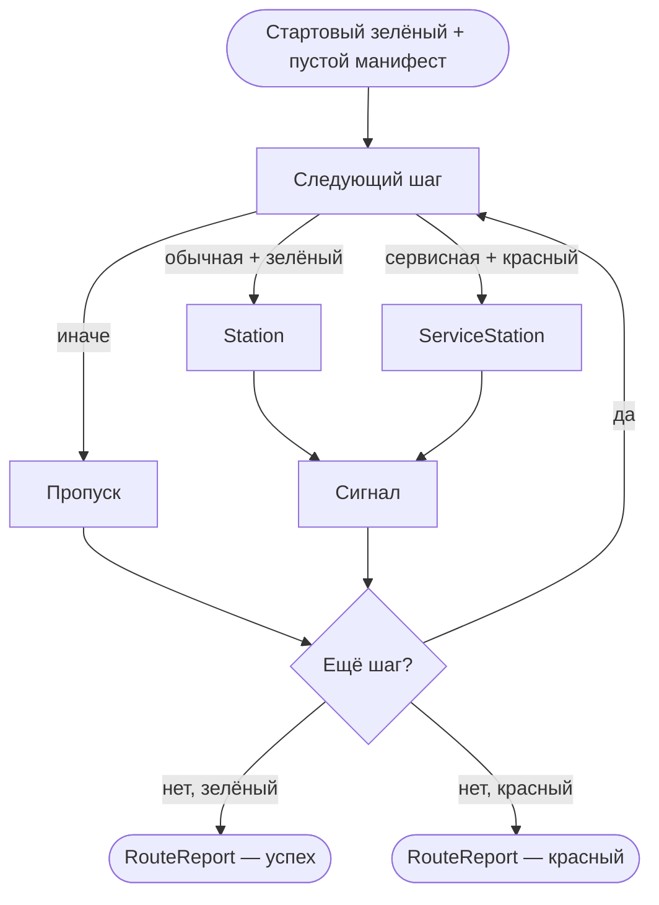

# TrainOP: учебник

Этот текст можно читать сверху вниз. Он — **исчерпывающее** руководство: зачем нужна библиотека, как писать маршруты, как текут данные и сигналы, как устроены генератор/анализатор/runtime, cross-assembly, диагностики, ограничения и карта репозитория. Правила «как можно и нельзя собирать маршрут» собраны в **§10** (с сводкой в **§20**). Соседние файлы в `docs/` остаются краткими выдержками и дорожными картами для агентов; для понимания продукта достаточно учебника.

---

## 1. Зачем TrainOP

В обычном C#-коде пайплайн «проверь → посчитай → сохрани» быстро обрастает вложенными `if`, ранними `return` и ручной передачей промежуточных значений. Railway Oriented Programming предлагает другую модель: шаги идут по рельсам; успех везёт данные дальше; ошибка останавливает поезд на станции и не заставляет каждую следующую функцию проверять «а не сломалось ли уже».

TrainOP воплощает эту идею для .NET (`netstandard2.0`). Вы описываете **маршрут** из **станций**. Между станциями едет **манифест груза** — набор именованных значений («вагонов»). Станция либо обновляет груз и даёт **зелёный** сигнал, либо возвращает **красный** и останавливает движение. В конце вы получаете **отчёт**: доехали ли до конца, какие станции посетили, какой груз остался на терминале.

Главное удобство библиотеки — не в том, что вы руками крутите словарь. Рекомендуемый стиль — **обработчики над данными**: обычные функции. Имена параметров — это ключи вагонов. Возврат — новые данные или сигналы из `RailwaySignals`. Манифест и адаптеры вызова скрыты в коде, который генерирует source generator: он сам достаёт вагоны, вызывает handler и записывает возвращённые поля обратно в манифест.

Без генератора fluent `.Station(...)` над данными не заработает: именно он эмитит типизированные расширения. Анализатор в том же пакете ловит ошибки потока вагонов ещё на этапе компиляции.

На одном и том же checkout-сценарии (валидация, async-шаги, отказы, recovery, `CancellationToken`) TrainOP снимает ручной `StepResult`, nested `if (!ok)`, повторяемые проверки токена и часть `try/catch` — см. главу про объём кода. Цена — инфраструктура hop'а (манифест, адаптер, merge, отчёт); по наносекундам библиотека не гонится за hand-written pipeline.

---

## 2. Метафора: рельсы, станции, сигналы

Думайте о пайплайне как о железной дороге.

**Манифест** (`CargoManifest`) — состав поезда: словарь `имя вагона → значение`. Он мутабельный: станции меняют его на месте через адаптер, а не передают новую копию на каждом шаге в пользовательском коде.

**Маршрут** (`TrainRoute`) — план пути: упорядоченный список станций, который вы собираете fluent-цепочкой.

**Запуск** — `TrainRoute.Travel()` / `TravelAsync()`: снимок плана + пустой манифест на каждый рейс.

**Зелёный сигнал** — «продолжай». Груз обновлён (или оставлен как был) и едет дальше.

**Красный сигнал** — «стоп». Обычные станции дальше по плану на красном не вызываются; сработать может только следующая станция техобслуживания (если она есть).

**Отчёт** (`RouteReport`) — итог рейса: `ReachedDestination`, история визитов, `FailureCode` / `FailureMessage`, доступ к терминальным вагонам через `Get<T>` или индексатор.

Эти слова — не украшение API. Они помогают читать код: ранняя станция загружает состав, проверка ставит семафор, техобслуживание чинит состав или фиксирует ошибку.

---

## 3. Подключение

Один пакет **TrainOP**: runtime + source generator / chain analyzer.

| Содержимое пакета | Назначение |
|-------|------------|
| Runtime (`lib/`) | `TrainRoute`, `CargoManifest`, сигналы, `Travel` |
| Analyzer (`analyzers/dotnet/cs/`) | Source generator + chain analyzer для `.Station(...)` |

### Требования

- Пакет TrainOP: single-TFM **`netstandard2.0`** (потребитель — любая совместимая платформа, например `net8.0`).
- **SDK-style** `.csproj` с поддержкой analyzers / source generators (не `packages.config` без analyzers).
- Дополнительных MSBuild-свойств для chain-dispatch не нужно: режим один — **caller dispatch** (ctor + ordinal).

### NuGet (внешний проект)

```bash
dotnet add package TrainOP
# или явно:
dotnet add package TrainOP --version 0.16.0
```

```xml
<ItemGroup>
  <PackageReference Include="TrainOP" Version="0.16.0" />
</ItemGroup>
```

Для NuGet атрибуты `OutputItemType` / `ReferenceOutputAssembly` **не нужны**: генератор подключается из `analyzers/dotnet/cs` внутри пакета. Актуальную версию сверяйте с `CHANGELOG.md` / nuget.org.

В Visual Studio: **Tools → NuGet Package Manager → Manage NuGet Packages for Solution** — установите **TrainOP**.

### Локальный feed (pack из исходников)

```bash
dotnet pack src/TrainOP/TrainOP.csproj -c Release
```

Артефакт: `src/TrainOP/bin/Release/TrainOP.*.nupkg`.

```bash
# одноразовый источник
dotnet add package TrainOP --source C:\path\to\TrainOP\src\TrainOP\bin\Release

# или постоянный feed
dotnet nuget add source C:\path\to\local-nuget-feed --name trainop-local
```

### ProjectReference (разработка в solution)

```xml
<ItemGroup>
  <ProjectReference Include="path/to/TrainOP/TrainOP.csproj" />
  <ProjectReference Include="path/to/TrainOP/TrainOP.Generators/TrainOP.Generators.csproj"
                    OutputItemType="Analyzer"
                    ReferenceOutputAssembly="false" />
</ItemGroup>

<Import Project="path/to/TrainOP/TrainOP.Generators/build/TrainOP.Generators.targets" />
```

| | NuGet | ProjectReference |
|---|-------|------------------|
| Сценарий | Внешние приложения, CI без клона TrainOP | Разработка библиотеки, `samples/` |
| Генератор | Внутри пакета `TrainOP` | `OutputItemType="Analyzer"` + `.targets` |
| Версионирование | SemVer | Текущий коммит |

### Проверка подключения

После `dotnet restore` / сборки:

1. В зависимостях виден пакет **TrainOP** (или ProjectReference на оба проекта).
2. `.Station(...)` компилируется без «метод не найден».
3. Терминальные вагоны читаются через `report.Get<T>("name")` / `report["name"]`.

Если генератор «молчит»: убедитесь, что установлен **TrainOP** и выполнен restore; пересоберите проект; при кэше IDE — перезапуск; проверьте SDK-style. Ошибки `TOPxxxx` — контракт цепочки (см. главу про диагностики), а не «сломанный NuGet».

---

## 4. Первый маршрут

Начнём с короткого платёжного сценария: положить данные, снизить сумму, проверить, прочитать результат.

```csharp
using TrainOP;

var route = new TrainRoute()
    .Station("Seed", () => new { paymentId = "pay-1", amount = 100m })
    .Station("Discount", (string paymentId, decimal amount) =>
        new { paymentId, amount = amount * 0.9m })
    .Station("Validate", (string paymentId, decimal amount) =>
        amount > 0
            ? RailwaySignals.Green(new { paymentId, amount })
            : RailwaySignals.Red("INVALID_TOTAL", "amount must be positive"));

var report = route.Travel();

if (report.ReachedDestination)
{
    var paymentId = report.Get<string>("paymentId");
    var amount = report.Get<decimal>("amount");
}
else
{
    Console.WriteLine($"{report.FailureCode}: {report.FailureMessage}");
}
```

Разберём по строкам.

`new TrainRoute()` создаёт пустой план. Каждое `.Station(имя, handler)` добавляет шаг. Имя станции попадает в отчёт и в `SignalIssue.StationName` при ошибке.

Канон один: вагоны появляются только из возвратов станций. Поэтому в примерах часто ставят первую станцию без параметров и называют её `"Seed"`: лямбда замыкает внешние переменные или просто кладёт константы (`() => new { paymentId, amount }`). Это **обычный сценарий**, а не особый вид станции. Для библиотеки `"Seed"` — такое же строковое имя, как `"Discount"` или `"Validate"`.

Стартовые данные можно набрать и иначе. Первая станция может вызвать метод и вернуть его результат:

```csharp
.Station("LoadPayment", () => PaymentRepository.GetDraft(orderId))
```

Или состав собирается **несколькими** ранними станциями: одна кладёт идентификатор, следующая по нему подгружает сумму, третья добавляет контекст. Пока анализатор видит, что к моменту чтения вагон уже произведён, порядок и число «загрузочных» шагов — дело сценария, а не особого API.

**Правильно** — вагоны появляются из станций:

```csharp
// Одна загрузочная станция
.Station("Seed", () => new { paymentId, amount })

// Вызов метода
.Station("Load", () => repo.Get(id))

// Постепенный набор
.Station("Id", () => new { paymentId })
.Station("Amount", (string paymentId) => new { paymentId, amount = repo.AmountOf(paymentId) })
```

**Неправильно** — читать вагон, который ещё никто не положил (TOP001):

```csharp
.Station("OnlyId", () => new { paymentId = "pay-1" })
.Station("UseAmount", (decimal amount) => new { amount })
```

`Discount` объявляет параметры `paymentId` и `amount`. Генератор трактует их как ключи вагонов: адаптер перед вызовом достанет эти значения из манифеста. Возврат анонимного типа означает: записать эти поля в манифест и дать зелёный сигнал.

`Validate` показывает явный сигнал через `RailwaySignals`: зелёный с данными (`Green(...)`) и красный (`Red(code, message)`). По смыслу зелёный с данными близок к голому `new { … }`; красный останавливает обычное движение по плану.

`Travel()` снимает снимок плана, создаёт пустой манифест и гоняет рейс. Успех читаете из отчёта; провал — через `FailureCode` / `FailureMessage` (и при необходимости `FailureIssues`).

Уже здесь виден контракт стиля «над данными»: **параметры = входы из манифеста**, **возврат = новые данные или сигнал**, **манифест в handler трогать не обязательно**.

---

## 5. Как текут данные

Представьте манифест после каждой станции в примере выше.

1. Старт: пусто.
2. После первой станции (`"Seed"` в примере): `paymentId`, `amount`.
3. После `Discount`: те же ключи, `amount` обновлён.
4. После `Validate` (зелёный): состав сохранён, рейс завершён успешно.

Запись возврата handler'а в манифест делает библиотека во время выполнения, а не ваш код. Правила стоит запомнить сразу — без них поведение «пропавшего» вагона выглядит магией.

Кратко по виду возврата:

| Что вернул handler | Что происходит |
|--------------------|----------------|
| Анонимный тип / record / именованный tuple | Поля записываются в манифест; дальше идёт зелёный сигнал |
| `RailwaySignals.Green(...)` с данными | То же: данные из аргумента записываются в манифест, затем зелёный |
| `RailwaySignals.Red(code, msg)` | Красный сигнал; успешная запись возврата не выполняется |
| `RailwaySignals.White` | Манифест **не меняется** (даже если в handler меняли `ref`-параметры) |
| `void` / `new { }` | Частичный возврат: значения `ref`-вагонов записываются; обычные входные вагоны, которых нет в возврате, **снимаются** с манифеста |
| `CargoManifest` | Манифест заменяется целиком (анализатор предупредит TOP004) |

Ниже — развёрнутые варианты на одной и той же исходной картине.

### Исходный манифест для примеров

Перед станцией в манифесте уже есть:

- `paymentId` = `"pay-1"`
- `amount` = `100m`
- `note` = `"keep"` — вагон, который станция **не** принимает (лежит «сбоку»)

Если не сказано иное, handler обычной `.Station` объявлен так: `(string paymentId, decimal amount) => …`.

### Обычная станция: варианты возврата

**1. Полный возврат обоих входов**

```csharp
(string paymentId, decimal amount) => new { paymentId, amount = amount * 0.9m }
```

После: `paymentId` = `"pay-1"`, `amount` = `90m`, `note` = `"keep"`.  
Оба входа обновлены/сохранены; посторонний `note` не тронут.

**2. То же через `Green`**

```csharp
(string paymentId, decimal amount) =>
    RailwaySignals.Green(new { paymentId, amount = amount * 0.9m })
```

После: как в п.1. `Green` только оборачивает те же данные.

**3. Частичный возврат — вернули только `amount`**

```csharp
(string paymentId, decimal amount) => new { amount = amount * 0.9m }
```

После: `amount` = `90m`, `note` = `"keep"`. Вагона `paymentId` **больше нет**: обычный вход, которого нет в возврате, снимается.  
Именно поэтому частичный возврат опасен, если хвост снова ждёт снятый вагон (TOP003).

**4. Добавили новое поле**

```csharp
(string paymentId, decimal amount) =>
    new { paymentId, amount, status = "discounted" }
```

После: `paymentId`, `amount` = `100m`, `status` = `"discounted"`, `note` = `"keep"`.  
Новый ключ появляется; `note` по-прежнему на месте.

**5. `White` — ничего не писать**

```csharp
(string paymentId, decimal amount) => RailwaySignals.White
```

После: как было — `paymentId`, `amount` = `100m`, `note`.  
Даже если внутри handler'а меняли локальные переменные или `ref`, в манифест это не попадёт.

**6. Пустой возврат / `void`**

```csharp
(string paymentId, decimal amount) => { /* side effect */ }
// или: => new { }
```

После: остаётся только `note` = `"keep"`.  
Обычные входы `paymentId` и `amount` сняты (их нет в возврате), `ref` здесь не было.

**7. `ref` вместо возврата поля (сахар)**

```csharp
(string paymentId, ref decimal amount) => { amount *= 0.9m; }
```

После: `amount` = `90m`, `note` = `"keep"`. Вагона `paymentId` **нет**.  
`amount` записан из `ref`; `paymentId` — обычный вход без поля в возврате, поэтому снят. Эквивалент по смыслу для `amount`: вернуть `new { amount = amount * 0.9m }` без `ref`, но тогда нужно явно решить судьбу `paymentId` (вернуть его или осознанно снять).

**8. `ref` + явный возврат другого входа**

```csharp
(string paymentId, ref decimal amount) =>
{
    amount *= 0.9m;
    return new { paymentId = paymentId + "-x" };
}
```

После: `paymentId` = `"pay-1-x"`, `amount` = `90m`, `note` = `"keep"`.  
`paymentId` из возврата, `amount` из `ref`.

**9. `ref` + `White`**

```csharp
(ref decimal amount) =>
{
    amount = 1m;
    return RailwaySignals.White;
}
```

После: `amount` по-прежнему `100m` (и остальные вагоны как были).  
`White` отменяет любую запись, в том числе обратную запись `ref`.

**10. Красный сигнал**

```csharp
(string paymentId, decimal amount) =>
    RailwaySignals.Red("INVALID", "bad amount")
```

Манифест для успешной записи возврата не обновляется этим handler'ом: рейс уходит в красную ветку обхода (сервисные станции дальше по плану). Состав на момент ошибки — тот, что был **до** этой станции.

### Станция техобслуживания: те же возвраты, другие правила

На `.ServiceStation` состав манифеста **нельзя** расширить или сузить. Разрешено только обновить значения уже существующих ключей. Возьмём тот же исходный манифест и handler `(decimal amount, SignalIssue issue) => …` (вход один — `amount`).

**11. Обновили существующий ключ**

```csharp
(decimal amount, SignalIssue issue) => RailwaySignals.Green(new { amount = 1m })
```

После: `paymentId` = `"pay-1"`, `amount` = `1m`, `note` = `"keep"`.  
`amount` обновлён; остальные вагоны на месте.

**12. Попытались добавить новый ключ**

```csharp
(decimal amount, SignalIssue issue) => new { amount = 1m, status = "recovered" }
```

Анализатор: **TOP015** — сервисная станция не может расширить состав манифеста.

**13. Опустили входной вагон**

```csharp
(string paymentId, decimal amount, SignalIssue issue) => new { amount = 1m }
```

Анализатор: **TOP016** — опуск non-`ref` входа изменил бы состав (на обычной станции `paymentId` снялся бы).  
Обновление только уже существующих ключей (в том числе невходных, если они уже в манифесте) — допустимо:

```csharp
(decimal amount, SignalIssue issue) => new { amount = 1m } // OK: единственный вход возвращён
```

**14. `White` / красный на техобслуживании**

`RailwaySignals.White` — манифест как был.  
`RailwaySignals.Red(...)` — снова красный, запись успешного возврата не делается.

### Как этим пользоваться

- Нужны те же вагоны дальше — верните их явно (или обновите через `ref` и верните остальные входы).
- Хотите убрать вагон на обычной станции — не включайте его в возврат (частичный возврат).
- Хотите «только посмотреть / залогировать» без изменений — `RailwaySignals.White`.
- На техобслуживании не рассчитывайте добавить или снять вагон: только правка существующих значений.

Имена вагонов сравниваются как обычные строки и **чувствительны к регистру**. Типы должны согласовываться вдоль цепочки: нельзя на одной станции положить `string id`, а на следующей читать его как `int` — будет TOP002 ещё до запуска.

Для кортежей предпочитайте имена: `(paymentId: …, amount: …)` или вывод имён из идентификаторов `(paymentId, amount)`. Голый `(expr1, expr2)` без имён — предупреждение TOP006: элементы становятся **новыми** вагонами `ItemN`. Сначала снимаются omitted non-`ref` входы (частичный возврат), затем аллоцируются ключи по `max` уже существующих `Item*` + 1. Так соседние станции могут «создал → сразу потратил»: следующая читает `Item1`/`Item2`, при своём unnamed-возврате снова получает `Item1`/`Item2` после unload.

Опасность неименованных кортежей в том, что сложно отследить, сколько и каких вагонов `ItemN` уже нагенерировалось — особенно если создание маршрута разделено на части (factory + extension, несколько сборок). По возможности избегайте их в пользу именованных кортежей, анонимных типов или records.

```csharp
.Station("Discount", (string paymentId, decimal amount) =>
    (paymentId + "-disc", amount * 0.9m)); // TOP006

// после Travel — вагоны Item1 / Item2; paymentId / amount сняты
var a = report.Get<string>("Item1");
var b = report.Get<decimal>("Item2");

// следующая станция:
.Station("Finalize", (string Item1, decimal Item2) =>
    new { paymentId = Item1, amount = Item2 });
```

Если предыдущие `Item*` ещё живы (их не читали как входы), следующий unnamed кортеж продолжит нумерацию (`Item3`, `Item4`, …). Явное `(Item1: x)` пишет в ключ `Item1` без аллокатора. На `ServiceStation` новые `ItemN` запрещены (**TOP015**).

**Правильно / неправильно** для кортежей:

```csharp
// OK — имена
(paymentId: paymentId + "-x", amount: amount * 0.9m)
(paymentId, amount)

// TOP006 — новые вагоны Item1/Item2, входы без имени в возврате снимаются
(paymentId + "-x", amount * 0.9m)
```

---

## 6. Сигналы и остановка

Зелёный — продолжение. Красный — остановка **на этой станции**: хвост маршрута не выполняется.

```csharp
.Station("Validate", (string paymentId, decimal amount) =>
    amount > 0
        ? RailwaySignals.Green(new { paymentId, amount })
        : RailwaySignals.Red("INVALID_TOTAL", "amount must be positive"))
```

`RailwaySignals` — то, что возвращает пользовательский handler. Типы движка `GreenSignal` / `RedSignal` из handler'а **не** возвращайте: анализатор ответит TOP010. Адаптер сам превратит `RailwaySignals.Red` во внутренний красный сигнал с `SignalIssue(code, message, stationName)`.

**Правильно:**

```csharp
amount > 0
    ? RailwaySignals.Green(new { paymentId, amount })
    : RailwaySignals.Red("INVALID_TOTAL", "amount must be positive")

// или просто данные — поля тоже запишутся в манифест, сигнал будет зелёным
return new { paymentId, amount };
```

**Неправильно** (TOP010):

```csharp
return RailwaySignals.Green();
return RailwaySignals.Red(issue);
```

Красный сигнал хранит **цепочку** записей об ошибках: от корневой причины к непосредственной остановке. `Issue` — последний элемент (то же, что отражает `FailureCode` / `FailureMessage` в отчёте). Одна простая станция без вложенных поездов даёт один элемент. При провале подмаршрута родитель может пробросить историю:

```csharp
return RailwaySignals.Red(
    "BRANCH_FAILED",
    "branch did not complete",
    subReport.FailureIssues);
```

Необработанное исключение внутри станции (кроме отмены) тоже становится красным: код `STATION_EXCEPTION`, сообщение с текстом исключения. Для станции техобслуживания — `SERVICE_STATION_EXCEPTION`.

`OperationCanceledException` **не** маскируется под красный сигнал: она пробрасывается наружу. Отмена — не бизнес-ошибка маршрута.

---

## 7. Станция техобслуживания

`ServiceStation` стоит в том же плане, что и обычные станции. Правила обхода простые: обычная станция вызывается только после зелёного сигнала; сервисная — только после красного; иначе шаг пропускается. Типичные роли — **восстановить** данные и продолжить хвост маршрута, либо **отреагировать на красный** без восстановления (лог, метрика) и снова вернуть красный. Чередование `Station → ServiceStation → Station → ServiceStation` даёт локальное восстановление после каждого рискованного шага. Если красный дошёл до конца плана — отчёт неудачный.

```csharp
var route = new TrainRoute()
    .Station("Seed", () => new { amount = -1m })
    .Station("Validate", (decimal amount) =>
        amount > 0
            ? RailwaySignals.Green(new { amount })
            : RailwaySignals.Red("INVALID", "amount must be positive"))
    .ServiceStation("Recovery", (decimal amount, SignalIssue issue) =>
        issue.Code == "INVALID"
            ? RailwaySignals.Green(new { amount = 1m })
            : RailwaySignals.Red("CANNOT_RECOVER", "unsupported failure"))
    .Station("Double", (decimal amount) => new { amount = amount * 2m });
```

**Правильно** — позиция зависит от роли:

```csharp
// Локальное восстановление: сервисная сразу после риска, чтобы хвост ещё мог поехать
.Station("Validate", …)
.ServiceStation("Recovery", …)
.Station("Charge", …)

// Несколько точек восстановления
.Station("Validate", …)
.ServiceStation("Recovery", …)
.Station("Charge", …)
.ServiceStation("ChargeRecovery", …)

// Финальная обработка ошибки без восстановления (лог, метрика, аудит):
// сервисная в конце — нормальный паттерн; обычно снова красный сигнал после побочного эффекта
.Station("Validate", …)
.Station("Charge", …)
.ServiceStation("LogFailure", (SignalIssue issue) =>
{
    logger.LogWarning("{Code}: {Message}", issue.Code, issue.Message);
    return RailwaySignals.Red(issue.Code, issue.Message);
})
```

После зелёного сигнала шаги `ServiceStation` пропускаются. После красного пропускаются обычные `.Station`, пока не встретится сервисная или конец плана.

**Не путать роли.** Если нужно восстановить данные и продолжить хвост, сервисная в самом конце после ещё не выполненных обычных станций не «долечит» уже пропущенный участок: при красном сигнале `Charge` между `Validate` и конечной сервисной не вызовется. Для продолжения маршрута ставьте восстановление **перед** шагами, которые должны ехать после починки. Если восстановление не предусмотрено — конечная `ServiceStation` как раз для финальной реакции на ошибку (лог и повторный красный сигнал).

Отдельно про запись возврата в манифест на техобслуживании. На обычной станции возврат может добавить поля, обновить существующие и снять входные вагоны, которых нет в возврате. На `ServiceStation` иначе: разрешено только **обновить значения уже существующих вагонов**. Попытка добавить ключ (**TOP015**), опустить входной non-`ref` вагон (**TOP016**) или вернуть `CargoManifest` (**TOP017**) — ошибка анализатора. Так сделано потому, что хвост маршрута уже проверен на исходный набор вагонов, а техобслуживание может вообще не вызваться — нельзя подменять состав манифеста «на удачу».

**Неправильно** — менять состав на сервисной станции:

```csharp
// TOP015 — status не был в манифесте
.ServiceStation("Recovery", (decimal amount, SignalIssue issue) =>
    new { amount = 1m, status = "recovered" })

// TOP016 — опущен вход paymentId
.ServiceStation("Recovery", (string paymentId, decimal amount, SignalIssue issue) =>
    new { amount = 1m })
```

**Правильно** — менять только то, что уже есть:

```csharp
.ServiceStation("Recovery", (decimal amount, SignalIssue issue) =>
    RailwaySignals.Green(new { amount = 1m }))
```

Параметры handler'а техобслуживания:

| Параметр | Источник |
|----------|----------|
| вагоны (`amount`, …) | манифест рейса (по значению или необязательный `ref`) |
| `CargoManifest manifest` | тот же манифест (framework / escape hatch) |
| `SignalIssue issue` | `red.Issue` — **последний** элемент цепочки (непосредственная остановка) |
| `IReadOnlyList<SignalIssue> issues` | `red.Issues` — полная цепочка (корень → непосредственная остановка) |
| `RedSignal red` | полный красный сигнал (issues; без груза) |
| `CancellationToken` | токен рейса |

При одной ошибке без вложенных поездов `issue` и `issues[0]` — одна запись. При провале подмаршрута `issue` — обёртка родителя; корневая причина — в `issues[0]`.

Контракт возврата тот же (зелёный / красный / `RailwaySignals.White` / данные), но запись в манифест — только обновление существующих ключей.

Асинхронное восстановление с вагонами — **по значению** (CS1988 запрещает `async` + `ref`):

```csharp
.ServiceStation("Recovery", async (decimal amount, SignalIssue issue, CancellationToken token) =>
{
    await Task.Delay(10, token);
    return issue.Code == "INVALID"
        ? RailwaySignals.Green(new { amount = 1m })
        : RailwaySignals.Red("CANNOT_RECOVER", "unsupported failure");
});
```

Если ни одна `ServiceStation` не стоит после упавшей станции (или все снова вернули красный), ошибка доходит до конца рейса.

Есть и низкоуровневый запасной вариант без сгенерированного адаптера вагонов: handler вида `Func<RedSignal, CargoManifest, Signal>` (и асинхронный с `CancellationToken`) с правками через `manifest.LoadWagon(...)`. Для обычного кода достаточно формы над данными.

Runnable-обзор служебных параметров: `samples/TrainOP.Samples/Examples/FrameworkParametersExample.cs`.

---

## 8. Async, отмена и `ref`

Станция может быть асинхронной: `async`-лямбда, возврат `Task` / `Task<T>`. Тогда запускайте только `TravelAsync`. Синхронный `Travel()` на таком маршруте бросит `InvalidOperationException` с намёком «Use TravelAsync».

```csharp
var route = new TrainRoute()
    .Station("Seed", () => new { counter = 10 })
    .Station("Fetch", async (int counter, CancellationToken token) =>
    {
        await Task.Delay(50, token);
        return new { counter = counter * 2 };
    });

var report = await route.TravelAsync();
```

`CancellationToken` — служебный параметр: его подставляет библиотека при выполнении, это не вагон. Тот же токен можно передать в `Travel(ct)` / `TravelAsync(ct)`.

Параметр `ref` на вагоне — по сути синтаксический сахар вместо явного возврата нового значения обычным способом. Вместо «принять `amount`, посчитать, вернуть `new { amount = … }`» можно написать `(ref decimal amount) => { amount *= 0.9m; }`: библиотека после вызова запишет изменённое значение обратно в манифест, даже если поля нет в анонимном возврате. По смыслу это тот же результат, что у стандартного возврата обновлённого вагона; меняется только форма записи. На обычной станции и на `ServiceStation` `ref` необязателен. Но **`async` + `ref` запрещены языком C# (CS1988)**: машина состояний не может безопасно удержать ссылку между `await`. Поэтому асинхронные handler'ы принимают вагоны по значению и возвращают новые данные обычным возвратом. Параметры `in` / `out` библиотека для обратной записи не использует.

**Правильно:**

```csharp
.Station("Fetch", async (int counter, CancellationToken token) =>
{
    await Task.Delay(50, token);
    return new { counter = counter * 2 };
});

await route.TravelAsync();

// sync + ref — допустимо
.Station("Bump", (ref decimal amount) => { amount += 1m; })
```

**Неправильно:**

```csharp
// на маршруте с async-станциями
route.Travel(); // InvalidOperationException: Use TravelAsync

// CS1988 — язык не позволяет
.Station("Fetch", async (ref decimal amount, CancellationToken token) => { … })
```

`RailwaySignals.White` при наличии `ref` тоже не записывает изменения: `White` означает «манифест как был». Чтобы сохранить новые значения `ref`-вагонов, нужен пустой/`void`-возврат, частичный возврат или явные данные в возврате.

### Отмена (`CancellationToken`)

Токен передаётся в `Travel(ct)` / `TravelAsync(ct)` и подставляется в handler как служебный параметр (не вагон):

```csharp
using var cts = new CancellationTokenSource(TimeSpan.FromSeconds(2));

var route = new TrainRoute()
    .Station("Seed", () => new { })
    .Station("Work", (CancellationToken token) =>
    {
        token.ThrowIfCancellationRequested();
        return RailwaySignals.White;
    });

route.Travel(cts.Token);
// или: await route.TravelAsync(cts.Token);
```

`OperationCanceledException` пробрасывается наружу и **не** преобразуется в красный сигнал.

### Необработанные исключения

Исключение внутри станции (кроме отмены) → красный сигнал:

| Поле | Значение |
|------|----------|
| `Issue.Code` | `STATION_EXCEPTION` или `SERVICE_STATION_EXCEPTION` |
| `Issue.Message` | `Unhandled station exception: {сообщение}` |
| `Issue.StationName` | имя станции |

---

## 9. Композиция: вложенные маршруты и ветвление

Отдельного API «switch/fork» нет. Ветвление собирают композицией:

1. Подмаршруты — свои `TrainRoute`, обычно фабрики `Build(...)` с собственной первой загрузочной станцией.
2. Родительская станция по данным выбирает подмаршрут, вызывает `Travel()`.
3. По `RouteReport` дочернего рейса родитель **сам** решает, что вернуть: данные или `RailwaySignals.Red(...)`.

Манифест руками между родителем и ребёнком не собирают: в дочерний seed передают значения параметрами `Build`. Каждый подмаршрут анализируется генератором независимо.

```csharp
internal static class PremiumBranchRoute
{
    public static TrainRoute Build(string paymentId, decimal amount) => new TrainRoute()
        .Station("Seed", () => new { paymentId, amount })
        .Station("ApplyPremiumDiscount", (string paymentId, decimal amount) =>
            new { paymentId = paymentId + "-premium", amount = amount * 0.8m, channel = "premium" });
}

var route = new TrainRoute()
    .Station("Seed", () => new { paymentId = "pay-branch", amount = 100m, tier = "premium" })
    .Station("Branch", (string paymentId, decimal amount, string tier) =>
    {
        var subRoute = tier == "premium"
            ? PremiumBranchRoute.Build(paymentId, amount)
            : StandardBranchRoute.Build(paymentId, amount);

        var subReport = subRoute.Travel();
        if (!subReport.ReachedDestination)
        {
            return RailwaySignals.Red(
                "BRANCH_FAILED",
                $"tier '{tier}' did not complete",
                subReport.FailureIssues);
        }

        return new
        {
            paymentId = subReport.Get<string>("paymentId"),
            amount = subReport.Get<decimal>("amount"),
            channel = subReport.Get<string>("channel"),
        };
    })
    .Station("Finalize", (string paymentId, decimal amount, string channel) =>
        new { paymentId, amount, channel, status = "completed" });
```

Runnable-пример: `samples/TrainOP.Samples/Examples/NestedBranchingRouteExample.cs`.

Так библиотека остаётся простой на поверхности: один примитив станции плюс вложенные поездки, без отдельного языка ветвлений.

---

## 10. Какие формы кода «видит» библиотека

Это центральный раздел про **можно / нельзя** при сборке маршрута. Генератор и анализатор понимают не любой C#: им нужен **статически привязанный origin** цепочки и **читаемая схема** каждого handler'а. Без этого — TOP005 (якорь) или TOP009 (handler).

### 10.1. Форма handler'а

Handler должен быть:

- лямбдой `(string paymentId, decimal amount) => …`,
- anonymous method `delegate(…) { … }`,
- или method group / local function, **объявленными в текущей compilation** (есть исходник в проекте) и **однозначно** резолвящимися.

**Правильно:**

```csharp
.Station("Discount", (string paymentId, decimal amount) =>
    new { paymentId, amount = amount * 0.9m })

.Station("Discount", Discount);

static object Discount(string paymentId, decimal amount) =>
    new { paymentId, amount = amount * 0.9m };
```

**Неправильно** (TOP009):

```csharp
Func<string, decimal, object> discount = (paymentId, amount) =>
    new { paymentId, amount = amount * 0.9m };

.Station("Discount", discount); // переменная Func<> — нет

// также TOP009: неоднозначная перегрузка method group;
// метод только из referenced DLL без исходников в этой compilation
```

**Почему.** Source generator читает схему станции (имена параметров-вагонов, `ref`, форму возврата) только из лямбды, anonymous method или однозначного method group / local function в текущей compilation. Ссылка на `Func<>` — непрозрачный делегат без этих метаданных; dataflow к инициализатору не выполняется. У `Func<T1,T2,TResult>` нет ваших имён вагонов, а значение можно переназначить — compile-time схема маршрута перестала бы быть детерминированной.

### 10.2. Валидные формы сборки цепочки

```csharp
// 1) Прямая fluent-цепочка
var route = new TrainRoute()
    .Station("Seed", () => new { id = 1 })
    .Station("Next", (int id) => new { id = id + 1 });

// 2) Локальная после new + fluent-присваивание той же локали
var route = new TrainRoute();
route = route.Station("Seed", () => new { id = 1 });

// 3) Private/internal factory (в т.ч. local function) + extension
var route = CreateSeed().Station("Next", (int id) => new { id = id + 1 });

// 4) Public factory из referenced assembly (exported schema)
var route = PaymentModule.Build()
    .Station("Finalize", (string paymentId, decimal amount) =>
        new { paymentId, status = "done" });
```

`CreateSeed().Station(...)` для **private/internal** factory идёт через inter-procedural analysis (тот же контракт у **local function**). **Public** factory — через generated schema (`[RouteSchemaFor]`). Фабрика, которая собирает цепочку внутри и снаружи только вызывает `.Travel()`, тоже поддерживается.

### 10.3. Statement-local: несколько `.Station` на одной локали

Несколько statement-вызовов `.Station` / `.ServiceStation` на **одной** локали после **одного** known origin → одна `RouteChain`:

```csharp
var route = new TrainRoute();
route.Station("Seed", () => new { id = 1 });
route.Station("Next", (int id) => new { id = id + 1 });

var route = CreateSeed();
route.Station("Next", (int id) => new { id = id + 1 });

var route = new TrainRoute().Station("Seed", () => new { id = 1 });
route.Station("Next", (int id) => new { id = id + 1 });

var route = CreateSeed().Station("Mid", (int id) => new { id });
route.Station("Tail", (int id) => new { id = id + 1 });

// смешение fluent на statement OK
var route = new TrainRoute();
route.Station("A", () => new { id = 1 }).Station("B", (int id) => new { id });
route.Station("C", (int id) => new { id = id + 1 });
```

Правила окна:

- порядок станций — по положению в исходнике (`SpanStart` в методе);
- следующее присваивание локали с **новым** origin RHS (`route = new TrainRoute()` / другой factory) **сбрасывает** окно — начинается новая цепочка;
- `route = route.Station(...)` — продолжение той же цепочки (не сброс);
- алиас на другую локаль (`route1 = route.Station(...)`; затем `route1.Station`) — **не** окно, а TOP005.

### 10.4. Допустимые якоря «прочий C#»

Пока первая `.Station` / `.ServiceStation` не вызвана, origin можно установить узкими формами C#, если под ними **статически виден** `new` / user-defined factory / schema:

```csharp
// Условное / switch присваивание локали (ветки known; иначе TOP008)
var route = flag ? new TrainRoute() : CreateSeed();
route.Station("Next", (int id) => new { id = id + 1 });

var route = kind switch { 0 => new TrainRoute(), _ => CreateSeed() };
route.Station("Next", (int id) => new { id = id + 1 });

// Init before Station: null/default — только заготовка
TrainRoute route = null;
route = new TrainRoute();
route.Station("Seed", () => new { id = 1 });

// await прозрачен (Task / ValueTask<TrainRoute>)
var route = await CreateAsync();
route.Station("Next", (int id) => new { id = id + 1 });
(await CreateAsync()).Station("Seed", () => new { id = 1 });

// out TrainRoute — как return/factory (private/internal)
Get(out TrainRoute route);
route.Station("Next", (int id) => new { id = id + 1 });

// Узкий tuple literal / deconstruct — элемент с known origin
(var route, _) = (new TrainRoute().Station("Seed", () => new { id = 1 }), 0);
route.Station("Next", (int id) => new { id = id + 1 });

// Pattern при known origin под is / case
if (new TrainRoute().Station("Seed", () => new { id = 1 }) is TrainRoute r)
    r.Station("Next", (int id) => new { id = id + 1 });
```

`?:` / `??` / `switch` на **fluent-receiver** call site тоже поддерживаются; при несовместимых terminal веток — TOP008.

**Прозрачные обёртки** (peel; origin под ними должен быть допустимым): скобки `(expr)`, `expr!`, cast, `await`, `await Task.FromResult(...)`.

```csharp
((TrainRoute)(object)new TrainRoute()).Station("Seed", () => new { id = 1 }); // OK
((TrainRoute)GetObject()).Station(...); // TOP005 — peel снимает cast, origin остаётся opaque
```

### 10.5. Что нельзя (TOP005 / TOP014 / вне модели)

```csharp
void Extend(TrainRoute baseRoute) =>
    baseRoute.Station("Next", (int id) => new { id }); // receiver-параметр

var a = new TrainRoute(); var b = new TrainRoute(); // два new на одной строке — TOP014

TrainRoute unset = null;
unset.Station("X", (int id) => new { id }); // Station без init — TOP005

var route = new TrainRoute();
var route1 = route.Station("A", () => new { id = 1 });
route1.Station("B", (int id) => new { id }); // алиас — TOP005

(var route, _) = GetPair();
route.Station("Y", (int id) => new { id }); // opaque tuple — TOP005

if (GetObject() is TrainRoute r)
    r.Station("Z", (int id) => new { id }); // is не создаёт origin — TOP005
```

Полный перечень отвергнутых способов получить receiver / origin:

| Способ | Пример | Диагностика |
|--------|--------|-------------|
| Параметр метода | `void F(TrainRoute r) => r.Station(...)` | TOP005 |
| Поле / свойство | `_route.Station(...)` / `this.Route.Station(...)` | TOP005 |
| Делегат / `Func<TrainRoute>` | `build().Station(...)` | TOP005 |
| Алиас локали | `var r2 = r1;` / `r2 = r1.Station(A); r2.Station(B)` | TOP005 |
| CFG `if`/`else` statement-регистраций | `if (c) route.Station(A); else route.Station(B);` без join | вне модели / TOP005 |
| `null` / `default` без init | `TrainRoute r = null; r.Station(...)` | TOP005 |
| `ref` / `in` параметр | `Mutate(ref r); r.Station(...)` (`out` — OK) | TOP005 |
| Массив / список / indexer | `routes[i].Station(...)` | TOP005 |
| Reflection / `Activator` | `Activator.CreateInstance<TrainRoute>()` | TOP005 |
| `dynamic` | `((dynamic)x).Station(...)` | вне analyzer |
| LINQ / проекции | `sources.Select(Create).First().Station(...)` | TOP005 |
| Cast / `await` / paren над opaque | `((TrainRoute)GetObject()).Station(...)` | TOP005 |
| Opaque tuple / `GetPair` | `(var r, _) = GetPair(); r.Station(...)` | TOP005 |
| Opaque pattern | `GetObject() is TrainRoute r` | TOP005 |
| Не user-defined «factory» | методы API TrainOP, не возвращающие анализируемую цепочку | TOP005 |
| Два `new TrainRoute()` на одной строке | `var a = new(); var b = new();` | TOP014 |

**Почему opaque запрещены.** У call site нет статически привязанного terminal seed: параметр / поле / делегат можно переназначить с другим составом вагонов. Без known origin генератор не может выбрать правильный chain-binding — silent wrong-dispatch хуже явного TOP005. Opt-in «объяви схему на параметре» снят: контракт не доказывает, что caller реально несёт заявленные вагоны.

Допустимый пользовательский API — fluent `.Station` / `.ServiceStation`, `RailwaySignals`, `Travel*`. Методы вроде `RegisterStation` существуют для генератора и скрыты из IntelliSense; руками их вызывать не нужно (динамическая сборка в runtime — не-цель продукта).

---

## 11. Что происходит при компиляции

Когда вы пишете `.Station(...)`, компилятор видит вызов расширения. Откуда берётся overload с вашей сигнатурой делегата?

**Source generator** (`TrainRouteStationGenerator` в проекте `TrainOP.Generators`, внутри NuGet-пакета `TrainOP`) сканирует синтаксис, находит кандидатов `.Station` / `.ServiceStation`, строит схему каждого handler'а и эмитит файлы:

- `TrainRouteStation.Extensions.g.cs` — типизированные расширения и адаптеры;
- `RouteSchemas.g.cs` — schema attributes для public factory (cross-assembly).

Параллельно **анализатор** (`TrainRouteValidationAnalyzer`) **не** генерирует код: симулирует поток вагонов и репортит TOP*.



### Стадии данных

Генератор не пишет `.g.cs` по ходу разбора. Работа с данными разделена на стадии: каждая читает уже собранные структуры и кладёт следующую. Общий снимок — `GenerationModel` (сигнатуры, якоря, граф, группы, планы веток, терминалы, дескрипторы схем, join'ы, диагностики). Строки исходника и `AddSource` появляются только на последней стадии, в `GenerationEmit.EmitAll`.

Номера **1a–7** — контракт стадий, а не порядок вызовов. Часть стадий независима и стартует раньше «предыдущего» номера. Переход — передача конкретного поля следующему потребителю.



| Стадия | Откуда берёт | Что отдаёт дальше |
|--------|--------------|-------------------|
| **1a StationSignatures** | call site `.Station` / `.ServiceStation` | `StationLink` со `StationHandlerBinding` → поле `StationSignatures` |
| **1b Anchors** | `new` / local / factory / импорт внешней schema | origin-часть (`IRoutePart`) → поле `Anchors` |
| **4 BuildChains** | слитый `IRoutePart[]` + compilation | `RouteGraph`: цепочки и `ChainIndex` |
| **7 JoinChains** | compilation: развилки `?:` / `??` / `switch` | `JoinedChains` |
| **5 Terminals** | терминалы join с `CanMerge` + `InitialWagons` якорей | `Terminals` (`TerminalSet` и его `Origin`) |
| **6 SchemaDescriptors** | public factory в compilation | `SchemaDescriptors` и диагностики TOP012 / TOP013 |
| **2 GroupSignatures** | `StationLinks` и схемы внутри `RouteGraph` | группы по CLR-сигнатуре, ещё **без** цепочки |
| **Attach** | группы + `RouteGraph.ChainIndex` | те же группы, уже с chain-binding |
| **3 BranchPlans** | группы после Attach | `BranchPlans`: canonical или chain-aware; здесь же TOP007 |
| **Emit** | заполненная `GenerationModel` | `TrainRouteStation.Extensions.g.cs` и `RouteSchemas.g.cs` |

Внутри **1a** схема handler'а собирается один раз: лямбда / anonymous method / method group из текущей compilation (`TryResolveHandler`; иначе `null` и позже TOP009), затем входы (`HandlerInputSchemaBuilder`: вагон против `CargoManifest` / `RedSignal` / `SignalIssue` / `CancellationToken`, флаг `ref`) и форма возврата (`HandlerReturnInference`). Это варианты одной стадии, не отдельные стадии. Внутри **4** шаги одного контракта `RouteGraph`: разбор уже материализованных частей → Connect → Validate (ребро).

### Как данные переходят между стадиями

1. **Синтаксис → части (1a параллельно 1b).** Два `SyntaxProvider`: станционный transform вызывает `StationLinkMaterializer`, якорный — `AnchorStage.TryResolvePart`. Предикаты остаются синтаксическими: узлы, не прошедшие predicate, в transform не попадают. `MergeParts` склеивает оба массива в один `ImmutableArray<IRoutePart>` и вместе с `CompilationProvider` отдаёт его в callback. Пока частей нет, граф и группы не стартуют.

2. **Части → граф (4).** Единственный вход цепочек — `BuildChainsStage.Build(parts, compilation)`. Группировка сигнатур граф не строит: ей нужен уже готовый `RouteGraph`. Граф пересчитывается целиком на каждый callback из актуального массива частей.

3. **Compilation → экспорт схем и join (6 и 7).** Эти стадии не читают `RouteGraph`. `SchemaDescriptorsStage.Collect` обходит public factory и возвращает дескрипторы экспорта. `JoinChainsStage.Collect` находит развилки receiver и возвращает `JoinedChain`. Оба результата приходят в `GenerationModel.Build` аргументами.

4. **Join и якоря → терминалы (5).** `GenerationModel.Build` забирает merged terminals тех join, у которых `CanMerge`, и seed-вагоны якорей (`TerminalSet.Origin`: `Join` и `AnchorSeed`) и кладёт их в поле `Terminals`. Emit это поле не печатает: расширения берутся из `BranchPlans`, а `RouteSchemas.g.cs` — из `SchemaDescriptors`. У дескриптора свой `TerminalSet`: его считает симуляция путей factory внутри стадии 6, а не поле `Terminals` модели.

5. **Граф → группы → план (2, затем Attach, затем 3).** `SignatureGroupingStage.Group(RouteGraph)` складывает handler'ы по CLR-сигнатуре и не смотрит, какой цепочке принадлежит вызов. Переход Attach — `AttachChainContextStage.Attach(groups, ChainIndex)`: к группе приклеиваются `ChainSiteBinding` по месту вызова. Без этого шага следующая стадия не отличает один набор имён вагонов от нескольких. `BranchPlanStage.Build` читает уже прикреплённые группы и пишет `BranchPlan[]`. `WithSignaturePipeline` кладёт группы и планы в ту же модель и discovery заново не собирает.

6. **Модель → файлы (Emit).** `GenerationEmit.EmitAll` — единственный писатель. Сначала диагностики модели, затем `RouteSchemas.g.cs` из `SchemaDescriptors`, затем `TrainRouteStation.Extensions.g.cs` из `BranchPlans` (Pull → вызов handler'а → `StationMerge`). Пустые планы — файл расширений не эмитится; schema при живых дескрипторах всё равно выходит.

Анализатор стадии 2, 3 и Emit не проходит. Он заново собирает сайты, вызывает `BuildChainsStage.Build` и `JoinChainsStage`, затем симулирует вагоны. Общий вход с генератором — discovery и граф; выход анализатора — диагностики TOP*, не файлы.

Инкрементальность Roslyn: SyntaxProvider отсекает узлы дешёвым predicate; semantic transform — только у кандидатов. Склейка `stationSites` ∥ `anchorSites` ∥ `CompilationProvider` идёт через `Combine`.

### Canonical vs chain-aware эмиссия

| Режим | Когда | Что эмитится |
|-------|-------|--------------|
| **Canonical** | Один набор имён вагонов на группу сигнатур | Статические `WagonNames_*`, один публичный `.Station` |
| **Chain-aware** | Несколько наборов имён (или per-site return metadata) при одной CLR-сигнатуре | `ResolveChainBinding_*(chainKey, index)`, таблицы `ChainBinding_*` |

Service station **не** участвует в caller-dispatch таблицах (`UsesChainDispatch` требует `!IsServiceStation`). Binding resolve при регистрации кэшируется (hot path Travel не зовёт `ResolveChainBinding_*` на каждом hop).

### Что делает анализатор за проход



`ChainGraphSimulator` station-by-station ведёт модель Live / Removed / HasUnknownReturn и выдаёт TOP001–TOP004, TOP006, TOP010. Ветки (`?:` / `??` / `switch` на receiver): join-валидатор → merged terminal или TOP008. Public factory: все return-path'ы должны сходиться (TOP012/TOP013). Сгенерированный `.g.cs` анализатор **не** трогает.

| | Generator | Analyzer |
|--|-----------|----------|
| Цель | эмитить `.g.cs` | волны в IDE / build |
| Нужен для data-oriented API | да | нет (но без него ошибки уедут в runtime) |
| TOP007 | да (`BranchPlanStage`) | нет |
| Симуляция вагонов | косвенно (bindings / schema) | полный walk |

Практический смысл: без генератора API над данными не соберётся; без анализатора «едет», но `KeyNotFoundException` / неверный merge всплывут при запуске.

Ключевые файлы: `TrainRouteStationGenerator.cs`, `Discovery/RoutePartDiscoverer.cs`, `Pipeline/GenerationModel.cs`, `Pipeline/GenerationEmit.cs`, стадии `AnchorStage` / `BuildChainsStage` / `JoinChainsStage` / `SignatureGroupingStage` / `AttachChainContextStage` / `BranchPlanStage` / `SchemaDescriptorsStage`, `TrainRouteValidationAnalyzer.cs`, `ChainGraphSimulator.cs`.

---

## 12. Зачем различать цепочки с одной сигнатурой

Два handler'а `(string, decimal)` для CLR — один и тот же тип делегата. Но в одном маршруте параметры могут называться `paymentId`/`amount`, в другом — `orderId`/`total`. Одна общая overload не знает, какие имена вагонов подставить на конкретном месте вызова.



TrainOP решает это **caller dispatch** (единственный режим): на `new TrainRoute()` штампуется `CallerChainKey`; каждая регистрация несёт порядковый индекс. Сгенерированный код по паре «ключ + индекс» выбирает `inputNames` / `returnMembers` / `refFlags`, известные на compile-time. Разбор имён параметров во время Travel не нужен.

Если в группе сигнатур только один набор имён — эмитится более простой canonical вариант. Если наборов несколько — таблицы `ResolveChainBinding_*`. Публичный API один: `.Station("Name", handler)`.

Отсюда TOP014 и запрет «плавающих» receiver'ов: генератору нужна стабильная идентичность цепочки в исходнике. Interceptors и reflection chain-dispatch сняты с очереди (удалены в 0.10.0).

---

## 13. Как едет поезд при выполнении

После того как все `.Station` / `.ServiceStation` отработали на этапе построения маршрута, у `TrainRoute` есть единый список шагов — план.



1. `Travel()` / `TravelAsync()` копирует план и создаёт пустой манифест рейса.
2. Обход стартует с условного зелёного сигнала (без груза в самом сигнале).
3. Для каждого шага: обычная станция — только после зелёного, сервисная — только после красного; иначе пропуск.
4. Обычная станция: `PullWagon` → handler → запись возврата (`StationMerge` / typed merge) → сигнал.
5. Сервисная: обработка красного; зелёный снова открывает обычные шаги.
6. Исключение станции → красный `STATION_EXCEPTION` / `SERVICE_STATION_EXCEPTION` (кроме отмены).
7. Конец плана на зелёном → успешный `RouteReport`; красный до конца → неудачный отчёт.

`Travel()` использует sync-цикл без `async`/`await` на hop; `TravelAsync` — async-цикл. Есть async-станция → только `TravelAsync`.

Пользовательский код в счастливом пути не трогает `CargoManifest`. Исключения — служебный параметр `CargoManifest` и низкоуровневый `ServiceStation` с `(RedSignal, CargoManifest)`.

### Журнал визитов

`StationVisit` — `readonly struct` с `StationName` + `IsGreen`. Полный сигнал только в `RouteReport.TerminalSignal` (перезапись на каждом hop). Промежуточный red с успешным recovery: в журнале будет `IsGreen == false` у упавшей станции и visit сервисной; код исходного red из visit **не** читается — только из терминала / `Failure*`.

```csharp
foreach (var visit in report.Visits)
{
    Console.WriteLine($"{visit.StationName}: {(visit.IsGreen ? "green" : "red")}");
}
```

Для отладки также полезны `report.Manifest.InspectWagons()`.

### Как возврат попадает в манифест (runtime)

| Возврат | Поведение |
|---------|-----------|
| anonymous / record / named tuple | поля → манифест → Green |
| `RailwaySignals.Green(...)` | данные из аргумента → манифест → Green |
| `RailwaySignals.Red(...)` | Red + `SignalIssue`, без успешной записи возврата |
| `RailwaySignals.White` | манифест без изменений (**без** записи `ref`) |
| `void` / `new { }` | Station: partial — `ref` пишутся, обычные входы снимаются; ServiceStation: опуск non-`ref` → TOP016 |
| `CargoManifest` | Station: полная замена (TOP004); ServiceStation: TOP017 |
| `GreenSignal` / `RedSignal` | запрещено — TOP010 |

Nullable value-type wagon: `HasWagon(...) ? PullWagon<T>() : default`.

---

## 14. Маршруты между сборками

Маршрут можно собрать в class library и продолжить в приложении.

В библиотеке публикуют public factory:

```csharp
public static class PaymentModule
{
    public static TrainRoute Build() => new TrainRoute()
        .Station("Seed", () => new { paymentId = "pay-1", amount = 100m })
        .Station("Discount", (string paymentId, decimal amount) =>
            new { paymentId, amount = amount * 0.9m });
}
```

В проекте библиотеки нужен пакет `TrainOP` (generator уже внутри). Генератор **эмитит** метаданные на generated partial type (не пишите атрибуты руками в consumer-коде):

- `[RouteSchemaFor(typeof(PaymentModule), "Build", CallerChainKey = "<hash>", StationCount = N)]`
- повторяющиеся `[RouteSchemaWagon(name, typeof(T))]`

`CallerChainKey` — тот же ключ, что runtime штампует на `new TrainRoute()` внутри factory. `StationCount` — число регистраций Station/ServiceStation в factory (смещение ordinal для станций consumer'а). Вместе они держат caller dispatch при продолжении маршрута. Схемы без `CallerChainKey` (старые пакеты) не могут надёжно диспатчить extension при конфликтующих CLR-сигнатурах.

Типы атрибутов public для reflection/tooling, но `[EditorBrowsable(Never)]` в IDE.

Приложение-потребитель продолжает цепочку:

```csharp
public static class AppRoute
{
    public static TrainRoute Build() =>
        PaymentModule.Build()
            .Station("Finalize", (string paymentId, decimal amount) =>
                new { paymentId, status = "completed" });
}
```

Анализатор consumer'а читает экспортированную схему терминальных вагонов и проверяет хвост.

| Видимость factory | Механизм |
|-------------------|----------|
| `private` / non-exported `internal` | Inter-procedural анализ тела в текущей compilation |
| `public` / exported | Generated schema `[RouteSchemaFor]` / `[RouteSchemaWagon]` |

Закрытая фабрика в том же проекте схему не требует. Публичная без схемы → информационный **TOP011**: стык не проверяется надёжно.

Если у фабрики несколько `return` / ternary / expression-body путей, все пути должны сходиться к одному итоговому набору вагонов (имена + типы; порядок не важен) — иначе **TOP012**. Unknown terminal на пути → **TOP013**.

При extension после factory локальная seed-станция **не нужна**: первая `.Station` consumer'а может сразу требовать вагоны из upstream.

Тесты: `tests/TrainOP.RouteLib.Tests` (`PaymentModule`) и `tests/TrainOP.RouteConsumer.Tests` (`AppRoute`).

---

## 15. Диагностики как учебник ошибок

Когда IDE подчёркивает вызов станции, почти всегда это спор о потоке данных или о форме цепочки.

| Код | Severity | Смысл | Кто репортит |
|-----|----------|-------|--------------|
| TOP001 | Error | Станция ждёт вагон, которого ещё нет | Analyzer (simulator) |
| TOP002 | Error | Конфликт типов одного имени | Analyzer |
| TOP003 | Error | Вагон сняли, а ниже он снова нужен | Analyzer |
| TOP004 | Warning | `return CargoManifest` — полная замена | Analyzer |
| TOP005 | Error | `.Station` вне поддерживаемой цепочки / якоря | Analyzer (orphans) |
| TOP006 | Warning | Tuple без имён → новые вагоны `ItemN` | Analyzer (на tuple literal) |
| TOP007 | Error | Разные имена вагонов при одной type-сигнатуре вне chain dispatch | **Generator** (`TypeSignatureGroup`) |
| TOP008 | Error | Ветки не сходятся перед следующей станцией | Analyzer (branch join) |
| TOP009 | Error | Неподдерживаемая форма handler'а | Analyzer |
| TOP010 | Error | Вернули `GreenSignal`/`RedSignal` вместо `RailwaySignals` | Analyzer |
| TOP011 | Info | Публичная фабрика без экспортированной схемы | Analyzer |
| TOP012 | Error | Пути возврата фабрики: разный terminal set | Analyzer |
| TOP013 | Error | Путь возврата фабрики: unknown terminal | Analyzer |
| TOP014 | Error | Два `new TrainRoute()` на одной строке | Analyzer |
| TOP015 | Error | ServiceStation добавляет вагон | Analyzer |
| TOP016 | Error | ServiceStation опускает входной non-`ref` вагон | Analyzer |
| TOP017 | Error | ServiceStation возвращает `CargoManifest` | Analyzer |

Описания в коде: `src/TrainOP.Generators/Diagnostics/TrainRouteDiagnostics.cs` (и `AnalyzerReleases.Shipped.md`). TOP001–TOP013 shipped с 0.7.0; TOP014–TOP017 — с 0.13.0.

TOP001–TOP003 учат загрузке вагонов и осторожному частичному возврату. TOP005/TOP009/TOP014 — форме кода и якорям (§10). TOP010 — границе DSL и внутренних сигналов. TOP008/TOP012/TOP013 — композиции и factory paths. TOP011 — public factory без schema. TOP015–TOP017 — составу манифеста на техобслуживании. Сводка «можно / нельзя» — §20.

---

## 16. Практический стиль письма маршрутов

Соберите привычки в один список — они следуют из глав выше.

1. Вагоны появляются из станций. Частый приём — первая станция-загрузчик (`"Seed"` или вызов метода); можно набирать состав несколькими ранними станциями. У `Build(...)` вход обычно уходит в замыкание первой станции фабрики. После public factory локальный seed не обязателен.
2. Имена параметров = стабильные ключи предметной области (`paymentId`, не `p`).
3. Для успеха возвращайте данные или `RailwaySignals.Green`; для остановки — только `RailwaySignals.Red`.
4. Частичный возврат используйте осознанно; иначе верните все поля, нужные хвосту.
5. При асинхронных станциях — `TravelAsync`; без `ref` на вагонах.
6. Ветвление — вложенные `Build` + родительская станция, читающая `RouteReport`; либо `?:`/`??`/`switch` на receiver с совместимыми terminal (TOP008).
7. `ServiceStation` по роли: локальное восстановление перед хвостом или финальный лог/аудит в конце; на техобслуживании только обновление существующих вагонов.
8. Держите цепочку «видимой»: fluent / statement-local от `new` / factory / прочих known-якорей из §10; без opaque receiver'ов и алиасов.
9. Читайте TOP* как контракт, а не как шум анализатора (карта ограничений — §10 и §20).
10. Смотрите примеры в `samples/TrainOP.Samples/Examples/` и сквозной тест `DataOrientedPaymentRouteEndToEndTests`.

---

## 17. Справочник публичных типов

### Ключевые типы

| Тип | Назначение |
|-----|------------|
| `CargoManifest` | Мутабельное хранилище вагонов (`string → object`) |
| `TrainRoute` | Построитель маршрута + `Travel` / `TravelAsync` |
| `RouteReport` | Отчёт: визиты, failure, `Manifest`, `Get<T>` / indexer |
| `Signal` / `GreenSignal` / `RedSignal` | Управление hop'ом (без груза в сигнале) |
| `RailwaySignals` | DSL handler'а: `Green` / `Red` / `White` |
| `SignalIssue` | `Code`, `Message`, `StationName` |
| `StationVisit` | `StationName` + `IsGreen` в журнале |

Typed deconstruct (`var (a, b) = …Travel()`) **не** используется: при C# 15 и ниже конфликты декомпозиции на общем terminal-типе языком не решаются. Читайте `report.Get<T>("name")`.

### CargoManifest

`LoadWagon` / `UnloadWagon` меняют экземпляр **на месте** и возвращают `this`.

| Метод | Описание |
|-------|----------|
| `HasWagon(string)` | Есть ли вагон |
| `TryGetWagon(string, out object)` | Чтение без исключения |
| `PullWagon<T>(string)` | Типизированное чтение (иначе исключение) |
| `LoadWagon(string, object)` | Добавить / заменить |
| `UnloadWagon(string)` | Удалить |
| `InspectWagons()` | Live view (`IReadOnlyDictionary<string, object>`) |

Имена сравниваются ordinal (регистр важен). Публичного `Travel(CargoManifest)` нет: канон — seed-станция / замыкание.

### RouteReport

- `ReachedDestination` — доехали ли на зелёном.
- `Get<T>("wagon")` / `report["wagon"]` — терминальные вагоны (`KeyNotFoundException`, если нет).
- `FailureCode` / `FailureMessage` / `FailureIssues` — из терминального красного.
- `TerminalSignal` — единственный полный сигнал.
- `Visits` — slim-журнал шагов.
- `Manifest` — манифест рейса на терминале.

### Advanced surface (не для ручного API)

Типы остаются **public** (generated adapters / reflection), но скрыты `[EditorBrowsable(Never)]`:

| Тип | Назначение |
|-----|------------|
| `TrainRoute.RegisterStation(...)` | Регистрация адаптеров (генератор) |
| `StationMerge` | Запись возврата → манифест / сигнал |
| `WagonStationReturn` | Reflection-путь чтения членов возврата |
| `RouteSchemaForAttribute` / `RouteSchemaWagonAttribute` | Exported schema |
| `CallerChainKeyFormat` | Формат ключей caller dispatch |

Поддерживаемый пользовательский API — fluent `.Station` / `.ServiceStation`, `RailwaySignals`, `Travel` / `TravelAsync`.

---

## 18. Объём кода и производительность

### Объём кода (manual vs TrainOP)

Один checkout-пайплайн: валидация, async (loyalty/stock/charge), `CancellationToken`, бизнес-отказы, recovery по `STOCK_LIMIT`, единый итог.

| Реализация | Файл | ≈ строк (non-blank, non-comment) |
|------------|------|----------------------------------|
| Без библиотеки | `samples/.../CodeVolume/ManualCheckoutPipeline.cs` | **122** |
| С TrainOP | `samples/.../CodeVolume/TrainOpCheckoutPipeline.cs` | **95** |

Разница ≈ **27 строк** (~22%). Выигрыш — не в формулах скидки, а в отсутствии ручного `StepResult`, nested `if (!ok)`, повторяемых проверок токена и части `try/catch`. Это закрывают `Red`/`Green`, `ServiceStation` и `TravelAsync(token)`.

Запуск сравнения: `dotnet run --project samples/TrainOP.Samples` (пример «Объём кода»).

### Производительность Travel

Разрыв с manual — цена абстракции (манифест, адаптеры, сигналы, отчёт), не арифметика станций. Ориентир TravelOnly (caller adapter, .NET 10 Release; цифры из плана производительности, сверяйте свежий артефакт бенчмарка):

| Сценарий | Manual | TrainOP TravelOnly | Ratio | Alloc |
|----------|--------|--------------------|-------|-------|
| Payment (2 ст.) | ~4.7 ns | ~414 ns | ~89× | ~1840 B |
| LongPayment (5 ст.) | ~16 ns | ~1094 ns | ~68× | ~4208 B |
| Checkout (7 ст.) | ~17 ns | ~2531 ns | ~150× | ~12448 B |

Уже сделано по hot path: мутабельный манифест без clone на hop; sync `TravelCore`; typed/`MergePlan` merge для известных return shapes; кэш chain binding при регистрации; slim `StationVisit`. Снято: typed bags в манифесте (регрессия CPU). Pending: opt-in Travel без журнала визитов (`TravelLight` / аналог).

Бенчмарки: [`benchmarks/README.md`](../benchmarks/README.md); фильтр `*LibraryVsManual*`.

---

## 19. Карта репозитория и примеры

```
TrainOP.sln
├── src/TrainOP              — runtime + единственный NuGet-пакет
├── src/TrainOP.Generators   — generator + chain analyzer (внутри пакета TrainOP)
├── samples/TrainOP.Samples  — консольные примеры
├── benchmarks/              — BenchmarkDotNet: library vs manual
└── tests/                   — xUnit (runtime, generators, cross-assembly)
```

| Путь | Назначение |
|------|------------|
| `src/TrainOP` | Runtime + NuGet-пакет (`lib/` + `analyzers/`) |
| `src/TrainOP.Generators` | Generator + analyzer (не публикуется отдельно) |
| `samples/TrainOP.Samples/Examples/` | Runnable-сценарии |
| `tests/TrainOP.Tests` | В т.ч. `DataOrientedPaymentRouteEndToEndTests` |
| `tests/TrainOP.RouteLib.Tests` + `RouteConsumer.Tests` | Cross-assembly |
| `docs/` | Учебник и справочные выдержки |
| `benchmarks/` | Library vs manual |

Примеры в `samples/.../Examples/`:

| Файл | Тема |
|------|------|
| `DataOrientedStationExample.cs` | Happy path |
| `DataOrientedRedSignalExample.cs` | Red + ServiceStation |
| `AsyncRouteExample.cs` | `TravelAsync` |
| `PartialWagonReturnExample.cs` | Частичный возврат |
| `FrameworkParametersExample.cs` | Служебные параметры |
| `NestedBranchingRouteExample.cs` | Вложенные ветки |
| `CodeVolume/*` | Manual vs TrainOP |

---

## 20. Известные ограничения и roadmap

Полный разбор «как можно и нельзя собирать маршрут» — в **§10**. Ниже — сводная карта ограничений продукта (сборка цепочки, handler, данные, API).

### Сборка цепочки и якоря

| Ограничение | Статус |
|-------------|--------|
| Receiver = параметр / поле / свойство / делегат | **Не поддерживается** → TOP005 |
| Алиас локали (`r2 = r1` / `r2 = r1.Station(...)` затем `r2.Station`) | **Не поддерживается** → TOP005 |
| CFG statement-`if`/`else` регистрации станций на локали | **Не поддерживается** |
| Массив / indexer / LINQ / reflection / `dynamic` как origin | **Не поддерживается** → TOP005 |
| `ref` / `in` параметр как якорь (`out` — OK) | **Не поддерживается** → TOP005 |
| `.Station` без init known origin после `null`/`default` | → TOP005 |
| Cast / `await` / paren над opaque | peel не «создаёт» origin → TOP005 |
| Два `new TrainRoute()` на одной строке | → TOP014 |
| Conditional / switch / coalesce и peel на **known** origin | **Поддерживаются**; конфликт terminal → TOP008 |
| Statement-local на одной локали после known origin | **Поддерживается** (см. §10.3) |
| `out` / `await` / узкий tuple literal / pattern при known origin | **Поддерживаются** (см. §10.4) |

### Handler и сигнатуры

| Ограничение | Статус |
|-------------|--------|
| `Func<>` / переменная-делегат как handler | → TOP009 |
| Неоднозначная перегрузка / method только из DLL без исходников | → TOP009 |
| Разные имена вагонов при одной type-сигнатуре вне chain dispatch | → TOP007 |
| Автоанализ произвольных тел lambda сверх сигнатуры и известных return shapes | Не-цель |

### Данные, ServiceStation, запуск

| Ограничение | Статус |
|-------------|--------|
| Читать вагон до появления / неверный тип / после снятия | TOP001 / TOP002 / TOP003 |
| `return CargoManifest` на обычной станции | Warning TOP004 |
| Unnamed tuple → новые `ItemN` | Warning TOP006 |
| `return GreenSignal` / `RedSignal` | → TOP010 |
| ServiceStation добавляет / снимает / заменяет манифест | TOP015 / TOP016 / TOP017 |
| Публичный `Travel(CargoManifest)` | Нет; только seed / замыкание первой станции |
| `async` + `ref` | Запрет языка CS1988 |
| Sync `Travel()` при async-станции в маршруте | Runtime `InvalidOperationException` — нужен `TravelAsync` |

### Снятые / вне цели продукта

| Ограничение | Статус |
|-------------|--------|
| Typed `var (a, b) = Travel()` без уникального derived-типа маршрута | **Снято** (C# ≤15; прозрачная декомпозиция только при явном уникальном потомке `TrainRoute`) |
| Динамическая сборка маршрута в runtime (`foreach` + `RegisterStation` руками) | Не-цель |
| Plugin-станции из произвольных DLL без перекомпиляции | Не-цель |
| Interceptors / reflection chain-dispatch / opt-in `[RouteUpstream]` | **Снято** |
| Nullable reference types в пакетах | Пока `Nullable` disable |

### Data-oriented roadmap (сводка)

- **Выполнено:** фазы 0–8 (адаптеры, analyzer TOP001+, якоря `new`/local/factory, branch merge, cross-assembly schema, caller dispatch); statement-local; misc-якоря (`out`, `await`, tuple/pattern, `?:`/`switch` assign, cast peel, init-before-Station).
- **Не поддерживается:** opaque-якоря (параметр / поле / свойство / делегат и прочий C# без known origin); алиасы локалей; CFG statement-`if`/`else` (TOP005; не отложено).
- **Снято:** typed Travel / deconstruct; interceptors; reflection chain-dispatch; opt-in `[RouteUpstream]`.

Подробные планы для агентов: [plan-data-oriented-handlers.md](plan-data-oriented-handlers.md), [plan-anchors-implementation.md](plan-anchors-implementation.md), [plan-statement-local-chains.md](plan-statement-local-chains.md), [plan-misc-csharp-anchors.md](plan-misc-csharp-anchors.md), [plan-performance.md](plan-performance.md).

### Готовность к релизу (срез)

Пакет ориентирован на **NuGet Preview 0.x** (версия в csproj — см. `CHANGELOG.md`, на момент среза docs — **0.16.0**). Фундамент продукта сильный; до публичного preview главный разрыв — publish workflow on tag; до стабильного 1.0 — SourceLink/snupkg, nullable policy, API freeze advanced surface, samples smoke в CI. Живой чеклист: [release-readiness.md](release-readiness.md).

---

## 21. Куда идти дальше

Вы прошли круг: метафора → подключение → первый маршрут → поток данных и сигналы → техобслуживание → async → композиция → **формы кода и ограничения якорей (§10)** → compile-time / runtime → cross-assembly → диагностики → справочник типов → объём/perf → сводная карта ограничений (§20).

Если читать только один документ — достаточно этого учебника. Краткие выдержки и планы:

| Файл | Зачем открывать |
|------|-----------------|
| [getting-started.md](getting-started.md) | Минимальный quick start |
| [nuget.md](nuget.md) | Только установка / feed / troubleshooting |
| [core-api.md](core-api.md) | Компактные таблицы API |
| [architecture-internals.md](architecture-internals.md) | Ещё более детальный Roslyn-разбор для контрибьюторов |
| [cross-assembly-routes.md](cross-assembly-routes.md) | Короткая карточка library + consumer |
| [code-volume-comparison.md](code-volume-comparison.md) | Только сравнение строк |
| [plan-data-oriented-handlers.md](plan-data-oriented-handlers.md) / [plan-statement-local-chains.md](plan-statement-local-chains.md) / [plan-misc-csharp-anchors.md](plan-misc-csharp-anchors.md) / [plan-performance.md](plan-performance.md) | Roadmap и детальные контракты якорей для разработки библиотеки |
| [release-readiness.md](release-readiness.md) | Чеклист публикации |
| [`benchmarks/README.md`](../benchmarks/README.md) | Запуск бенчмарков |

